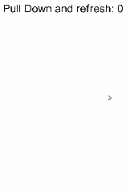

# Refresh

 The **\<Refresh>** component is a container that provides the pull-to-refresh feature.

>  **NOTE**
>
>  This component is supported since API version 8. Updates will be marked with a superscript to indicate their earliest API version.

## Child Components

This component supports only one child component.

## APIs

Refresh\(value: \{ refreshing: boolean, offset?:  number | string , friction?: number | string \}\)

**Parameters**

| Name        | Value Type                                     | Mandatory  | Description                                    |
| ---------- | ---------------------------------------- | ---- | ---------------------------------------- |
| refreshing | boolean                                  | Yes   | Whether the current component is being refreshed.<br>This parameter supports [$$](../../quick-start/arkts-two-way-sync.md) for two-way binding of variables.|
| offset     | string \| number               | No   | Distance from the pull-down starting point to the top of the component.<br>Default value: **16**, in vp<br>**NOTE**<br>The value range of **offset** is [0vp, 64vp]. If the value is greater than 64 vp, the value 64 vp will be used. The value cannot be a percentage or a negative number.|
| friction   | number \| string               | No   | Coefficient of friction, which indicates the **<Refresh\>** component's sensitivity to the pull-down gesture. The value ranges from 0 to 100.<br>Default value: **62**<br>- **0** indicates that the **\<Refresh>** component is not sensitive to the pull-down gesture.<br>- **100** indicates that the **\<Refresh>** component is highly sensitive to the pull-down gesture.<br>- A larger value indicates a more sensitive response of the **\<Refresh>** component to the pull-down gesture.|

## Attributes

The [universal attributes](ts-universal-attributes-size.md) are supported.

## Events

In addition to the [universal events](ts-universal-events-click.md), the following events are supported.


| Name                                      | Description                                    |
| ---------------------------------------- | -------------------------------------- |
| onStateChange(callback: (state: [RefreshStatus](#refreshstatus)) => void)| Triggered when the refresh status changes.<br>- **state**: refresh status.|
| onRefreshing(callback: () => void)       | Triggered when the component enters the refresh state.                          |

## RefreshStatus

| Name      | Value      | Description                  |
| -------- | -------- | -------------------- |
| Inactive | 0 | The component is not pulled down. This is the default value.            |
| Drag     | 1 | The component is being pulled down, but the pulled distance is shorter than the minimum length required to trigger the refresh.     |
| OverDrag | 2 | The component is being pulled down, and the pulled distance exceeds the minimum length required to trigger the refresh.     |
| Refresh  | 3 | The pull-down ends, and the component rebounds to the minimum length required to trigger the refresh and enters the refresh state.|
| Done     | 4 | The refresh is complete, and the component returns to the initial state (top).    |


## Example

```ts
// xxx.ets
@Entry
@Component
struct RefreshExample {
  @State isRefreshing: boolean = false
  @State counter: number = 0

  build() {
    Column() {
      Refresh({ refreshing: $$this.isRefreshing, offset: 120, friction: 100 }) {
        Text('Pull Down and refresh: ' + this.counter)
          .fontSize(30)
          .margin(10)
      }
      .onStateChange((refreshStatus: RefreshStatus) => {
        console.info('Refresh onStatueChange state is ' + refreshStatus)
      })
      .onRefreshing(() => {
        setTimeout(() => {
          this.counter++
          this.isRefreshing = false
        }, 1000)
        console.log('onRefreshing test')
      })
    }
  }
}
```


