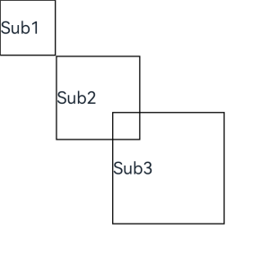

# Custom Component Lifecycle


The lifecycle callbacks of a custom component are used to notify users of the lifecycle of the component. These callbacks are private and are invoked by the development framework at a specified time at runtime. They cannot be manually invoked from applications.


>**NOTE**
>
>Promise and asynchronous callback functions can be used in lifecycle functions, for example, network resource getters and timer setters.


## aboutToAppear

aboutToAppear?(): void

Invoked after a new instance of the custom component is created and before its **build** function is executed. You can change state variables in the **aboutToAppear** function. The change will take effect when you execute the **build** function next time.

Since API version 9, this API is supported in ArkTS widgets.

## aboutToDisappear

aboutToDisappear?(): void

Invoked before the destructor of the custom component is consumed. Do not change state variables in the **aboutToDisappear** function as doing this can cause unexpected errors. For example, the modification of the **@Link** decorated variable may cause unstable application running.

Since API version 9, this API is supported in ArkTS widgets.

## onPageShow

onPageShow?(): void

Invoked when a page is displayed. This callback is used in the routing process or scenarios where the application is switched to the foreground or background. It works only for the custom components decorated by **@Entry**.


## onPageHide

onPageHide?(): void

Invoked when a page is hidden. This callback is used in the routing process or scenarios where the application is switched to the foreground or background. It works only for the custom components decorated by **@Entry**.


## onBackPress

onBackPress?(): void

Invoked when a user clicks the back button. It works only for the custom components decorated by **@Entry**.


```ts
// xxx.ets
@Entry
@Component
struct IndexComponent {
  @State textColor: Color = Color.Black;

  onPageShow() {
    this.textColor = Color.Blue;
    console.info('IndexComponent onPageShow');
  }

  onPageHide() {
    this.textColor = Color.Transparent;
    console.info('IndexComponent onPageHide');
  }

  onBackPress() {
    this.textColor = Color.Red;
    console.info('IndexComponent onBackPress');
  }

  build() {
    Column() {
      Text('Hello World')
        .fontColor(this.textColor)
        .fontSize(30)
        .margin(30)
    }.width('100%')
  }
}
```


## onLayout<sup>9+</sup>

onLayout?(children: Array&lt;LayoutChild&gt;, constraint: ConstraintSizeOptions): void

Invoked when the custom component lays out its child components. Through this callback the component receives its child component layout information and size constraint from the framework. The state variable cannot be changed in the **onLayout** callback.

Since API version 9, this API is supported in ArkTS widgets.

**Parameters**

| Name       | Type                                      | Description              |
| ---------- | ---------------------------------------- | ---------------- |
| children   | Array&lt;[LayoutChild](#layoutchild9)&gt; | Child component layout information.        |
| constraint | [ConstraintSizeOptions](ts-types.md#constraintsizeoptions) | Size constraint information of the parent component.|


## onMeasure<sup>9+</sup>

onMeasure?(children: Array&lt;LayoutChild&gt;, constraint: ConstraintSizeOptions): void

Invoked when the custom component lays out its child components. Through this callback the component receives its child component layout information and size constraint from the framework. The state variable cannot be changed in the **onMeasure** callback.

Since API version 9, this API is supported in ArkTS widgets.

**Parameters**

| Name       | Type                                      | Description              |
| ---------- | ---------------------------------------- | ---------------- |
| children   | Array&lt;[LayoutChild](#layoutchild9)&gt; | Child component layout information.        |
| constraint | [ConstraintSizeOptions](ts-types.md#constraintsizeoptions) | Size constraint information of the parent component.|


## LayoutChild<sup>9+</sup>

Provides the child component layout information.

Since API version 9, this API is supported in ArkTS widgets.

| Parameter        | Type                                    | Description                 |
| ---------- | ---------------------------------------- | ------------------- |
| name       | string                                   | Name of the child component.             |
| id         | string                                   | ID of the child component.             |
| constraint | [ConstraintSizeOptions](ts-types.md#constraintsizeoptions) | Constraint size of the child component.           |
| borderInfo | [LayoutBorderInfo](#layoutborderinfo9)   | Provides the border information of the child component.       |
| position   | [Position](ts-types.md#position8)         | Position coordinates of the child component.           |
| measure    | (childConstraint:) =&gt; void  | Method called to apply the size constraint to the child component.|
| layout     | (LayoutInfo:  [LayoutInfo](#layoutinfo9)) =&gt; void| Method called to apply the layout information to the child component.|


## LayoutBorderInfo<sup>9+</sup>

Provides the border information of the child component.

Since API version 9, this API is supported in ArkTS widgets.

| Parameter         | Type                                | Description                     |
| ----------- | ------------------------------------ | ----------------------- |
| borderWidth | [EdgeWidths](ts-types.md#edgewidths9) | Edge widths in different directions of the component.|
| margin      | [Margin](ts-types.md#margin)         | Margins in different directions of the component.  |
| padding     | [Padding](ts-types.md#padding)       | Paddings in different directions of the component.  |


## LayoutInfo<sup>9+</sup>

Provides the layout information of the child component.

Since API version 9, this API is supported in ArkTS widgets.

| Parameter        | Type                                    | Description      |
| ---------- | ---------------------------------------- | -------- |
| position   | [Position](ts-types.md#position8)         | Position coordinates of the child component.|
| constraint | [ConstraintSizeOptions](ts-types.md#constraintsizeoptions) | Constraint size of the child component.|


```ts
// xxx.ets
@Entry
@Component
struct Index {
  build() {
    Column() {
      CustomLayout() {
        ForEach([1, 2, 3], (index) => {
          Text('Sub' + index)
            .fontSize(30)
            .borderWidth(2)
        })
      }
    }
  }
}


@Component
struct CustomLayout {
  @BuilderParam builder: () => {};

  onLayout(children: Array<LayoutChild>, constraint: ConstraintSizeOptions) {
    let pos = 0;
    children.forEach((child) => {
      child.layout({ position: { x: pos, y: pos }, constraint: constraint })
      pos += 100;
    })
  }

  onMeasure(children: Array<LayoutChild>, constraint: ConstraintSizeOptions) {
    let size = 100;
    children.forEach((child) => {
      child.measure({ minHeight: size, minWidth: size, maxWidth: size, maxHeight: size })
      size += 50;
    })
  }

  build() {
    this.builder()
  }
}
```


