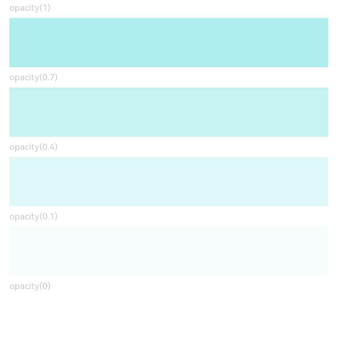

# Opacity

You can set the opacity of a component.

>  **NOTE**
>
>  The APIs of this module are supported since API version 7. Updates will be marked with a superscript to indicate their earliest API version.


## Attributes


| Name   | Type                                            | Description                                                        |
| ------- | ---------------------------------------------------- | ------------------------------------------------------------ |
| opacity | number \| [Resource](ts-types.md#resource) | Opacity of the component. The value ranges from 0 to 1. The value **1** means opaque, and **0** means completely transparent. When being completely transparent, the component is hidden, but still takes up space in the layout.<br/>**NOTE**<br/>A component can inherit the opacity setting from its parent component.<br/>Default value: **1**<br>Since API version 9, this API is supported in ArkTS widgets. |


## Example

```ts
// xxx.ets
@Entry
@Component
struct OpacityExample {
  build() {
    Column({ space: 5 }) {
      Text('opacity(1)').fontSize(9).width('90%').fontColor(0xCCCCCC)
      Text().width('90%').height(50).opacity(1).backgroundColor(0xAFEEEE)
      Text('opacity(0.7)').fontSize(9).width('90%').fontColor(0xCCCCCC)
      Text().width('90%').height(50).opacity(0.7).backgroundColor(0xAFEEEE)
      Text('opacity(0.4)').fontSize(9).width('90%').fontColor(0xCCCCCC)
      Text().width('90%').height(50).opacity(0.4).backgroundColor(0xAFEEEE)
      Text('opacity(0.1)').fontSize(9).width('90%').fontColor(0xCCCCCC)
      Text().width('90%').height(50).opacity(0.1).backgroundColor(0xAFEEEE)
      Text('opacity(0)').fontSize(9).width('90%').fontColor(0xCCCCCC)
      Text().width('90%').height(50).opacity(0).backgroundColor(0xAFEEEE)
    }
    .width('100%')
    .padding({ top: 5 })
  }
}
```


