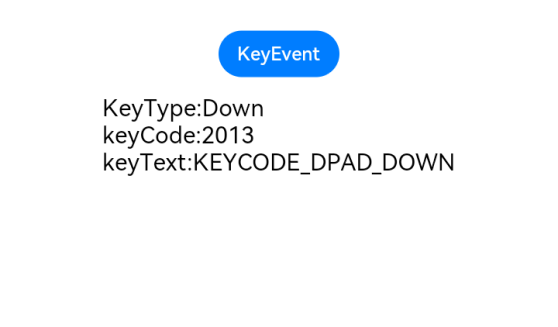

# Key Event

A key event is triggered when a focusable component, such as **\<Button>**, interacts with a keyboard, remote control, or any other input device with keys. To use a key event for components that are not focusable by default, such as **\<Text>** and **\<Image>**, first set their **focusable** attribute to **true**.

>  **NOTE**
>
>  The APIs of this module are supported since API version 7. Updates will be marked with a superscript to indicate their earliest API version.


## Events

| Name                                      | Bubbling Supported| Description                                    |
| ---------------------------------------- | ---- | ---------------------------------------- |
| onKeyEvent(event: (event?: KeyEvent) =&gt; void) | Yes   | Triggered when a key event occurs. For details about **event**, see [KeyEvent](#keyevent).|


## KeyEvent

| Name                                   | Type                                      | Description                        |
| ------------------------------------- | ---------------------------------------- | -------------------------- |
| type                                  | [KeyType](ts-appendix-enums.md#keytype)  | Key type.                    |
| [keyCode](../apis/js-apis-keycode.md#keycode) | number                                   | Key code.                    |
| keyText                               | string                                   | Key value.                    |
| keySource                             | [KeySource](ts-appendix-enums.md#keysource) | Type of the input device that triggers the key event.            |
| deviceId                              | number                                   | ID of the input device that triggers the key event.            |
| metaKey                               | number                                   | State of the metakey (that is, the **WIN** key on the Windows keyboard or the **Command** key on the Mac keyboard) when the key is pressed. The value **1** indicates the pressed state, and **0** indicates the unpressed state.|
| timestamp                             | number                                   | Timestamp of the event. It is the interval between the time when the event is triggered and the time when the system starts, in nanoseconds.|
| stopPropagation                       | () => void                               | Stops the event from bubbling upwards or downwards.                 |


## Example

```ts
// xxx.ets
@Entry
@Component
struct KeyEventExample {
  @State text: string = ''
  @State eventType: string = ''

  build() {
    Column() {
      Button('KeyEvent')
        .onKeyEvent((event: KeyEvent) => {
          if (event.type === KeyType.Down) {
            this.eventType = 'Down'
          }
          if (event.type === KeyType.Up) {
            this.eventType = 'Up'
          }
          this.text = 'KeyType:' + this.eventType + '\nkeyCode:' + event.keyCode + '\nkeyText:' + event.keyText
        })
      Text(this.text).padding(15)
    }.height(300).width('100%').padding(35)
  }
}
```

  
