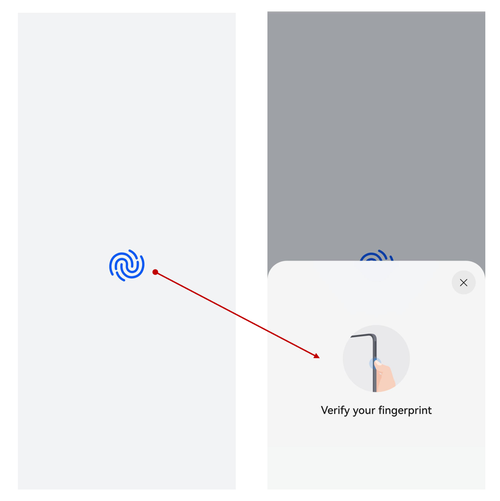

# Using Embedded User Identity Authentication Icons

The system provides embedded icons to simplify the user identity authentication process.

1. The icons for facial authentication and fingerprint authentication can be easily integrated into your applications.
2. The color and size of the icons can be customized, but the icon style cannot be changed.
3. The pop-up facial or fingerprint authentication component can be started once the icon is tapped.

The embedded user authentication icons support the following types of authentication:

- Facial authentication
- Fingerprint authentication
- Facial + lock screen password authentication
- Fingerprint + lock screen password authentication
- Facial + fingerprint + lock screen password authentication

The following figure shows the use of the fingerprint authentication icon. When a user taps the fingerprint authentication icon (shown in the left of the figure) integrated into the application, the system starts the user authentication component (shown in the right of the figure) to complete identity authentication. The embedded icons eliminate the need for initiating user identity authentication requests by using APIs, making the identity authentication process simpler.

## Example

For details, see [@ohos.userIAM.userAuthIcon](../../reference/apis-user-authentication-kit/ohos-useriam-userauthicon.md).
