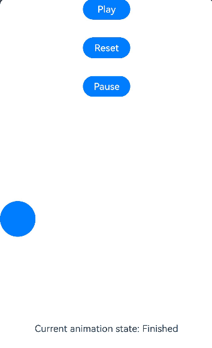

# Frame Animation

Frame animation involves the use of the **onFrame** callback in applications, which allows you to adjust property values with each frame that is rendered, thereby creating animation effects for the components associated with those property values. For details about the APIs, see [@ohos.animator (Animator)](../reference/apis-arkui/js-apis-animator.md).


## Implementing an Animation with animator

To create a simple animator and print the current interpolation value in each frame callback:

1. Import dependencies.

   ```ts
   import { AnimatorOptions, AnimatorResult } from '@kit.ArkUI';
   ```

2. Create an animator object.

   ```ts
   // Initial options for creating an animator object
   let options: AnimatorOptions = {                        
      duration: 1500,                               
      easing: "friction",                        
      delay: 0,                           
      fill: "forwards",                                  
      direction: "normal",                                  
      iterations: 2,                                        
      // Initial frame value used for interpolation in the onFrame callback                                   
      begin: 200.0,                                         
      // End frame value used for interpolation in the onFrame callback                                   
      end: 400.0                                            
   }; 
   let result: AnimatorResult = this.getUIContext().createAnimator(options);
      // Set up a callback for when a frame is received, so that the onFrame callback is called for every frame throughout the animation playback process.
       result.onFrame = (value: number) => {
       console.log("current value is :" + value);
   }
   ```

3. Play the animation.

   ```ts
   // Play the animation.
   result.play();
   ```

4. After the animation has finished executing, manually release the **AnimatorResult** object.

   ```ts
   // Play the animation.
   result = undefined;
   ```

## Implementing a Ball's Parabolic Motion with Animator

1. Import dependencies.

   ```ts
   import { AnimatorOptions, AnimatorResult } from '@kit.ArkUI';
   ```

2. Define the component to be animated.

   ```ts
   Button()
     .width(60)
     .height(60)
     .translate({ x: this.translateX, y: this.translateY })
   ```

3. Create an **AnimatorResult** Object in **onPageShow**.

   ```ts
   onPageShow(): void {
       // Create an animatorResult object.
       this.animatorOptions = this.getUIContext().createAnimator(options);
       this.animatorOptions.onFrame = (progress: number) => {
       this.translateX = progress;
       if (progress > this.topWidth && this.translateY < this.bottomHeight) {
          this.translateY = Math.pow(progress - this.topWidth, 2) * this.g;
       }
    }
    // Invoked when the animation is canceled.
    this.animatorOptions.onCancel = () => {
       this.animatorStatus = 'Canceled'
    }
    // Invoked when the animation finishes playing.
    this.animatorOptions.onFinish = () => {
       this.animatorStatus = 'Finished'
    }
    // Invoked when the animation repeats.
    this.animatorOptions.onRepeat = () => {
       console.log("Animation repeating");
    }
   }
   ```

4. Define buttons for controlling the animation.

   ```ts
   Button('Play').onClick(() => {
     this.animatorOptions?.play();
     this.animatorStatus = 'Playing'
   }).width(80).height(35)
   Button("Reset").onClick(() => {
     this.translateX = 0;
     this.translateY = 0;
   }).width(80).height(35)
   Button("Pause").onClick(() => {
     this.animatorOptions?.pause();
     this.animatorStatus = 'Paused'
   }).width(80).height(35)
   ```
5. Destroy the animation in the page's **onPageHide** lifecycle callback.
   ```ts
   onPageHide(): void {
     this.animatorOptions = undefined;
   }
   ```

A complete example is as follows:

```ts
import { AnimatorOptions, AnimatorResult } from '@kit.ArkUI';

@Entry
@Component
struct Index {
  @State animatorOptions: AnimatorResult | undefined = undefined;
  @State animatorStatus: string =' Created'
  begin: number = 0;
  end: number = 300
  topWidth: number = 150;
  bottomHeight: number = 100;
  g: number = 0.18
  animatorOption: AnimatorOptions = {
    duration: 4000,
    delay: 0,
    easing: 'linear',
    iterations: 1,
    fill: "forwards",
    direction: 'normal',
    begin: this.begin,
    end: this.end
  };
  @State translateX: number = 0;
  @State translateY: number = 0;

  onPageShow(): void {
    this.animatorOptions = this.getUIContext().createAnimator(this.animatorOption)
    this.animatorOptions.onFrame = (progress: number) => {
      this.translateX = progress;
      if (progress > this.topWidth && this.translateY < this.bottomHeight) {
        this.translateY = Math.pow(progress - this.topWidth, 2) * this.g;
      }
    }
    this.animatorOptions.onCancel = () => {
      this.animatorStatus = 'Canceled'
    }
    this.animatorOptions.onFinish = () => {
      this.animatorStatus = 'Finished'
    }
    this.animatorOptions.onRepeat = () => {
      console.log("Animation repeating");
    }
  }

  onPageHide(): void {
    this.animatorOptions = undefined;
  }

  build() {
    Column() {
      Column({ space: 30 }) {
        Button('Play').onClick(() => {
          this.animatorOptions?.play();
          this.animatorStatus = 'Playing';
        }).width(80).height(35)
        Button("Reset").onClick(() => {
          this.translateX = 0;
          this.translateY = 0;
        }).width(80).height(35)
        Button("Pause").onClick(() => {
          this.animatorOptions?.pause();
          this.animatorStatus = 'Paused';
        }).width(80).height(35)
      }.width("100%").height('25%')

      Stack() {
        Button()
          .width(60)
          .height(60)
          .translate({ x: this.translateX, y: this.translateY })
      }
      .width("100%")
      .height('45%')
      .align(Alignment.Start)

      Text("Current animation state: "+ this.animatorStatus)
    }.width("100%").height('100%')
  }
}
```


