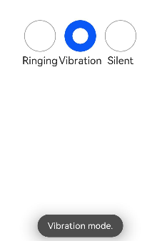

# Radio Button (Radio)


The **\<Radio>** component allows users to select from a set of mutually exclusive options. Only one radio button in a given group can be selected at the same time. For details, see [Radio](../reference/apis-arkui/arkui-ts/ts-basic-components-radio.md).


## Creating a Radio Button

You can create a radio button by calling the following API:


```ts
Radio(options: {value: string, group: string})
```

In this API, **value** indicates the name of the radio button, and **group** indicates the name of the group to which the radio button belongs. You can use the **checked** attribute of the radio button to specify whether it is selected. The value **true** means that the radio button is selected.

The style of the radio button can be customized for the selected and unselected states, but the shape cannot be customized.

```ts
Radio({ value: 'Radio1', group: 'radioGroup' })
  .checked(false)
Radio({ value: 'Radio2', group: 'radioGroup' })
  .checked(true)
```


## Adding Events

The **\<Radio>** component supports the [universal events](../reference/apis-arkui/arkui-ts/ts-universal-events-click.md). In addition, it can be bound to the **onChange** event so that it responds with custom behavior after being selected.

```ts
  Radio({ value: 'Radio1', group: 'radioGroup' })
    .onChange((isChecked: boolean) => {
      if(isChecked) {
        // Operation
      }
    })
  Radio({ value: 'Radio2', group: 'radioGroup' })
    .onChange((isChecked: boolean) => {
      if(isChecked) {
        // Operation
      }
    })
```


## Example Scenario

In this example, the **\<Radio>** components are used to switch between sound modes.


```ts
// xxx.ets
import promptAction from '@ohos.promptAction';
@Entry
@Component
struct RadioExample {
  @State Rst:promptAction.ShowToastOptions = {'message': 'Ringing mode.'}
  @State Vst:promptAction.ShowToastOptions = {'message': 'Vibration mode.'}
  @State Sst:promptAction.ShowToastOptions = {'message': 'Silent mode.'}
  build() {
    Row() {
      Column() {
        Radio({ value: 'Radio1', group: 'radioGroup' }).checked(true)
          .height(50)
          .width(50)
          .onChange((isChecked: boolean) => {
            if(isChecked) {
              // Switch to the ringing mode.
              promptAction.showToast(this.Rst)
            }
          })
        Text('Ringing')
      }
      Column() {
        Radio({ value: 'Radio2', group: 'radioGroup' })
          .height(50)
          .width(50)
          .onChange((isChecked: boolean) => {
            if(isChecked) {
              // Switch to the vibration mode.
              promptAction.showToast(this.Vst)
            }
          })
        Text('Vibration')
      }
      Column() {
        Radio({ value: 'Radio3', group: 'radioGroup' })
          .height(50)
          .width(50)
          .onChange((isChecked: boolean) => {
            if(isChecked) {
              // Switch to the silent mode.
              promptAction.showToast(this.Sst)
            }
          })
        Text('Silent')
      }
    }.height('100%').width('100%').justifyContent(FlexAlign.Center)
  }
}
```



