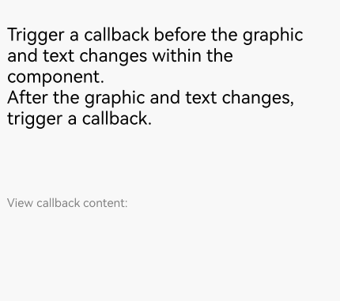
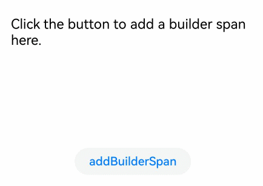

# Rich Text (RichEditor)
**RichEditor** is a component that supports interactive text editing and mixture of text and imagery. It is typically used to handle user inputs with mixed content, such as comment sections that allow for image input. For details, see RichEditor](../reference/apis-arkui/arkui-ts/ts-basic-components-richeditor.md).

## Creating a RichEditor Component
You create a **RichEditor** component by calling an API, which varies depending on the type of component you want to create.

### Creating a RichEditor Component Without Using a Styled String
```ts
RichEditor(value: RichEditorOptions)
```
Creates a **RichEditor** component with the initialization options specified by **RichEditorOptions**.

```ts
controller: RichEditorController = new RichEditorController();
options: RichEditorOptions = { controller: this.controller };

RichEditor(this.options)
    .onReady(() => {
        this.controller.addTextSpan('Create a RichEditor component without using a styled string.', {
            style: {
                fontColor: Color.Black,
                fontSize: 15
            }
        })
    })
```


### Creating a RichEditor Component Using a Styled String
```ts
RichEditor(options: RichEditorStyledStringOptions)
```

Creates a **RichEditor** component with the initialization options specified by **RichEditorStyledStringOptions**. For details about how to use styled strings, see [Styled String (StyledString/MutableStyledString)](arkts-styled-string.md).

```ts
mutableStyledString: MutableStyledString = new MutableStyledString("Create a RichEditor component using a styled string.",
    [{
        start: 0,
        length: 5,
        styledKey: StyledStringKey.FONT,
        styledValue: this.fontStyle
    }]);

controller: RichEditorStyledStringController = new RichEditorStyledStringController();
options: RichEditorStyledStringOptions = {controller: this.controller};

RichEditor(this.options)
    .onReady(() => {
        this.controller.setStyledString(this.mutableStyledString);
    })
```


## Setting Attributes

### Setting the Custom Context Menu on Text Selection

You can set custom context menu on text selection using the [bindSelectionMenu](../reference/apis-arkui/arkui-ts/ts-basic-components-richeditor.md#bindselectionmenu) API, which includes the following parameters:

**spanType**: type of the menu, with the default being text.<br>**content**: content of the menu.<br>**responseType**: response type of the menu, with the default being a long press.<br>**options**: options of the menu, allowing you to set callbacks for when the menu appears or disappears.

If the custom menu is too long, embed a **Scroll** component to prevent the keyboard from being blocked.

```ts
RichEditor(this.options)
    .onReady(() => {
        this.controller.addTextSpan('The component has a custom menu that can be triggered by a long press.', {
            style: {
                fontColor: Color.Black,
                fontSize: 18
            }
        })
    })
    .bindSelectionMenu(RichEditorSpanType.TEXT, this.SystemMenu, ResponseType.LongPress, {
        onDisappear: () => {
            this.sliderShow = false
        }
    })
    .width(300)
    .height(300)

@Builder
SystemMenu() {
    Column() {
            Menu() {
                    if (this.controller) {
                        MenuItemGroup() {
                            MenuItem({
                                startIcon: this.theme.cutIcon,
                                content: "Cut",
                                labelInfo: "Ctrl+X",
                            })
                            MenuItem({
                                startIcon: this.theme.copyIcon,
                                content: "Copy",
                                labelInfo: "Ctrl+C"
                            })
                            MenuItem({
                                startIcon: this.theme.pasteIcon,
                                content: "Paste",
                                labelInfo: "Ctrl+V"
                            })
                        }
                    }
                }
                .radius(this.theme.containerBorderRadius)
                .clip(true)
                .backgroundColor(Color.White)
                .width(this.theme.defaultMenuWidth)
        }
        .width(this.theme.defaultMenuWidth)
}
```


### Setting the Color of the Caret and Selection Handle in the Text Box

You can set the color of the caret and selection handle in the text box using the [caretColor](../reference/apis-arkui/arkui-ts/ts-basic-components-richeditor.md#caretcolor12) API.

```ts
RichEditor(this.options)
    .onReady(() => {
        this.controller.addTextSpan('The component has the color set for the caret and selection handle.', {
            style: {
                fontColor: Color.Black,
                fontSize: 15
            }
        })
    })
    .caretColor(Color.Orange)
    .width(300)
    .height(300)
```


### Setting Placeholder Text

You can set the placeholder text, which is displayed when there is no input, using the [placeholder](../reference/apis-arkui/arkui-ts/ts-basic-components-richeditor.md#placeholder12) API.

In the API, **value** indicates the placeholder text displayed when there is no input; **style** indicates the font style for the placeholder text. If not specified, the style follows the theme settings.

```ts
RichEditor(this.options)
    .placeholder("Enter your content here", {
        fontColor: Color.Gray,
        font: {
            size: 15,
            weight: FontWeight.Normal,
            family: "HarmonyOS Sans",
            style: FontStyle.Normal
        }
    })
    .width(300)
    .height(300)
```


For details about all available attributes, see [RichEditor Attributes](../reference/apis-arkui/arkui-ts/ts-basic-components-richeditor.md#attributes).

## Adding Events
### Adding a Callback for Component Initialization

Use the [onReady](../reference/apis-arkui/arkui-ts/ts-basic-components-richeditor.md#onready) API to add a callback that is invoked after the component has been initialized.

In the API, **callback** indicates the callback invoked when the **RichEditor** component has completed initialization.

```ts
RichEditor(this.options)
    .onReady(() => {
        this.controller.addTextSpan('The onReady callback content is preset text within the component.', {
            style: {
                fontColor: Color.Black,
                fontSize: 15
            }
        })
    })
```


### Adding a Callback for Content Selection

Use the [onSelect](../reference/apis-arkui/arkui-ts/ts-basic-components-richeditor.md#onselect) API to add a callback that is invoked when content within the component is selected.

In **callback**, [RichEditorSelection](../reference/apis-arkui/arkui-ts/ts-basic-components-richeditor.md#richeditorselection) provides information about all the selected content.

The callback can be invoked in either of the following ways: (1) If content is selected with the mouse left button, the callback is invoked after the left button is released. (2) If content is selected with a finger, the callback is invoked after the finger is lifted.

```ts
RichEditor(this.options)
    .onReady(() => {
        this.controller.addTextSpan('Select this text to invoke the onSelect callback.', {
            style: {
                fontColor: Color.Black,
                fontSize: 15
            }
        })
    })
    .onSelect((value: RichEditorSelection) => {
        this.controller1.addTextSpan(JSON.stringify(value), {
            style: {
                fontColor: Color.Gray,
                fontSize: 10
            }
        })
    })
    .width(300)
    .height(50)
Text('View callback content:').fontSize(10).fontColor(Color.Gray).width(300)
RichEditor(this.options1)
    .width(300)
    .height(70)
```


### Adding Callbacks for Before and After Text and Image Changes

Use the [onWillChange](../reference/apis-arkui/arkui-ts/ts-basic-components-richeditor.md#onwillchange12) API to add a callback invoked before text or image changes. Use the [onDidChange](../reference/apis-arkui/arkui-ts/ts-basic-components-richeditor.md#ondidchange12) API to add a callback invoked after text or image changes.

In the **onWillChange** callback, [RichEditorChangeValue](../reference/apis-arkui/arkui-ts/ts-basic-components-richeditor.md#richeditorchangevalue12) provides information about the text and image change; a boolean value indicates whether the change is allowed (**true**) or not allowed (**false**).

In the **onDidChange** callback, [OnDidChangeCallback](../reference/apis-arkui/arkui-ts/ts-text-common.md#ondidchangecallback12) provides the content range before and after the text or image change.

The **RichEditor** component constructed with [RichEditorStyledStringOptions](../reference/apis-arkui/arkui-ts/ts-basic-components-richeditor.md#richeditorstyledstringoptions12) does not support these two types of callbacks.

```ts
RichEditor(this.options)
    .onReady(() => {
        this.controller.addTextSpan('The callback is invoked before the text or image change.\nThe callback is invoked after the text or image change.', {
            style: {
                fontColor: Color.Black,
                fontSize: 15
            }
        })
    })
    .onWillChange((value: RichEditorChangeValue) => {
        this.controller1.addTextSpan('The callback is invoked before the text or image change: \n' + JSON.stringify(value), {
            style: {
                fontColor: Color.Gray,
                fontSize: 10
            }
        })
        return true;
    })
    .onDidChange((rangeBefore: TextRange, rangeAfter: TextRange) => {
        this.controller1.addTextSpan('\nThe callback is invoked after the text or image change: \nrangeBefore: ' + JSON.stringify(rangeBefore) + '\nrangeAfter: ' + JSON.stringify(rangeBefore), {
            style: {
                fontColor: Color.Gray,
                fontSize: 10
            }
        })
        return true;
    })
    .width(300)
    .height(50)
Text('View callback content:').fontSize(10).fontColor(Color.Gray).width(300)
RichEditor(this.options1)
    .width(300)
    .height(70)
```



### Adding Callbacks for Before and After Content Input in the Input Method

Use the [aboutToIMEInput](../reference/apis-arkui/arkui-ts/ts-basic-components-richeditor.md#abouttoimeinput) API to add a callback invoked when content is about to be entered in the input method. Use the [onIMEInputComplete](../reference/apis-arkui/arkui-ts/ts-basic-components-richeditor.md#onimeinputcomplete) method to add a callback invoked when text input in the input method is complete.

In the **aboutToIMEInput** callback, [RichEditorInsertValue](../reference/apis-arkui/arkui-ts/ts-basic-components-richeditor.md#richeditorinsertvalue) provides information about the content to be entered in the input method; a boolean value indicates whether the content is inserted (**true**) or not (**false**).

In the **onIMEInputComplete** callback, [RichEditorTextSpanResult](../reference/apis-arkui/arkui-ts/ts-basic-components-richeditor.md#richeditortextspanresult) provides information about the text span after the text input is completed.

The **RichEditor** component constructed with [RichEditorStyledStringOptions](../reference/apis-arkui/arkui-ts/ts-basic-components-richeditor.md#richeditorstyledstringoptions12) does not support these two types of callbacks.

```ts
RichEditor(this.options)
          .onReady(() => {
            this.controller.addTextSpan('The callback is invoked before content input in the input method.\nThe callback is invoked when text input in the input method is complete.' , {
              style: {
                fontColor: Color.Black,
                fontSize: 15
              }
            })
          })
          .aboutToIMEInput((value: RichEditorInsertValue) => {
            this.controller1.addTextSpan('The callback is invoked before content input in the input method: \n'+JSON.stringify(value), {
              style: {
                fontColor: Color.Gray,
                fontSize: 10
              }
            })
            return true;
          })
          .onIMEInputComplete((value: RichEditorTextSpanResult) => {
            this.controller1.addTextSpan('The callback is invoked when text input in the input method is complete: \n'+ JSON.stringify(value), {
              style: {
                fontColor: Color.Gray,
                fontSize: 10
              }
            })
            return true;
          })
          .width(300)
          .height(50)
Text('View callback content:').fontSize(10).fontColor(Color.Gray).width(300)
RichEditor(this.options1)
    .width(300)
    .height(70)
```


### Adding a Callback for Before Paste Completion

Use the [onPaste](../reference/apis-arkui/arkui-ts/ts-basic-components-richeditor.md#onpaste11) API to add a callback invoked when the paste is about to be completed.

In the API, **callback** is used to define the user paste event.

By default, only plain text can be pasted. You can use this API to override the default system behavior so that both images and text can be pasted.

```ts
RichEditor(this.options)
    .onReady(() => {
        this.controller.addTextSpan('Copy and paste operations on this text trigger the corresponding callbacks.', {
            style: {
                fontColor: Color.Black,
                fontSize: 15
            }
        })
    })
    .onPaste(() => {
        this.controller1.addTextSpan('The onPaste callback is invoked.\n', {
            style: {
                fontColor: Color.Gray,
                fontSize: 10
            }
        })
    })
    .width(300)
    .height(70)
```

### Adding a Callback for Before Cut Completion

Use the [onCut](../reference/apis-arkui/arkui-ts/ts-basic-components-richeditor.md#oncut12) API to add a callback invoked when text is about to be cut.

In the API, **callback** is used to define the user cut event.

By default, only plain text can be cut. You can use this API to override the default system behavior so that both images and text can be cut.

```ts
RichEditor(this.options)
    .onReady(() => {
        this.controller.addTextSpan('Copy and paste operations on this text trigger the corresponding callbacks.', {
            style: {
                fontColor: Color.Black,
                fontSize: 15
            }
        })
    })
    .onCut(() => {
        this.controller1.addTextSpan('The onCut callback is invoked.\n', {
            style: {
                fontColor: Color.Gray,
                fontSize: 10
            }
        })
    })
    .width(300)
    .height(70)
```

### Adding a Callback for Before Copy Completion

Use the [onCopy](../reference/apis-arkui/arkui-ts/ts-basic-components-richeditor.md#oncopy12) API to add a callback invoked when text is about to be copied.

In the API, **callback** is used to define the user copy event.

By default, only plain text can be copied. You can use this API to override the default system behavior so that both images and text can be copied.

```ts
RichEditor(this.options)
    .onReady(() => {
        this.controller.addTextSpan('Copy and paste operations on this text trigger the corresponding callbacks.', {
            style: {
                fontColor: Color.Black,
                fontSize: 15
            }
        })
    })
    .onCopy(() => {
        this.controller1.addTextSpan('The onCopy callback is invoked.\n', {
            style: {
                fontColor: Color.Gray,
                fontSize: 10
            }
        })
    })
    .width(300)
    .height(70)
```


For details about all available events, see [RichEditor Events](../reference/apis-arkui/arkui-ts/ts-basic-components-richeditor.md#events).

## Setting the Typing Style

Use the [setTypingStyle](../reference/apis-arkui/arkui-ts/ts-basic-components-richeditor.md#settypingstyle12) API to set the typing style.

In the API, **value** indicates the preset typing style.

```ts
RichEditor(this.options)
    .onReady(() => {
        this.controller.addTextSpan('Click the button to change the preset typing style.', {
            style: {
                fontColor: Color.Black,
                fontSize: 15
            }
        })
    })
    .width(300)
    .height(60)
Button('setTypingStyle', {
        buttonStyle: ButtonStyleMode.NORMAL
    })
    .height(30)
    .fontSize(13)
    .onClick(() => {
        this.controller.setTypingStyle({
            fontWeight: 'medium',
            fontColor: Color.Pink,
            fontSize: 15,
            fontStyle: FontStyle.Italic,
            decoration: {
                type: TextDecorationType.Underline,
                color: Color.Gray
            }
        })
    })
```


## Setting Highlight for Selected Content

Use the [setSelection](../reference/apis-arkui/arkui-ts/ts-basic-components-richeditor.md#setselection12) API to configure the component to highlight the background of the selected portion.

In the API:<br>**selectionStart**: start position of the selection.<br>selectionEnd: end position of the selection. If both **selectionStart** and **selectionEnd** are set to **-1**, the entire content is selected.

If this API is called when the text box is not focused, the selected effect is not displayed.

```ts
RichEditor(this.options)
    .onReady(() => {
        this.controller.addTextSpan('Click the button to select the text at positions 0 to 2 here.', {
            style: {
                fontColor: Color.Black,
                fontSize: 15
            }
        })
    })
    .width(300)
    .height(60)
Button('setSelection(0,2)', {
        buttonStyle: ButtonStyleMode.NORMAL
    })
    .height(30)
    .fontSize(13)
    .onClick(() => {
        this.controller.setSelection(0, 2)
    })
```


## Adding a Text Span

In addition to directly entering content into the component, you can also add a text span using the [addTextSpan](../reference/apis-arkui/arkui-ts/ts-basic-components-richeditor.md#addtextspan) API.

In the API, **value** indicates the text content to add, and **options** indicates the text options, which include the offset position where the text is added and the text style information ([RichEditorTextSpanOptions](../reference/apis-arkui/arkui-ts/ts-basic-components-richeditor.md#richeditortextspanoptions)).

If the cursor in the component is blinking, the cursor position is updated to be after the inserted text span.

```ts
RichEditor(this.options)
    .onReady(() => {
        this.controller.addTextSpan('Click the button to add text here.', {
            style: {
                fontColor: Color.Black,
                fontSize: 15
            }
        })
    })
    .width(300)
    .height(100)
Button('addTextSpan', {
        buttonStyle: ButtonStyleMode.NORMAL
    })
    .height(30)
    .fontSize(13)
    .onClick(() => {
        this.controller.addTextSpan('Add text.')
    })
```


## Adding an Image Span

Use the [addImageSpan](../reference/apis-arkui/arkui-ts/ts-basic-components-richeditor.md#addimagespan) API to add an image span.

In the API, **value** indicates the image content to be added, and **options** indicates the image options, which include the offset position where the image is added and the image style information ([RichEditorImageSpanOptions](../reference/apis-arkui/arkui-ts/ts-basic-components-richeditor.md#richeditorimagespanoptions)).

Adds an image span. If the cursor in the component is blinking, the cursor position is updated to be after the inserted image span.

```ts
RichEditor(this.options)
    .onReady(() => {
        this.controller.addTextSpan('Click the button to add an image here.', {
            style: {
                fontColor: Color.Black,
                fontSize: 15
            }
        })
    })
    .width(300)
    .height(100)
Button('addImageSpan', {
        buttonStyle: ButtonStyleMode.NORMAL
    })
    .height(30)
    .fontSize(13)
    .onClick(() => {
        this.controller.addImageSpan($r("app.media.startIcon"), {
            imageStyle: {
                size: ["57px", "57px"]
            }
        })
    })
```


## Adding @Builder Decorated Content
Use [addBuilderSpan](../reference/apis-arkui/arkui-ts/ts-basic-components-richeditor.md#addbuilderspan11) to add the content decorated by the @Builder decorator.

In the API, **value** indicates the content created by the builder, and **options** indicates the builder options, which allow you to set the index of this builder in the **RichEditor** component through [RichEditorBuilderSpanOptions](../reference/apis-arkui/arkui-ts/ts-basic-components-richeditor.md#richeditorbuilderspanoptions11). Each text character is considered a single unit.

```ts
@Builder
TextBuilder() {
    Row() {
            Image($r('app.media.startIcon')).width(50).height(50).margin(16)
            Column() {
                Text("Text.txt").fontWeight(FontWeight.Bold).fontSize(16)
                Text("123.45KB").fontColor('#8a8a8a').fontSize(12)
            }.alignItems(HorizontalAlign.Start)
        }.backgroundColor('#f4f4f4')
        .borderRadius("20")
        .width(220)
}

Button('addBuilderSpan', {
        buttonStyle: ButtonStyleMode.NORMAL
    })
    .height(30)
    .fontSize(13)
    .onClick(() => {
        this.my_builder = () => {
            this.TextBuilder()
        }
        this.controller.addBuilderSpan(this.my_builder)
    })
```
   

## Adding a Symbol Span

Use the [addSymbolSpan](../reference/apis-arkui/arkui-ts/ts-basic-components-richeditor.md#addsymbolspan11) AOU to add a symbol span.

In the API, **value** indicates the content of the symbol span, and **options** indicates options of the symbol span, which are used to set the offset position and style information of the symbol span ([RichEditorSymbolSpanOptions](../reference/apis-arkui/arkui-ts/ts-basic-components-richeditor.md#richeditorsymbolspanoptions11)).

If the cursor in the component is blinking, the cursor position is updated to be after the inserted symbol span.

Currently, gestures, copying, and dragging are not supported for the symbol span.

```ts
RichEditor(this.options)
    .onReady(() => {
        this.controller.addTextSpan('Click the button to add a symbol here.', {
            style: {
                fontColor: Color.Black,
                fontSize: 15
            }
        })
    })
    .width(300)
    .height(100)
Button('addSymbolSpan', {
        buttonStyle: ButtonStyleMode.NORMAL
    })
    .height(30)
    .fontSize(13)
    .onClick(() => {
        this.controller.addSymbolSpan($r("sys.symbol.basketball_fill"), {
            style: {
                fontSize: 30
            }
        })
    })
```


## Obtaining Span Information

Use the [getSpans](../reference/apis-arkui/arkui-ts/ts-basic-components-richeditor.md#getspans) API to obtain the span information of the component.

In the API, **value** indicates the range of the target span. The return value is an array of either [RichEditorTextSpanResult](../reference/apis-arkui/arkui-ts/ts-basic-components-richeditor.md#richeditortextspanresult) or [RichEditorImageSpanResult](../reference/apis-arkui/arkui-ts/ts-basic-components-richeditor.md#richeditorimagespanresult), which includes information about text and image spans.

```ts
RichEditor(this.options)
    .onReady(() => {
        this.controller.addTextSpan('Click the button to obtain the span information.', {
            style: {
                fontColor: Color.Black,
                fontSize: 15
            }
        })
    })
    .width(300)
    .height(50)
Text('View the return value of getSpans: ').fontSize(10).fontColor(Color.Gray).width(300)
RichEditor(this.options1)
    .width(300)
    .height(50)
Button('getSpans', {
        buttonStyle: ButtonStyleMode.NORMAL
    })
    .height(30)
    .fontSize(13)
    .onClick(() => {
        this.controller1.addTextSpan(JSON.stringify(this.controller.getSpans()), {
            style: {
                fontColor: Color.Gray,
                fontSize: 10
            }
        })

    })
```

<!--RP1--><!--RP1End-->