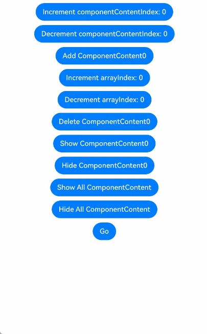

# Managing Overlays (OverlayManager)

Overlays, implemented using **OverlayManager**, are used to display custom UI content on top of a page, but below such components as created through **Dialog**, **Popup**, **Menu**, **BindSheet**, **BindContentCover**, and **Toast**. These overlays are confined to the safe area of the current window. Overlays are applicable to scenarios such as persistent floating elements.


You can use the [getOverlayManager](../reference/apis-arkui/js-apis-arkui-UIContext.md#getoverlaymanager12) API in [UIContext](../reference/apis-arkui/js-apis-arkui-UIContext.md#uicontext) to obtain the [OverlayManager](../reference/apis-arkui/js-apis-arkui-UIContext.md#overlaymanager12) object associated with the current UI context, and then call the corresponding APIs using this object.

## Specifications Constraints

* The nodes on **OverlayManager** are above the page level, but below such components as created through **Dialog**, **Popup**, **Menu**, **BindSheet**, **BindContentCover**, and **Toast**.
* There is no default animation when nodes on **OverlayManager** appear or disappear.
* The drawing method inside and outside the safe area of nodes on **OverlayManager** is consistent with that of the page, and the keyboard avoidance method is also the same as that of the page.
* For properties related to **OverlayManager**, you are advised to use AppStorage for global storage across the application to prevent changes in property values when switching pages, which could lead to service errors.

## Managing Overlays

With **OverlayManager**, you can add a specified node ([addComponentContent](../reference/apis-arkui/js-apis-arkui-UIContext.md#addcomponentcontent12)), remove a specified node ([removeComponentContent](../reference/apis-arkui/js-apis-arkui-UIContext.md#removecomponentcontent12)), show all nodes ([showAllComponentContents](../reference/apis-arkui/js-apis-arkui-UIContext.md#showallcomponentcontents12)), and hide all nodes ([hideAllComponentContents](../reference/apis-arkui/js-apis-arkui-UIContext.md#hideallcomponentcontents12)).

```ts
import { ComponentContent, OverlayManager, router } from '@kit.ArkUI';

class Params {
  text: string = ""
  offset: Position
  constructor(text: string, offset: Position) {
    this.text = text
    this.offset = offset
  }
}
@Builder
function builderText(params: Params) {
  Column() {
    Text(params.text)
      .fontSize(30)
      .fontWeight(FontWeight.Bold)
  }.offset(params.offset)
}

@Entry
@Component
struct OverlayExample {
  @State message: string = 'ComponentContent';
  private uiContext: UIContext = this.getUIContext()
  private overlayNode: OverlayManager = this.uiContext.getOverlayManager()
  @StorageLink('contentArray') contentArray: ComponentContent<Params>[] = []
  @StorageLink('componentContentIndex') componentContentIndex: number = 0
  @StorageLink('arrayIndex') arrayIndex: number = 0
  @StorageLink("componentOffset") componentOffset: Position = {x: 0, y: 80}

  build() {
    Column({space:10}) {
      Button("Increment componentContentIndex: " + this.componentContentIndex).onClick(()=>{
        ++this.componentContentIndex
      })
      Button("Decrement componentContentIndex: " + this.componentContentIndex).onClick(()=>{
        --this.componentContentIndex
      })
      Button("Add ComponentContent" + this.contentArray.length).onClick(()=>{
        let componentContent = new ComponentContent(
          this.uiContext, wrapBuilder<[Params]>(builderText),
          new Params(this.message + (this.contentArray.length), this.componentOffset)
        )
        this.contentArray.push(componentContent)
        this.overlayNode.addComponentContent(componentContent, this.componentContentIndex)
      })
      Button("Increment arrayIndex: " + this.arrayIndex).onClick(()=>{
        ++this.arrayIndex
      })
      Button("Decrement arrayIndex: " + this.arrayIndex).onClick(()=>{
        --this.arrayIndex
      })
      Button("Delete ComponentContent" + this.arrayIndex).onClick(()=>{
        if (this.arrayIndex >= 0 && this.arrayIndex < this.contentArray.length) {
          let componentContent = this.contentArray.splice(this.arrayIndex, 1)
          this.overlayNode.removeComponentContent(componentContent.pop())
        } else {
          console.info("Invalid arrayIndex.")
        }
      })
      Button("Show ComponentContent" + this.arrayIndex).onClick(()=>{
        if (this.arrayIndex >= 0 && this.arrayIndex < this.contentArray.length) {
          let componentContent = this.contentArray[this.arrayIndex]
          this.overlayNode.showComponentContent(componentContent)
        } else {
          console.info("Invalid arrayIndex.")
        }
      })
      Button("Hide ComponentContent" + this.arrayIndex).onClick(()=>{
        if (this.arrayIndex >= 0 && this.arrayIndex < this.contentArray.length) {
          let componentContent = this.contentArray[this.arrayIndex]
          this.overlayNode.hideComponentContent(componentContent)
        } else {
          console.info("Invalid arrayIndex.")
        }
      })
      Button("Show All ComponentContent").onClick(()=>{
          this.overlayNode.showAllComponentContents()
      })
      Button("Hide All ComponentContent").onClick(()=>{
        this.overlayNode.hideAllComponentContents()
      })

      Button("Go").onClick(()=>{
        router.pushUrl({
          url: 'pages/Second'
        })
      })
    }
    .width('100%')
    .height('100%')
  }
}
```


The following example shows how to display a floating bubble that always stays on the left side of the screen, and clicking it displays an alert dialog box.

```ts
import { ComponentContent, OverlayManager } from '@kit.ArkUI';

class Params {
  context: UIContext
  offset: Position
  constructor(context: UIContext, offset: Position) {
    this.context = context
    this.offset = offset
  }
}
@Builder
function builderOverlay(params: Params) {
  Column() {
    Stack(){
    }.width(50).height(50).backgroundColor(Color.Yellow).position(params.offset).borderRadius(50)
    .onClick(() => {
      params.context.showAlertDialog(
        {
          title: 'title',
          message: 'Text',
          autoCancel: true,
          alignment: DialogAlignment.Center,
          gridCount: 3,
          confirm: {
            value: 'Button',
            action: () => {}
          },
          cancel: () => {}
        }
      )
    })
  }.focusable(false).width('100%').height('100%').hitTestBehavior(HitTestMode.Transparent)
}

@Entry
@Component
struct OverlayExample {
  @State message: string = 'ComponentContent';
  private uiContext: UIContext = this.getUIContext()
  private overlayNode: OverlayManager = this.uiContext.getOverlayManager()
  private overlayContent:ComponentContent<Params>[] = []
  controller: TextInputController = new TextInputController()

  aboutToAppear(): void {
    let uiContext = this.getUIContext();
    let componentContent = new ComponentContent(
      this.uiContext, wrapBuilder<[Params]>(builderOverlay),
      new Params(uiContext, {x:0, y: 100})
    )
    this.overlayNode.addComponentContent(componentContent, 0)
    this.overlayContent.push(componentContent)
  }

  aboutToDisappear(): void {
    let componentContent = this.overlayContent.pop()
    this.overlayNode.removeComponentContent(componentContent)
  }

  build() {
    Column() {

    }
    .width('100%')
    .height('100%')
  }
}

```


Since API version 18, you can use the **getOverlayManager** API in **UIContext** to obtain an **OverlayManager** object. With this object you can call [addComponentContentWithOrder](../reference/apis-arkui/js-apis-arkui-UIContext.md#addcomponentcontentwithorder18) to add components to specific layers, with overlays on higher layers covering those on lower ones.

```ts
import { ComponentContent, LevelOrder, OverlayManager } from '@kit.ArkUI';

class Params {
  text: string = ""
  offset: Position
  constructor(text: string, offset: Position) {
    this.text = text
    this.offset = offset
  }
}

@Builder
function builderTopText(params: Params) {
  Column() {
    Stack(){
      Text(params.text)
        .fontSize(30)
        .fontWeight(FontWeight.Bold)
    }.width(300).height(200).padding(5).backgroundColor('#F7F7F7').alignContent(Alignment.Top)
  }.offset(params.offset)
}

@Builder
function builderNormalText(params: Params) {
  Column() {
    Stack(){
      Text(params.text)
        .fontSize(30)
        .fontWeight(FontWeight.Bold)
    }.width(300).height(400).padding(5).backgroundColor('#D5D5D5').alignContent(Alignment.Top)
  }.offset(params.offset)
}

@Entry
@Component
struct Index {
  private ctx: UIContext = this.getUIContext()
  private overlayManager: OverlayManager = this.ctx.getOverlayManager()
  @StorageLink('contentArray') contentArray: ComponentContent<Params>[] = []
  @StorageLink('componentContentIndex') componentContentIndex: number = 0
  @StorageLink('arrayIndex') arrayIndex: number = 0
  @StorageLink('componentOffset') componentOffset: Position = {x: 0, y: 80}

  build() {
    Row() {
      Column({ space: 5 }) {
        Button('Open Top-Level Dialog Box')
          .onClick(() => {
            let componentContent = new ComponentContent(
              this.ctx, wrapBuilder<[Params]>(builderTopText),
              new Params('I am a top-level dialog box', this.componentOffset)
            )
            this.contentArray.push(componentContent)
            this.overlayManager.addComponentContentWithOrder(componentContent, LevelOrder.clamp(100000))
          })
        Button('Open Normal Dialog Box')
          .onClick(() => {
            let componentContent = new ComponentContent(
              this.ctx, wrapBuilder<[Params]>(builderNormalText),
              new Params('I am a normal dialog box', this.componentOffset)
            )
            this.contentArray.push(componentContent)
            this.overlayManager.addComponentContentWithOrder(componentContent, LevelOrder.clamp(0))
          })
        Button("Remove Dialog Box").onClick(()=>{
          if (this.arrayIndex >= 0 && this.arrayIndex < this.contentArray.length) {
            let componentContent = this.contentArray.splice(this.arrayIndex, 1)
            this.overlayManager.removeComponentContent(componentContent.pop())
          } else {
            console.info("Invalid arrayIndex.")
          }
        })
      }.width('100%')
    }
  }
}
```

