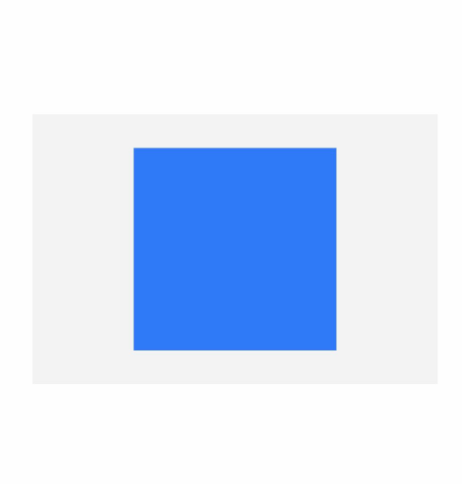

# Custom Property Animation


The property animation is an illusion of movement created on the UI when the value of an animatable property changes over time. It is implemented by setting continuous value changes of a property to the property API that can cause the UI re-render.


ArkUI provides the [@AnimatableExtend](../quick-start/arkts-animatable-extend.md) decorator for customizing animatable property APIs. Since the data type of the parameters must have a certain degree of continuity, the parameter types for custom animatable property APIs only support the number type and custom types that implement the [AnimatableArithmetic\<T>](../quick-start/arkts-animatable-extend.md#animatablearithmetict) API. With custom animatable property APIs and animatable data types, you can achieve animation effects on non-animatable property APIs by modifying their values through a per-frame callback function when using **animateTo** or **animation**. Additionally, you can implement frame-by-frame layout effects by modifying the values of animatable properties in the per-frame callback function.


## Implementing Frame-by-Frame Layout Effects for Text Component Width Using the number Data Type and @AnimatableExtend Decorator


```ts
// Step 1: Use the @AnimatableExtend decorator to customize an animatable property API.
@AnimatableExtend(Text)
function animatableWidth(width: number) {
  .width(width) // Call the system property API to modify the property value on a frame-by-frame basis.
}

@Entry
@Component
struct AnimatablePropertyExample {
  @State textWidth: number = 80;

  build() {
    Column() {
      Text("AnimatableProperty")
        .animatableWidth(this.textWidth)// Step 2: Set the custom animatable property API on the component.
        .animation({ duration: 2000, curve: Curve.Ease }) // Step 3: Bind an animation to the custom animatable property.
      Button("Play")
        .onClick(() => {
          this.textWidth = this.textWidth == 80 ? 160 : 80; // Step 4: Change the parameters of the custom animatable property to create an animation.
        })
    }.width("100%")
    .padding(10)
  }
}
```


## Changing Graphic Shapes Using Custom Data Types and \@AnimatableExtend Decorator


```ts
declare type Point = number[];

// Define the parameter type of the animatable property API and implement the addition, subtraction, multiplication, and equivalence judgment functions in the AnimatableArithmetic<T> API.
class PointClass extends Array<number> {
  constructor(value: Point) {
    super(value[0], value[1])
  }

  add(rhs: PointClass): PointClass {
    let result: Point = new Array<number>() as Point;
    for (let i = 0; i < 2; i++) {
      result.push(rhs[i] + this[i])
    }
    return new PointClass(result);
  }

  subtract(rhs: PointClass): PointClass {
    let result: Point = new Array<number>() as Point;
    for (let i = 0; i < 2; i++) {
      result.push(this[i] - rhs[i]);
    }
    return new PointClass(result);
  }

  multiply(scale: number): PointClass {
    let result: Point = new Array<number>() as Point;
    for (let i = 0; i < 2; i++) {
      result.push(this[i] * scale)
    }
    return new PointClass(result);
  }
}

// Define the parameter type of the animatable property API and implement the addition, subtraction, multiplication, and equivalence judgment functions in the AnimatableArithmetic<T> API.
// Template T supports nested implementation of the AnimatableArithmetic<T> type.
class PointVector extends Array<PointClass> implements AnimatableArithmetic<Array<Point>> {
  constructor(initialValue: Array<Point>) {
    super();
    if (initialValue.length) {
      initialValue.forEach((p: Point) => this.push(new PointClass(p)))
    }
  }

  // implement the IAnimatableArithmetic interface
  plus(rhs: PointVector): PointVector {
    let result = new PointVector([]);
    const len = Math.min(this.length, rhs.length)
    for (let i = 0; i < len; i++) {
      result.push(this[i].add(rhs[i]))
    }
    return result;
  }

  subtract(rhs: PointVector): PointVector {
    let result = new PointVector([]);
    const len = Math.min(this.length, rhs.length)
    for (let i = 0; i < len; i++) {
      result.push(this[i].subtract(rhs[i]))
    }
    return result;
  }

  multiply(scale: number): PointVector {
    let result = new PointVector([]);
    for (let i = 0; i < this.length; i++) {
      result.push(this[i].multiply(scale))
    }
    return result;
  }

  equals(rhs: PointVector): boolean {
    if (this.length !== rhs.length) {
      return false;
    }
    for (let index = 0, size = this.length; index < size; ++index) {
      if (this[index][0] !== rhs[index][0] || this[index][1] !== rhs[index][1]) {
        return false;
      }
    }
    return true;
  }
}

// Define a custom animatable property API.
@AnimatableExtend(Polyline)
function animatablePoints(points: PointVector) {
  .points(points)
}

@Entry
@Component
struct AnimatedShape {
  squareStartPointX: number = 75;
  squareStartPointY: number = 25;
  squareWidth: number = 150;
  squareEndTranslateX: number = 50;
  squareEndTranslateY: number = 50;
  @State pointVec1: PointVector = new PointVector([
    [this.squareStartPointX, this.squareStartPointY],
    [this.squareStartPointX + this.squareWidth, this.squareStartPointY],
    [this.squareStartPointX + this.squareWidth, this.squareStartPointY + this.squareWidth],
    [this.squareStartPointX, this.squareStartPointY + this.squareWidth]
  ]);
  @State pointVec2: PointVector = new PointVector([
    [this.squareStartPointX + this.squareEndTranslateX, this.squareStartPointY + this.squareStartPointY],
    [this.squareStartPointX + this.squareWidth + this.squareEndTranslateX,
      this.squareStartPointY + this.squareStartPointY],
    [this.squareStartPointX + this.squareWidth, this.squareStartPointY + this.squareWidth],
    [this.squareStartPointX, this.squareStartPointY + this.squareWidth]
  ]);
  @State color: Color = Color.Green;
  @State fontSize: number = 20.0;
  @State polyline1Vec: PointVector = this.pointVec1;
  @State polyline2Vec: PointVector = this.pointVec2;

  build() {
    Row() {
      Polyline()
        .width(300)
        .height(200)
        .backgroundColor("#0C000000")
        .fill('#317AF7')
        .animatablePoints(this.polyline1Vec)
        .animation({ duration: 2000, delay: 0, curve: Curve.Ease })
        .onClick(() => {

          if (this.polyline1Vec.equals(this.pointVec1)) {
            this.polyline1Vec = this.pointVec2;
          } else {
            this.polyline1Vec = this.pointVec1;
          }
        })
    }
    .width('100%').height('100%').justifyContent(FlexAlign.Center)
  }
}
```



