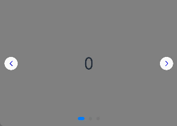
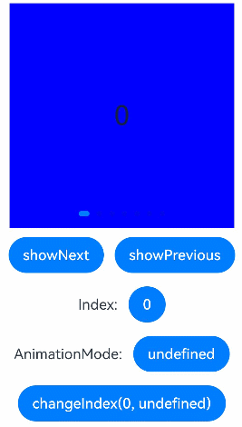
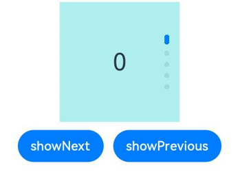
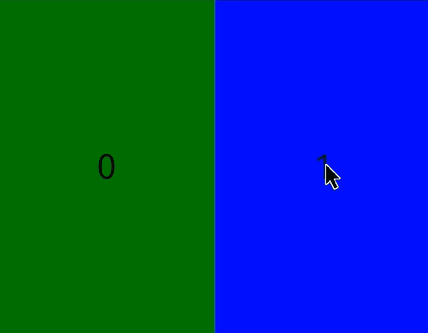

# Creating a Swiper (Swiper)


The [Swiper](../reference/apis-arkui/arkui-ts/ts-container-swiper.md) component is a container that is able to display child components in looping mode. It is typically used in scenarios such as display of recommended content on the home page.

The **Swiper** component provides a preloading mechanism, which you can use to improve the swipe experience in complex scenarios. This mechanism allows for prebuilding and prerendering components when the main thread is idle. <!--Del-->For details, see [High-Performance Swiper Development](../performance/swiper_optimization.md).<!--DelEnd-->


## Layout and Constraints

The **Swiper** component follows its own size settings if they are configured. If the component does not have its own size settings configured, it follows the size of its parent component when the **prevMargin** or **nextMargin** attribute is set, or adapts its size to its child components otherwise.


## Loop Playback

The **loop** attribute sets whether to enable loop playback. Its default value is **true**.

When **loop** is set to **true**, the user can switch to the previous or next page when they are on the first or last page.  

- Example of setting **loop** to **true**:

```ts
Swiper() {
  Text('0')
    .width('90%')
    .height('100%')
    .backgroundColor(Color.Gray)
    .textAlign(TextAlign.Center)
    .fontSize(30)

  Text('1')
    .width('90%')
    .height('100%')
    .backgroundColor(Color.Green)
    .textAlign(TextAlign.Center)
    .fontSize(30)

  Text('2')
    .width('90%')
    .height('100%')
    .backgroundColor(Color.Pink)
    .textAlign(TextAlign.Center)
    .fontSize(30)
}
.loop(true)
```


- Example of setting **loop** to **false**:

```ts
Swiper() {
  // ...
}
.loop(false)
```


## Automatic Playback

The **autoPlay** attribute sets whether to enable automatic playback for child component switching. Its default value is **false**.

When **autoPlay** is set to **true**, automatic playback is enabled for child component switching. The playback interval is specified by the **interval** attribute, which is **3000** by default, in milliseconds.

```ts
Swiper() {
  // ...
}
.loop(true)
.autoPlay(true)
.interval(1000)
```


## Navigation Indicator

The **Swiper** component comes with default indicator and arrow styles, with the indicators centered at the bottom and arrows hidden.

With the **indicator** attribute, you can set the position of the indicator relative to the edges of the **Swiper** component, in addition to the size, color, and mask of each indicator as well as the color of the selected indicator.

- Example of using the navigation indicator in its default style:

```ts
Swiper() {
  Text('0')
    .width('90%')
    .height('100%')
    .backgroundColor(Color.Gray)
    .textAlign(TextAlign.Center)
    .fontSize(30)

  Text('1')
    .width('90%')
    .height('100%')
    .backgroundColor(Color.Green)
    .textAlign(TextAlign.Center)
    .fontSize(30)

  Text('2')
    .width('90%')
    .height('100%')
    .backgroundColor(Color.Pink)
    .textAlign(TextAlign.Center)
    .fontSize(30)
}
```


- Example of customizing the style of the navigation indicator, with the diameter of 30 vp, left margin of 0, and color of red:

 

```ts
Swiper() {
  // ...
}
.indicator(
  Indicator.dot()
    .left(0)
    .itemWidth(15)
    .itemHeight(15)
    .selectedItemWidth(30)
    .selectedItemHeight(15)
    .color(Color.Red)
    .selectedColor(Color.Blue)
)
```


You can set the [displayArrow](../reference/apis-arkui/arkui-ts/ts-container-swiper.md#displayarrow10) attribute of **Swiper** to control the size, position, color, and background of navigation point arrows, and whether to display arrows on mouse hover.

- Example of using the navigation point arrows in the default style:

```ts
Swiper() {
  // ...
}
.displayArrow(true, false)
```


- Example of customizing the style of navigation point arrows:

In this example, the arrows are displayed on both sides of the component, with a size of 18 vp and a color of blue.

```ts
Swiper() {
  // ...
}
.displayArrow({ 
  showBackground: true,
  isSidebarMiddle: true,
  backgroundSize: 24,
  backgroundColor: Color.White,
  arrowSize: 18,
  arrowColor: Color.Blue
  }, false)
```



## Page Switching Mode

The **Swiper** component supports three page switching modes: swiping with fingers, touching navigation points, and using a controller. The following example shows how to switch between pages using a controller.

```ts
@Entry
@Component
struct SwiperDemo {
  private swiperBackgroundColors: Color[] = [Color.Blue, Color.Brown, Color.Gray, Color.Green, Color.Orange,
    Color.Pink, Color.Red, Color.Yellow];
  private swiperAnimationMode: (SwiperAnimationMode | boolean | undefined)[] = [undefined, true, false,
    SwiperAnimationMode.NO_ANIMATION, SwiperAnimationMode.DEFAULT_ANIMATION, SwiperAnimationMode.FAST_ANIMATION];
  private swiperController: SwiperController = new SwiperController();
  private animationModeIndex: number = 0;
  private animationMode: (SwiperAnimationMode | boolean | undefined) = undefined;
  @State animationModeStr: string = 'undefined';
  @State targetIndex: number = 0;

  aboutToAppear(): void {
    this.toSwiperAnimationModeStr();
  }

  build() {
    Column({ space: 5 }) {
      Swiper(this.swiperController) {
        ForEach(this.swiperBackgroundColors, (backgroundColor: Color, index: number) => {
          Text(index.toString())
            .width(250)
            .height(250)
            .backgroundColor(backgroundColor)
            .textAlign(TextAlign.Center)
            .fontSize(30)
        })
      }
      .indicator(true)

      Row({ space: 12 }) {
        Button('showNext')
          .onClick(() => {
            this.swiperController.showNext(); // Switch to the next page using the controller.
          })
        Button('showPrevious')
          .onClick(() => {
            this.swiperController.showPrevious(); // Switch to the previous page using the controller.
          })
      }.margin(5)

      Row({ space: 12 }) {
        Text('Index:')
        Button(this.targetIndex.toString())
          .onClick(() => {
            this.targetIndex = (this.targetIndex + 1) % this.swiperBackgroundColors.length;
          })
      }.margin(5)
      Row({ space: 12 }) {
        Text('AnimationMode:')
        Button(this.animationModeStr)
          .onClick(() => {
            this.animationModeIndex = (this.animationModeIndex + 1) % this.swiperAnimationMode.length;
            this.toSwiperAnimationModeStr();
          })
      }.margin(5)

      Row({ space: 12 }) {
        Button('changeIndex(' + this.targetIndex + ', ' + this.animationModeStr + ')')
          .onClick(() => {
            this.swiperController.changeIndex(this.targetIndex, this.animationMode); // Switch to the specified page using the controller.
          })
      }.margin(5)
    }.width('100%')
    .margin({ top: 5 })
  }

  private toSwiperAnimationModeStr() {
    this.animationMode = this.swiperAnimationMode[this.animationModeIndex];
    if ((this.animationMode === true) || (this.animationMode === false)) {
      this.animationModeStr = '' + this.animationMode;
    } else if ((this.animationMode === SwiperAnimationMode.NO_ANIMATION) ||
      (this.animationMode === SwiperAnimationMode.DEFAULT_ANIMATION) ||
      (this.animationMode === SwiperAnimationMode.FAST_ANIMATION)) {
      this.animationModeStr = SwiperAnimationMode[this.animationMode];
    } else {
      this.animationModeStr = 'undefined';
    }
  }
}
```




## Playback Direction

You can set the playback direction for the Swiper component through its **vertical** attribute.

When **vertical** is set to **true**, vertical swiping is used. The default value of **vertical** is **false**.


- Example of using horizontal swiping:

```ts
Swiper() {
  // ...
}
.indicator(true)
.vertical(false)
```


- Example of using vertical swiping:

```ts
Swiper() {
  // ...
}
.indicator(true)
.vertical(true)
```





## Child Components Per Page

You can set the number of child components per page for the **Swiper** component through its [displayCount](../reference/apis-arkui/arkui-ts/ts-container-swiper.md#displaycount8) attribute.

```ts
Swiper() {
  Text('0')
    .width(250)
    .height(250)
    .backgroundColor(Color.Gray)
    .textAlign(TextAlign.Center)
    .fontSize(30)
  Text('1')
    .width(250)
    .height(250)
    .backgroundColor(Color.Green)
    .textAlign(TextAlign.Center)
    .fontSize(30)
  Text('2')
    .width(250)
    .height(250)
    .backgroundColor(Color.Pink)
    .textAlign(TextAlign.Center)
    .fontSize(30)
  Text('3')
    .width(250)
    .height(250)
    .backgroundColor(Color.Blue)
    .textAlign(TextAlign.Center)
    .fontSize(30)
}
.indicator(true)
.displayCount(2)
```


## Customizing Transition Animation

Use the [customContentTransition](../reference/apis-arkui/arkui-ts/ts-container-swiper.md#customcontenttransition12) attribute to set a custom transition animation for **Swiper**. Define the animation by adjusting opacity, scale, translation, and rendering layer for all pages within the viewport frame by frame in the callback.

```ts
@Entry
@Component
struct SwiperCustomAnimationExample {
  private DISPLAY_COUNT: number = 2
  private MIN_SCALE: number = 0.75

  @State backgroundColors: Color[] = [Color.Green, Color.Blue, Color.Yellow, Color.Pink, Color.Gray, Color.Orange]
  @State opacityList: number[] = []
  @State scaleList: number[] = []
  @State translateList: number[] = []
  @State zIndexList: number[] = []

  aboutToAppear(): void {
    for (let i = 0; i < this.backgroundColors.length; i++) {
      this.opacityList.push(1.0)
      this.scaleList.push(1.0)
      this.translateList.push(0.0)
      this.zIndexList.push(0)
    }
  }

  build() {
    Column() {
      Swiper() {
        ForEach(this.backgroundColors, (backgroundColor: Color, index: number) => {
          Text(index.toString()).width('100%').height('100%').fontSize(50).textAlign(TextAlign.Center)
            .backgroundColor(backgroundColor)
            .opacity(this.opacityList[index])
            .scale({ x: this.scaleList[index], y: this.scaleList[index] })
            .translate({ x: this.translateList[index] })
            .zIndex(this.zIndexList[index])
        })
      }
      .height(300)
      .indicator(false)
      .displayCount(this.DISPLAY_COUNT, true)
      .customContentTransition({
        timeout: 1000,
        transition: (proxy: SwiperContentTransitionProxy) => {
          if (proxy.position <= proxy.index % this.DISPLAY_COUNT || proxy.position >= this.DISPLAY_COUNT + proxy.index % this.DISPLAY_COUNT) {
            // When a group of pages is completely scrolled out of the viewport, reset the attribute values.
            this.opacityList[proxy.index] = 1.0
            this.scaleList[proxy.index] = 1.0
            this.translateList[proxy.index] = 0.0
            this.zIndexList[proxy.index] = 0
          } else {
            // When a group of pages is not scrolled out of the viewport, adjust the attribute values frame by frame for the left and right pages in the group based on the position.
            if (proxy.index % this.DISPLAY_COUNT === 0) {
              this.opacityList[proxy.index] = 1 - proxy.position / this.DISPLAY_COUNT
              this.scaleList[proxy.index] = this.MIN_SCALE + (1 - this.MIN_SCALE) * (1 - proxy.position / this.DISPLAY_COUNT)
              this.translateList[proxy.index] = - proxy.position * proxy.mainAxisLength + (1 - this.scaleList[proxy.index]) * proxy.mainAxisLength / 2.0
            } else {
              this.opacityList[proxy.index] = 1 - (proxy.position - 1) / this.DISPLAY_COUNT
              this.scaleList[proxy.index] = this.MIN_SCALE + (1 - this.MIN_SCALE) * (1 - (proxy.position - 1) / this.DISPLAY_COUNT)
              this.translateList[proxy.index] = - (proxy.position - 1) * proxy.mainAxisLength - (1 - this.scaleList[proxy.index]) * proxy.mainAxisLength / 2.0
            }
            this.zIndexList[proxy.index] = -1
          }
        }
      })
    }.width('100%')
  }
}
```


