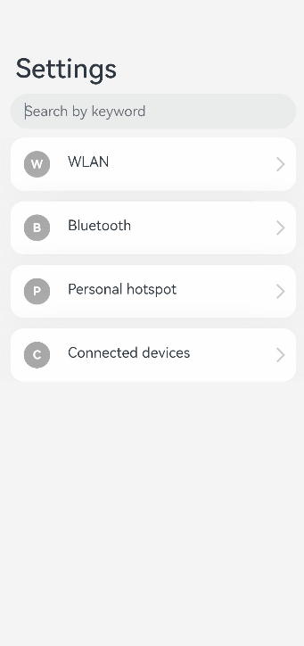

# Navigation Transition


Navigation transition is a transition animation that runs during the navigation from one view to another. You can customize the animation settings of the navigation transition. For details, see [Navigation Example 3](../reference/apis-arkui/arkui-ts/ts-basic-components-navigation.md#example-3).


To implement the navigation transition, you are advised to use the [\<Navigation>](../reference/apis-arkui/arkui-ts/ts-basic-components-navigation.md) component, complete with the [\<NavDestination>](../reference/apis-arkui/arkui-ts/ts-basic-components-navdestination.md) component.


Below is the complete sample code and effect.

## Creating a Navigation Page
To create a navigation page:

1. Use **Navigation** to create a navigation home page and create a **NavPathStack** as the navigation stack to enable transitions between different pages.

2. Add a **List** component to **Navigation** to define the different level-1 pages on the navigation home page.

3. Add an **onClick** method to the component inside the **List**, and use the **pushPathByName** method of the **NavPathStack** within it. This allows the component to transition from the current page to the page corresponding to the input parameter **name** in the routing table upon click.
```ts
//PageOne.ets
@Entry
@Component
struct NavigationDemo {
  @Provide('pathInfos') pathInfos: NavPathStack = new NavPathStack();
  private listArray: Array<string> = ['WLAN', 'Bluetooth', 'Personal Hotpot', 'Connect & Share'];

  build() {
    Column() {
      Navigation(this.pathInfos) {
        TextInput({ placeholder: 'Search by keyword' })
          .width('90%')
          .height(40)
          .margin({ bottom: 10 })

        // Define the level-1 navigation view through List.
        List({ space: 12, initialIndex: 0 }) {
          ForEach(this.listArray, (item: string) => {
            ListItem() {
              Row() {
                Row() {
                  Text(`${item.slice(0, 1)}`)
                    .fontColor(Color.White)
                    .fontSize(14)
                    .fontWeight(FontWeight.Bold)
                }
                .width(30)
                .height(30)
                .backgroundColor('#a8a8a8')
                .margin({ right: 20 })
                .borderRadius(20)
                .justifyContent(FlexAlign.Center)

                Column() {
                  Text(item)
                    .fontSize(16)
                    .margin({ bottom: 5 })
                }
                .alignItems(HorizontalAlign.Start)

                Blank()

                Row()
                  .width(12)
                  .height(12)
                  .margin({ right: 15 })
                  .border({
                    width: { top: 2, right: 2 },
                    color: 0xcccccc
                  })
                  .rotate({ angle: 45 })
              }
              .borderRadius(15)
              .shadow({ radius: 100, color: '#ededed' })
              .width('90%')
              .alignItems(VerticalAlign.Center)
              .padding({ left: 15, top: 15, bottom: 15 })
              .backgroundColor(Color.White)
            }
            .width('100%')
            .onClick(() => {
              this.pathInfos.pushPathByName(`${item}`, 'Details page parameters')// Push the navigation destination page specified by name, with the data specified by param, to the navigation stack.
            })
          }, (item: string): string => item)
        }
        .listDirection(Axis.Vertical)
        .edgeEffect(EdgeEffect.Spring)
        .sticky(StickyStyle.Header)
        .chainAnimation(false)
        .width('100%')
      }
      .width('100%')
      .mode(NavigationMode.Auto)
      .title('Settings') // Set the title text.
    }
    .size({ width: '100%', height: '100%' })
    .backgroundColor(0xf4f4f5)
  }
}
```
## Creating a Navigation Subpage
Create navigation subpage 1 as follows:

1. Use **NavDestination** to create a navigation subpage **CommonPage**.

2. Create a navigation stack **NavPathStack** and initialize it in **onReady** to obtain the current page stack to enable transitions between different pages.

3. Add an **onClick** method to the components within the subpage and use the **pop** method of the **NavPathStack** to pop the top element of the stack and return to the previous page upon click.
```ts
//PageOne.ets

@Builder
export function MyCommonPageBuilder(name: string, param: string) {
  MyCommonPage({ name: name, value: param })
}

@Component
export struct MyCommonPage {
  pathInfos: NavPathStack = new NavPathStack();
  name: String = '';
  @State value: String = '';

  build() {
    NavDestination() {
      Column() {
        Text(`${this.name} settings`)
          .width('100%')
          .fontSize(20)
          .fontColor(0x333333)
          .textAlign(TextAlign.Center)
          .textShadow({
            radius: 2,
            offsetX: 4,
            offsetY: 4,
            color: 0x909399
          })
          .padding({ top: 30 })
        Text(`${JSON.stringify(this.value)}`)
          .width('100%')
          .fontSize(18)
          .fontColor(0x666666)
          .textAlign(TextAlign.Center)
          .padding({ top: 45 })
        Button ('Back')
          .width('50%')
          .height(40)
          .margin({ top: 50 })
          .onClick(() => {
            // Pop the top element of the stack and return to the previous page.
            this.pathInfos.pop();
          })
      }
      .size({ width: '100%', height: '100%' })
    }.title(`${this.name}`)
    .onReady((ctx: NavDestinationContext) => {
      // NavDestinationContext obtains the current page stack.
      this.pathInfos = ctx.pathStack;
    }) 

  }
}


```
Create navigation subpage 2 as follows:

1. Use **NavDestination** to create a navigation subpage **SharePage**.

2. Create a navigation stack **NavPathStack** and initialize it in **onReady** to obtain the current page stack to enable transitions between different pages.

3. Add an **onClick** method to a component inside the subpage and use the **pushPathByName** method of the **NavPathStack**. This allows the component to transition from the current page to the page corresponding to the input parameter **name** in the routing table upon click.
```ts
//PageTwo.ets
@Builder
export function MySharePageBuilder(name: string, param: string) {
  MySharePage({ name: name })
}

@Component
export struct MySharePage {
  pathInfos: NavPathStack = new NavPathStack();
  name: String = '';
  private listArray: Array<string> = ['Projection', 'Print', 'VPN', 'Private DNS', 'NFC'];

  build() {
    NavDestination() {
      Column() {
        List({ space: 12, initialIndex: 0 }) {
          ForEach(this.listArray, (item: string) => {
            ListItem() {
              Row() {
                Row() {
                  Text(`${item.slice(0, 1)}`)
                    .fontColor(Color.White)
                    .fontSize(14)
                    .fontWeight(FontWeight.Bold)
                }
                .width(30)
                .height(30)
                .backgroundColor('#a8a8a8')
                .margin({ right: 20 })
                .borderRadius(20)
                .justifyContent(FlexAlign.Center)

                Column() {
                  Text(item)
                    .fontSize(16)
                    .margin({ bottom: 5 })
                }
                .alignItems(HorizontalAlign.Start)

                Blank()

                Row()
                  .width(12)
                  .height(12)
                  .margin({ right: 15 })
                  .border({
                    width: { top: 2, right: 2 },
                    color: 0xcccccc
                  })
                  .rotate({ angle: 45 })
              }
              .borderRadius(15)
              .shadow({ radius: 100, color: '#ededed' })
              .width('90%')
              .alignItems(VerticalAlign.Center)
              .padding({ left: 15, top: 15, bottom: 15 })
              .backgroundColor(Color.White)
            }
            .width('100%')
            .onClick(() => {
              this.pathInfos.pushPathByName(`${item}`, 'Parameters')
            })
          }, (item: string): string => item)
        }
        .listDirection(Axis.Vertical)
        .edgeEffect(EdgeEffect.Spring)
        .sticky(StickyStyle.Header)
        .width('100%')
      }
      .size({ width: '100%', height: '100%' })
    }.title(`${this.name}`)
    .onReady((ctx: NavDestinationContext) => {
      // NavDestinationContext obtains the current page stack.
      this.pathInfos = ctx.pathStack;
    }) 
  }
}
```
## Creating Route Navigation
To create route navigation:

1. In the project configuration file **module.json5**, add the configuration **{"routerMap": "$profile:route_map"}**.

2. In the **route_map.json** file, define the global routing table. The navigation stack **NavPathStack** can push the corresponding page information onto the stack based on the name in the routing table.
```ts
{
  "routerMap" : [
    {
      "name" : "WLAN",
      "pageSourceFile"  : "src/main/ets/pages/PageOne.ets",
      "buildFunction" : "MyCommonPageBuilder"
    },
    {
      "name" : "Bluetooth",
      "pageSourceFile"  : "src/main/ets/pages/PageOne.ets",
      "buildFunction" : "MyCommonPageBuilder"
    },
    {
      "name" : "Personal Hotpot",
      "pageSourceFile"  : "src/main/ets/pages/PageOne.ets",
      "buildFunction" : "MyCommonPageBuilder"
    },
    {
      "name" : "Connect & Share",
      "pageSourceFile"  : "src/main/ets/pages/PageTwo.ets",
      "buildFunction" : "MySharePageBuilder"
    },
    {
      "name" : "Projection",
      "pageSourceFile"  : "src/main/ets/pages/PageOne.ets",
      "buildFunction" : "MyCommonPageBuilder"
    },
    {
      "name" : "Print",
      "pageSourceFile"  : "src/main/ets/pages/PageOne.ets",
      "buildFunction" : "MyCommonPageBuilder"
    },
    {
      "name" : "VPN",
      "pageSourceFile"  : "src/main/ets/pages/PageOne.ets",
      "buildFunction" : "MyCommonPageBuilder"
    },
    {
      "name" : "Private DNS",
      "pageSourceFile"  : "src/main/ets/pages/PageOne.ets",
      "buildFunction" : "MyCommonPageBuilder"
    },
    {
      "name" : "NFC",
      "pageSourceFile"  : "src/main/ets/pages/PageOne.ets",
      "buildFunction" : "MyCommonPageBuilder"
    }
  ]
}
```


