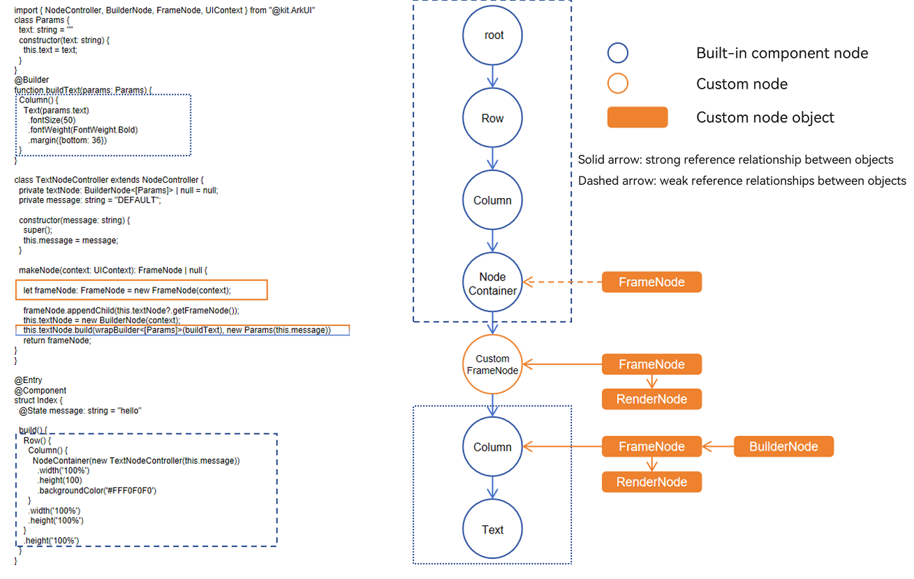

# Custom Node Overview

Custom nodes in the ArkUI framework are node objects that provide basic capabilities of underlying entity nodes through APIs, and can be mixed and displayed with built-in components. The attachment and display of custom nodes depend on [custom placeholder nodes](./arkts-user-defined-place-hoder.md). There are three types of custom nodes: [FrameNode](../reference/apis-arkui/js-apis-arkui-frameNode.md), [RenderNode](../reference/apis-arkui/js-apis-arkui-renderNode.md), and [BuilderNode](../reference/apis-arkui/js-apis-arkui-builderNode.md). The FrameNode represents a single custom component node, the RenderNode represents a streamlined render node, and the BuilderNode provides the capability to create and update built-in components and component trees.

## Basic Concepts

- [Built-in component](arkts-ui-development-overview.md): component provided directly by ArkUI. Components are essential elements of the UI, working together to shape the UI.

- Entity node: native node created by the backend.

## Custom Placeholder Nodes
Custom placeholder nodes, acting as built-in components, provide anchor points for custom nodes in the built-in component tree, thereby allowing for a mixed display of custom nodes and built-in components.

## Custom Component Node (FrameNode)

FrameNode represents the entity node of a component, with two main capabilities:

- Fully custom node: offers full customization, including custom measurement, layout, and rendering, with support for dynamically adding and removing nodes, setting universal attributes, and configuring event callbacks. It is suitable for scenarios where there is no built-in rendering engine and reliance on the system's layout, event, animation, rendering, and other capabilities is needed.

- Built-in component proxy node: provides proxy capabilities for built-in components, enabling traversal of the node tree. By using FrameNodes within the component tree, you can navigate the entire tree and access component information or register additional event listeners. This is useful for combining seamless listening APIs to implement services such as tracking, advertising SDKs, and mid-end DFX.

## Custom Render Node (RenderNode)
The RenderNode, as a lightweight rendering node, only provides capabilities for setting rendering-related properties, custom drawing content, and node operations. It is suitable for custom scenarios that rely solely on the system's rendering and animation capabilities.

## Custom Declarative Node (BuilderNode)
The BuilderNode uses a stateless UI method, the [global custom builder function](../quick-start/arkts-builder.md#global-custom-builder-function), which is decorated by @Builder, to generate a component tree where the nodes are built-in components. It is suitable for scenarios where a specific built-in component tree needs to be created based on the system capabilities for a mixed display with other custom nodes. Compared to built-in components, the BuilderNode offers the advantage of pre-creation and enables the control over the initiation of the creation process. Because it holds the actual node objects, the BuilderNode facilitates the synchronous reuse of nodes, and by combining with placeholder nodes, it can leverage FrameNodes and RenderNodes for display positioning.
