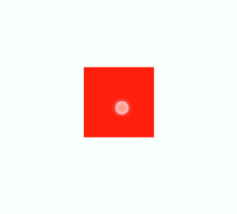

# Component Animation


Create and run an animation shortcut on the component. For details, see [Universal Methods](../reference/arkui-js/js-components-common-methods.md).


## Obtaining an Animation Object

Call the **animate** method to obtain an animation object, which supports animation attributes, methods, and events.

```html
<!-- xxx.hml -->
<div class="container">
  <div id="content" class="box" onclick="Show"></div>
</div>
```

```css
/* xxx.css */
.container {
  flex-direction: column;
  justify-content: center;
  align-items: center;
  width: 100%;
}
.box{
  width: 200px;
  height: 200px;
  background-color: #ff0000;
  margin-top: 30px;
}
```

```js
/* xxx.js */
export default {
    data: {
        animation: '',
        options: {},
        frames: {}
    },
    onInit() {
        this.options = {
            duration: 1500,
        };
        this.frames = [
            {
                width: 200, height: 200,
            },
            {
                width: 300, height: 300,
            }
        ];
    },
    Show() {
        this.animation = this.$element('content').animate(this.frames, this.options); // Obtain the animation object.
        this.animation.play();
    }
}
```



> **NOTE**
> - When using the animate method, you must pass the keyframes and options parameters.
> - If animate is called multiple times and the replace policy is used, parameters passed to the last call will take effect.


## Setting Animation Parameters

After obtaining an animation object, you can set its style working on the component by using the keyframes parameter.

```html
<!-- xxx.hml -->
<div class="container">
   <div id="content" class="box" onclick="Show"></div>
</div>
```

```css
/* xxx.css */
.container {
  flex-direction: column;
  justify-content: center;
  align-items: center;
  width: 100%;
  height: 100%;
}
.box{
  width: 200px;
  height: 200px;
  background-color: #ff0000;
  margin-top: 30px;
}
```

```js
/* xxx.js */
export default {
  data: {
    animation: '',
    keyframes:{},
    options:{}
  },
  onInit() {
    this.options = {
      duration: 4000,
    }
    this.keyframes = [
    {
      transform: {
        translate: '-120px -0px',   
        scale: 1,        
        rotate: 0
        },   
        transformOrigin: '100px 100px',  
        offset: 0.0, 
        width: 200,  
        height: 200   
      }, 
      {
        transform: {      
          translate: '120px 0px',     
          scale: 1.5,     
          rotate: 90   
          },
          transformOrigin: '100px 100px',
          offset: 1.0,
          width: 300,
          height: 300   
      }    
    ]
  },
  Show() {
    this.animation = this.$element('content').animate(this.keyframes, this.options)
    this.animation.play()
  }
}
```


> **NOTE**
> - The sequence of **translate**, **scale**, and **rotate** affects the animation effect.
> 
> - **transformOrigin** works only for scale and rotate.

Set the animation attributes by using the **options** parameter.

```html
<!-- xxx.hml -->
<div class="container">
   <div id="content" class="box" onclick="Show"></div>
</div>
```

```css
/* xxx.css */
.container {
  flex-direction: column;
  justify-content: center;
  align-items: center;
  width: 100%;
}
.box{
  width: 200px;
  height: 200px;
  background-color: #ff0000;
  margin-top: 30px;
}
```

```js
/* xxx.js */
export default {
    data: {
        animation: '',
        options: {},
        frames: {}
    },
    onInit() {
        this.options = {
            duration: 1500,
            easing: 'ease-in',
            delay: 5,
            iterations: 2,
            direction: 'normal',
        };
        this.frames = [
            {
                transform: {
                    translate: '-150px -0px'
                }
            },
            {
                transform: {
                    translate: '150px 0px'
                }
            }
        ];
    },
    Show() {
        this.animation = this.$element('content').animate(this.frames, this.options);
        this.animation.play();
    }
}
```


> **NOTE**
>
> **direction**: mode of playing the animation.
>
> **normal**: plays the animation in forward loop mode.
>
> **reverse**: plays the animation in reverse loop mode.
>
> **alternate**: plays the animation in alternating loop mode. When the animation is played for an odd number of times, the playback is in forward direction. When the animation is played for an even number of times, the playback is in reverse direction.
>
> **alternate-reverse**: plays the animation in reverse alternating loop mode. When the animation is played for an odd number of times, the playback is in reverse direction. When the animation is played for an even number of times, the playback is in forward direction.


