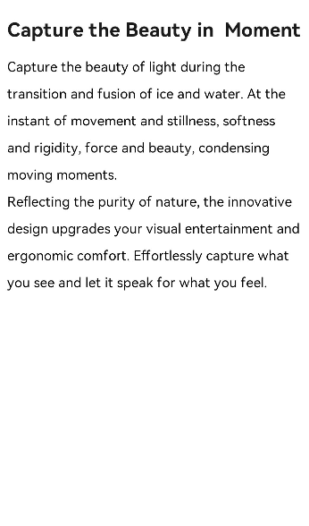

# Adding Title and Paragraph Text

The **Text** component is most commonly used to display text in title and paragraph areas. You can set attributes and styles for a **Text** component and add the text to be displayed between the **Text** and **\</text>** tags. For details about the attributes and styles, see [text](../reference/apis-arkui/arkui-js/js-components-basic-text.md). The following is an example of adding title and paragraph text on a page:


```html
<!-- xxx.hml -->
<div class="container">
  <text class="title-text">{{headTitle}}</text>
  <text class="paragraph-text">{{paragraphFirst}}</text>
  <text class="paragraph-text">{{paragraphSecond}}</text>
</div>
```


```css
/* xxx.css */
.container {
  flex-direction: column;
  margin-top: 20px;
  margin-left: 30px;
}
.title-text {
  color: #1a1a1a;
  font-size: 50px;
  margin-top: 40px;
  margin-bottom: 20px;
  font-weight: 700;
}
.paragraph-text {
  width: 95%;
  color: #000000;
  font-size: 35px;
  line-height: 60px;
}
```


```js
// xxx.js
export default {
  data: {
    headTitle: 'Capture the Beauty in Moment',
    paragraphFirst: 'Capture the beauty of light during the transition and fusion of ice and water. At the instant of movement and stillness, softness and rigidity, force and beauty, condensing moving moments.',
    paragraphSecond: 'Reflecting the purity of nature, the innovative design upgrades your visual entertainment and ergonomic comfort. Effortlessly capture what you see and let it speak for what you feel.',
  },
}
```

  
