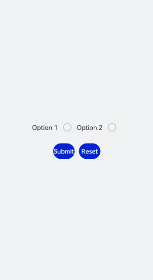

# \<form> Development

The **\<form>** component allows the content in [\<Input>](../reference/apis-arkui/arkui-js/js-components-basic-input.md) components to be submitted and reset. For details, see [form](../reference/apis-arkui/arkui-js/js-components-container-form.md).

## Creating a \<form> Component

Create a **\<form>** component in the .hml file under **pages/index**.
```html
<!-- xxx.hml -->
<div class="container">
  <form style="width: 100%; height: 20%">  
    <input type="text" style="width:80%"></input>
  </form>
</div>
```

```css
/* xxx.css */
.container {
  width:100%;
  height:100%;
  flex-direction: column;
  justify-content: center;
  align-items: center;
  background-color: #F1F3F5;
}
```


## Zooming In or Out on a Form

To implement the zoom effect after a form is clicked, add the **click-effect** attribute to the **\<form>** component. For values of **click-effect**, see [Universal Attributes](../reference/apis-arkui/arkui-js/js-components-common-attributes.md).
```html
<!-- xxx.hml -->
<div class="container">
  <form  id="formId" class="formClass" click-effect="spring-large">
    <input type="text"></input>  
  </form>
</div>
```


## Setting the Form Style


Add the **background-color** and **border** attributes.


```css
/* xxx.css */
.container {
  width: 100%;
  height: 100%;
  flex-direction: column;
  align-items: center;
  justify-content: center;
  background-color: #F1F3F5;
}
.formClass{
  width: 80%;
  height: 100px;
  padding: 10px;
  border: 1px solid #cccccc;
}
```


## Adding Response Events

To submit or reset a form, add the **submit** and **reset** events.

```html
<!-- xxx.hml -->
<div class="container">
  <form onsubmit='onSubmit' onreset='onReset' class="form">
    <div style="width: 100%;justify-content: center;">
      <label>Option 1</label>
      <input type='radio' name='radioGroup' value='radio1'></input>
      <label>Option 2</label>
      <input type='radio' name='radioGroup' value='radio2'></input>
    </div>
    <div style="width: 100%;justify-content: center; margin-top: 20px">
      <input type="submit" value="Submit" style="width:120px; margin-right:20px;" >   
      </input>
      <input type="reset" value="Reset" style="width:120px;"></input>
    </div>
  </form>
</div>
```

```css
/* index.css */
.container{
  width: 100%;
  height: 100%;
  flex-direction: column;
  justify-items: center;
  align-items: center;
  background-color: #F1F3F5;
}
.form{
  width: 100%;
  height: 30%;
  margin-top: 40%;
  flex-direction: column;
  justify-items: center;
  align-items: center;
}
```

```js
// xxx.js
import promptAction from '@ohos.promptAction';
export default{
  onSubmit(result) {
    promptAction.showToast({
      message: result.value.radioGroup
    })
  },
  onReset() {
    promptAction.showToast({
      message: 'Reset All'
    })
  }
}
```





## Example Scenario

Select an option and submit or reset the form data.

Create two [\<Input>](../reference/apis-arkui/arkui-js/js-components-basic-input.md) components, set their **type** attribute to **checkbox** and **radio**, and use the **onsubmit** and **onreset** events of the **\<form>** component to submit and reset the form data, respectively.

```html
<!-- xxx.hml -->
<div class="container">
   <form onsubmit="formSubmit" onreset="formReset">
 <text style="font-size: 30px; margin-bottom: 20px; margin-top: 100px;">
      <span > Form </span>
  </text>
    <div style="flex-direction: column;width: 90%;padding: 30px 0px;">
     <text class="txt">Select 1 or more options</text>
      <div style="width: 90%;height: 150px;align-items: center;justify-content: space-around;">
        <label target="checkbox1">Option 1</label>
        <input id="checkbox1" type="checkbox" name="checkbox1"></input>
        <label target="checkbox2">Option 2</label>
        <input id="checkbox2" type="checkbox" name="checkbox2"></input>
       </div>
       <divider style="margin: 20px 0px;color: pink;height: 5px;"></divider>
       <text class="txt">Select 1 option</text>
       <div style="width: 90%;height: 150px;align-items: center;justify-content: space-around;">
         <label target="radio1">Option 1</label>
         <input id="radio1" type="radio" name="myradio"></input>
         <label target="radio2">Option 2</label>
         <input id="radio2" type="radio" name="myradio"></input>
       </div>
       <divider style="margin: 20px 0px;color: pink;height: 5px;"></divider>
       <text class="txt">Text box</text>
       <input type="text" placeholder="Enter content." style="margin-top: 50px;"></input>
       <div style="width: 90%;align-items: center;justify-content: space-between;margin: 40px;">
         <input type="submit">Submit</input>
         <input type="reset">Reset</input>
       </div>
    </div>
  </form>
</div>
```

```css
/* index.css */
.container {
  width: 100%;
  height: 100%;
  flex-direction:column;
  align-items:center;
  background-color:#F1F3F5;
}
.txt {
  font-size:33px;
  font-weight:bold;
  color:darkgray;
}
label{
  font-size: 20px;
}
```

```js
// xxx.js
import promptAction from '@ohos.promptAction';
export default {
  formSubmit() {
    promptAction.showToast({
      message: 'Submitted.'
    })
  },
  formReset() {
    promptAction.showToast({
      message: 'Reset.'
    })
  }
}
```


