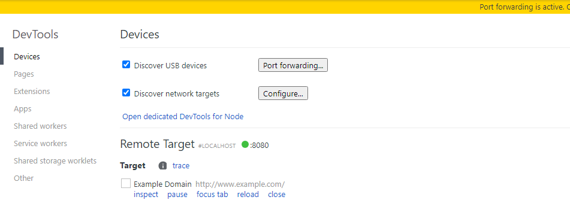

# Debugging Frontend Pages by Using DevTools


The **Web** component supports debugging of web frontend pages by using DevTools, a web frontend development and debugging tool that allows you to debug an application's frontend pages on a PC. Before you do this, use [setWebDebuggingAccess()](../reference/apis-arkweb/js-apis-webview.md#setwebdebuggingaccess) to enable frontend page debugging for the **Web** component and make sure the test device connected to the PC runs 4.1.0 or a later version.


To use DevTools for frontend page debugging, perform the following steps:


1. Enable web frontend page debugging in the application code.

   ```ts
   // xxx.ets
   import { webview } from '@kit.ArkWeb';

   @Entry
   @Component
   struct WebComponent {
     controller: webview.WebviewController = new webview.WebviewController();

     aboutToAppear() {
       // Enable web frontend page debugging.
       webview.WebviewController.setWebDebuggingAccess(true);
     }
 
     build() {
       Column() {
         Web({ src: 'www.example.com', controller: this.controller })
       }
     }
   }
   ```
2. Declare the required permission in the **module.json5** file of the HAP module in the application project in DevEco Studio. For details, see [Declaring Permissions in the Configuration File](../security/AccessToken/declare-permissions.md).

   ```
   "requestPermissions":[
      {
        "name" : "ohos.permission.INTERNET"
      }
    ]
   ```

3. Connect your device to a PC, and configure port mapping on the PC as follows:

   ```
   // Search for the domain socket name required for DevTools. The name is related to the process ID. After the application being debugged is restarted, repeat this step to complete port forwarding.
   cat /proc/net/unix | grep devtools
   // Configure port mapping. Replace [pid] with the actual process ID.
   hdc fport tcp:9222 localabstract:webview_devtools_remote_[pid]
   // View port mapping.
   hdc fport ls
   Example:
   hdc shell
   cat /proc/net/unix | grep devtools
   // Display webview_devtools_remote_3458.
   exit
   hdc fport tcp:9222 localabstract:webview_devtools_remote_3458
   hdc fport ls
   ```

4. Enter **chrome://inspect/\#devices** in the address box of the Chrome browser on the PC. Once the device is identified, you can get started with page debugging. The debugging effect is as follows:

     **Figure 1** Successful device identification 

     

     **Figure 2** Page debugging effect 

     


5. To debug multiple applications, click **Configure** under **Devices** and add multiple port numbers.

     **Figure 3** Adding port numbers 

     

6. You can use a script to accelerate debugging on Windows as follows: Create a .bat file that contains the following information, start the application to debug, and run the script:

   ```
   @echo off
   setlocal enabledelayedexpansion

   :: Initialize port number and PID list
   set PORT=9222
   set PID_LIST=

   :: Get the list of all forwarded ports and PIDs
   for /f "tokens=2,5 delims=:_" %%a in ('hdc fport ls') do (
       if %%a gtr !PORT! (
           set PORT=%%a
       )
       for /f "tokens=1 delims= " %%c in ("%%b") do (
           set PID_LIST=!PID_LIST! %%c
       )
   )

   :: Increment port number for next application
   set temp_PORT=!PORT!
   set /a temp_PORT+=1  
   set PORT=!temp_PORT! 

   :: Get the domain socket name of devtools
   for /f "tokens=*" %%a in ('hdc shell "cat /proc/net/unix | grep devtools"') do (
       set SOCKET_NAME=%%a

       :: Extract process ID
       for /f "delims=_ tokens=4" %%b in ("!SOCKET_NAME!") do set PID=%%b
 
       :: Check if PID already has a mapping
       echo !PID_LIST! | findstr /C:" !PID! " >nul
       if errorlevel 1 (
           :: Add mapping
           hdc fport tcp:!PORT! localabstract:webview_devtools_remote_!PID!
           if errorlevel 1 (
               echo Error: Failed to add mapping.
               pause
               exit /b
           )

           :: Add PID to list and increment port number for next application 
           set PID_LIST=!PID_LIST! !PID!
           set temp_PORT=!PORT!
           set /a temp_PORT+=1  
           set PORT=!temp_PORT! 
       )
   )

   :: If no process ID was found, prompt the user to open debugging in their application code and provide the documentation link
   if "!SOCKET_NAME!"=="" (
       echo No process ID was found. Please open debugging in your application code using the corresponding interface. You can find the relevant documentation at this link: [https://gitee.com/openharmony/docs/blob/master/zh-cn/application-dev/web/web-debugging-with-devtools.md]
       pause
       exit /b
   )

   :: Check mapping
   hdc fport ls

   echo.
   echo Script executed successfully. Press any key to exit...
   pause >nul

   :: Try to open the page in Edge
   start msedge chrome://inspect/#devices.com

   :: If Edge is not available, then open the page in Chrome
   if errorlevel 1 (
       start chrome chrome://inspect/#devices.com
   )

   endlocal
   ```

7. You can use a script to accelerate debugging on macOS or Linux: Create an .sh file that contains the following information (pay attention to chmod and format conversion), start the application to debug, and run the script:
   ```
   #!/bin/bash

   # Get current fport rule list
   CURRENT_FPORT_LIST=$(hdc fport ls)

   # Delete the existing fport rule one by one
   while IFS= read -r line; do
       # Extract the taskline
       IFS=' ' read -ra parts <<< "$line"
       taskline="${parts[1]} ${parts[2]}"
   
       # Delete the corresponding fport rule
       echo "Removing forward rule for $taskline"
       hdc fport rm $taskline
       result=$?
   
       if [ $result -eq 0 ]; then
           echo "Remove forward rule success, taskline:$taskline"
       else
           echo "Failed to remove forward rule, taskline:$taskline"
       fi
   
   done <<< "$CURRENT_FPORT_LIST"

   # Initial port number
   INITIAL_PORT=9222
    
   # Get the current port number, use initial port number if not set previously
   CURRENT_PORT=${PORT:-$INITIAL_PORT}

   # Get the list of all PIDs that match the condition
   PID_LIST=$(hdc shell cat /proc/net/unix | grep webview_devtools_remote_ | awk -F '_' '{print $NF}')

   if [ -z "$PID_LIST" ]; then
       echo "Failed to retrieve PID from the device"
       exit 1
   fi

   # Increment the port number
   PORT=$CURRENT_PORT

   # Forward ports for each application one by one
   for PID in $PID_LIST; do
       # Increment the port number
       PORT=$((PORT + 1))

       # Execute the hdc fport command
       hdc fport tcp:$PORT localabstract:webview_devtools_remote_$PID
    
       # Check if the command executed successfully
       if [ $? -ne 0 ]; then
           echo "Failed to execute hdc fport command"
           exit 1
       fi
   done

   # List all forwarded ports
   hdc fport ls
   ```
