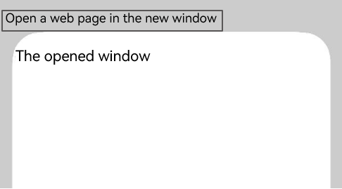

# Opening Pages in a New Window


The **Web** component provides the capability of opening pages in a new window. You can call [multiWindowAccess()](../reference/apis-arkweb/ts-basic-components-web.md#multiwindowaccess9) to specify whether to allow a web page to be opened in a new window. When a new window is opened in the **Web** component, the application will receive a window opening event through [onWindowNew()](../reference/apis-arkweb/ts-basic-components-web.md#onwindownew9). You need to add the code for processing the window opening request in the event callback.


> **NOTE**
>
> - If [allowWindowOpenMethod()](../reference/apis-arkweb/ts-basic-components-web.md#allowwindowopenmethod10) is set to **true**, you can open a new window in the frontend page by invoking its JavaScript functions.
>
> - If you do not create a new window in [onWindowNew()](../reference/apis-arkweb/ts-basic-components-web.md#onwindownew9), set the parameter of [ControllerHandler.setWebController()](../reference/apis-arkweb/ts-basic-components-web.md#setwebcontroller9) to **null**.


In the following example, when a user clicks the **Open Page in New Window** button, the application receives a window opening event in the [onWindowNew()](../reference/apis-arkweb/ts-basic-components-web.md#onwindownew9) callback.


- Application code:

  ```ts
  // xxx.ets
  import { webview } from '@kit.ArkWeb';

  // There are two Web components on the same page. When the WebComponent object opens a new window, the NewWebViewComp object is displayed. 
  @CustomDialog
  struct NewWebViewComp {
    controller?: CustomDialogController;
    webviewController1: webview.WebviewController = new webview.WebviewController();

    build() {
      Column() {
        Web({ src: "", controller: this.webviewController1 })
          .javaScriptAccess(true)
          .multiWindowAccess(false)
          .onWindowExit(() => {
            console.info("NewWebViewComp onWindowExit");
            if (this.controller) {
              this.controller.close();
            }
          })
      }
    }
  }

  @Entry
  @Component
  struct WebComponent {
    controller: webview.WebviewController = new webview.WebviewController();
    dialogController: CustomDialogController | null = null;

    build() {
      Column() {
        Web({ src: $rawfile("window.html"), controller: this.controller })
          .javaScriptAccess(true)
            // Enable the multi-window permission.
          .multiWindowAccess(true)
          .allowWindowOpenMethod(true)
          .onWindowNew((event) => {
            if (this.dialogController) {
              this.dialogController.close()
            }
            let popController: webview.WebviewController = new webview.WebviewController();
            this.dialogController = new CustomDialogController({
              builder: NewWebViewComp({ webviewController1: popController })
            })
            this.dialogController.open();
            // Return the WebviewController object corresponding to the new window to the Web kernel.
            // If the event.handler.setWebController API is not called, the render process will be blocked.
            // If no new window is created, set the value of event.handler.setWebController to null to notify the Web component that no new window is created.
            event.handler.setWebController(popController);
          })
      }
    }
  }
  ```


- Code of the **window.html** page:

  ```html
  <!DOCTYPE html>
  <html>
  <head>
      <meta name="viewport" content="width=device-width"/>
      <title>WindowEvent</title>
  </head>
  <body>
  <input type="button" value="Open Page in New Window" onclick="OpenNewWindow()">
  <script type="text/javascript">
      function OpenNewWindow()
      {
          var txt ='Opened window'
          let openedWindow = window.open("about:blank", "", "location=no,status=no,scrollvars=no");
          openedWindow.document.write("<p>" + "<br><br>" + txt.fontsize(10) + "</p>");
          openedWindow.focus();
      }
  </script>
  </body>
  </html>
  ```

**Figure 1** Effect of opening a page in a new window 




## Samples

The following samples are provided to help you better understand how to create a window:

- [Browser (ArkTS) (Full SDK) (API9)](https://gitee.com/openharmony/applications_app_samples/tree/master/code/BasicFeature/Web/Browser)

<!--no_check-->