# Polymorphic Component Overview

As an integral part of an application that can run in multi-device scenarios, components must be able to run on different devices. Necessary adjustments must also be made to them in terms of visual, interaction, and animation to achieve optimal experience. A component that is displayed in different forms on different devices is referred to as a polymorphic component.

Polymorphic components have the following characteristics:

- Serving a variety of device forms, such as the default device, tablet, smart TV, telematics device, and smart wearable. (supported in OpenHarmony 3.2 and later versions)

- Providing consistent effect in different scenarios: Polymorphic components enable the visual, interaction, and animation to be consistent in different scenarios, although attributes may be identical or differential in the design.

- Enabling device-specific optimization: In addition to effect consistency, polymorphic components ensure that optimizations are made specific for different devices and the effects presented on the devices are optimal.

## Component Statuses

- Component statuses are visual presentations that show the current interaction phases of the components. The same state of different components should keep the same visual style, which must be clear and visible.

- An application may be deployed on different devices. Some devices support multiple input modes. For example, a tablet can be connected to a Bluetooth keyboard and mouse for text editing. In this case, the component must meet the interaction requirements of both the keyboard and mouse, and support the focused and hover states. If the component does not support these two states, when users move focus using the keyboard or mouse over a given element, the component cannot render the appropriate state to give the user the correct visual guidance. OpenHarmony provides the default implementation for components in multiple interaction modes to support multiple input modes and unified interaction events.

Common button statuses are as follows.

| | 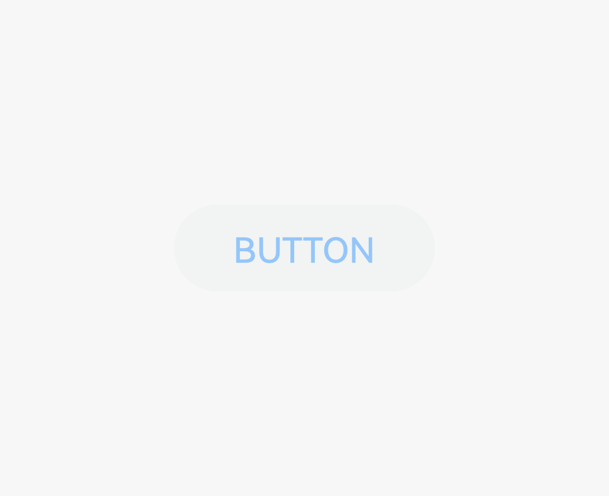 |  |
| -------- | -------- | -------- |
|**Normal** The component is interactive.|**Disabled** The component is non-interactive.| **Pressed** The component is being touched. Operation: Touch the component with a finger or click the component with a mouse, and hold it. |
|  |  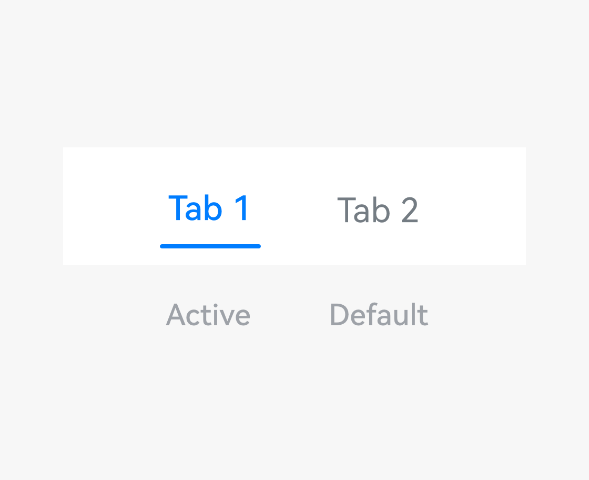  |   |
|**Focused** The component is focused. Operations: - Use arrow keys on a keyboard or remote control to move the focus from one component over another. - Use voice operations to allow a component to gain focus.| **Activated** The component is activated. This state is used for the component that has multiple elements to be focused. Operation: Click a focused subtab of a tab. Touch the tab to activate it.| **Hover**  The current component is hovered using a cursor.  Operation: Move the cursor over a component.|

# Component Lists

## Navigation

|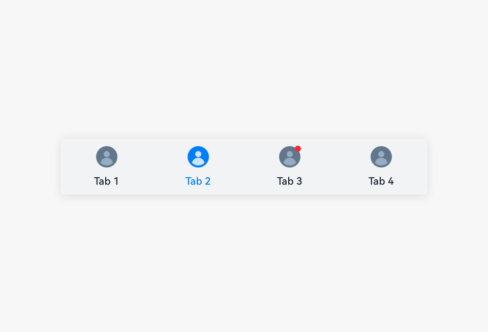| | |
| -------- | -------- | -------- |
|[Bottom tab](multimodal-bottom-tab.md)| [Subtab](multimodal-subtab.md)| [Title bar](multimodal-title-bar.md)|
| 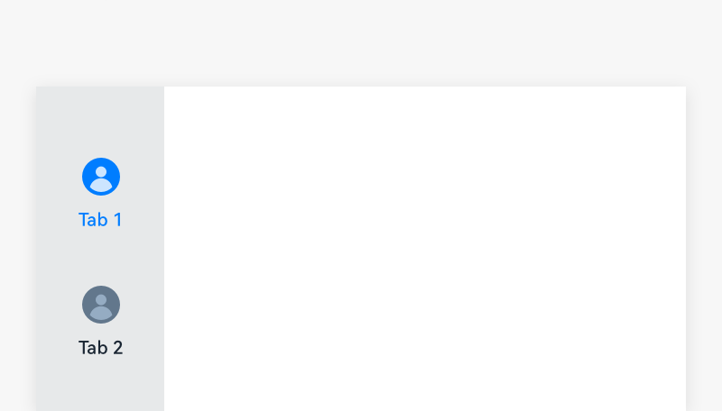|  |  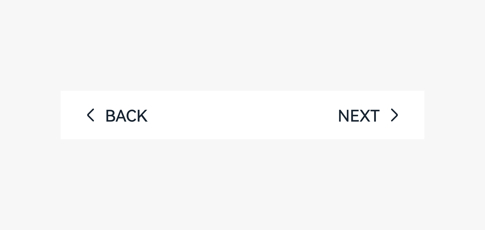 |
|[Sidebar](multimodal-sidebar.md)| [Page indicator](multimodal-swiper.md)| [Stepper](multimodal-stepper.md)|

## Display Components

| | 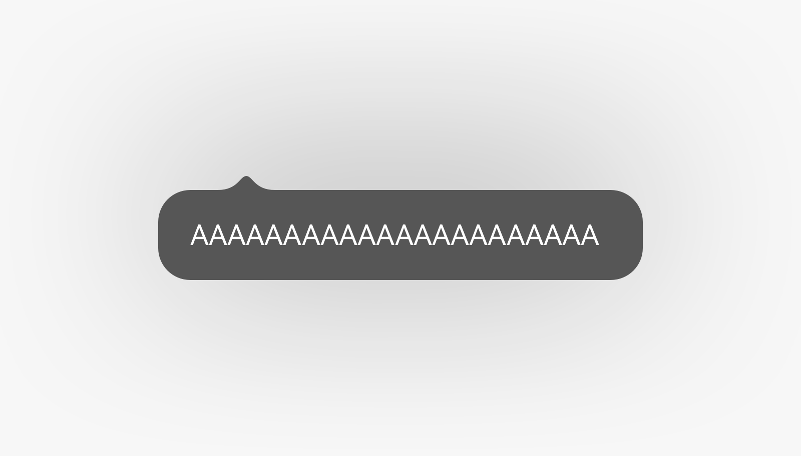| 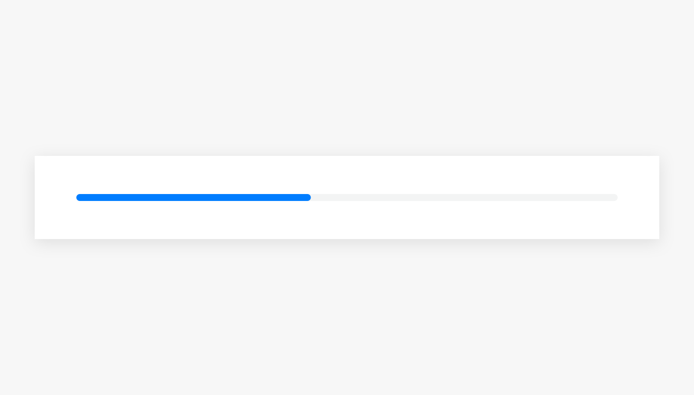 |
| -------- | -------- | -------- |
|[Divider](multimodal-divider.md)|[Bubble](multimodal-bubble.md)|[Progress bar](multimodal-progress-bar.md)|
||  | |
|[Badge](multimodal-badge.md)| [Instant tip](multimodal-instant-tip.md)|[Data panel](multimodal-data-panel.md)|
| |  |  |
| [Text](multimodal-text.md)|  |  |

## Operation-related Components

|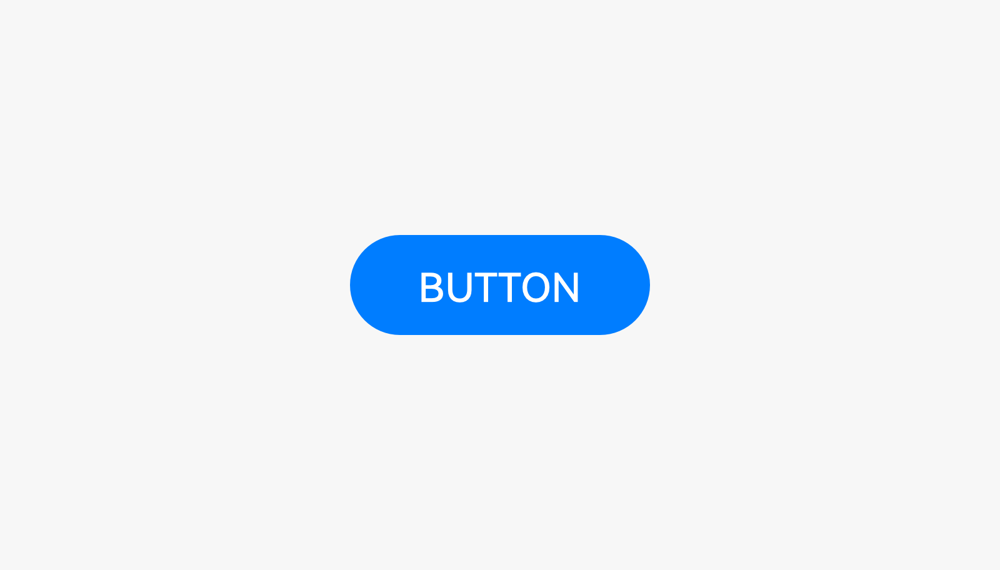 | 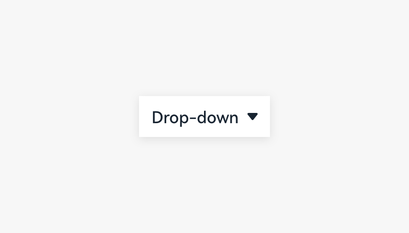| |
| -------- | -------- | -------- |
|[Button](multimodal-button.md) |[Drop-down list](multimodal-drop-down-menu.md)|[State button](multimodal-state-button.md)|
|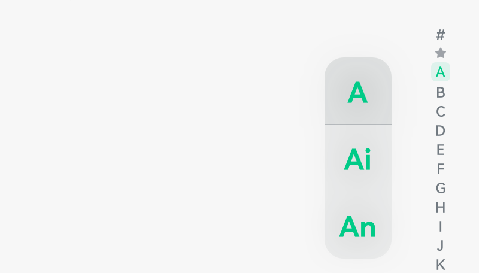 |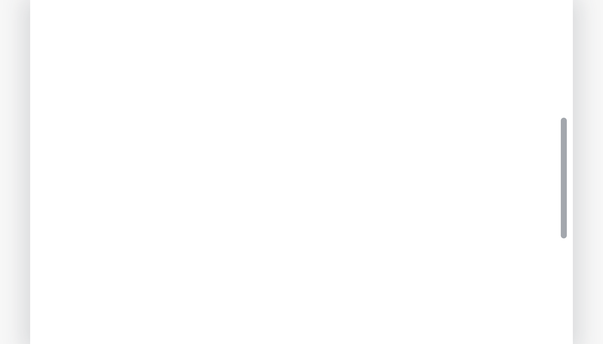 | |
|[Index bar](multimodal-index-bar.md)| [Scrollbar](multimodal-scrollbar.md)|[Pull to refresh](multimodal-pull-to-refresh.md)|
|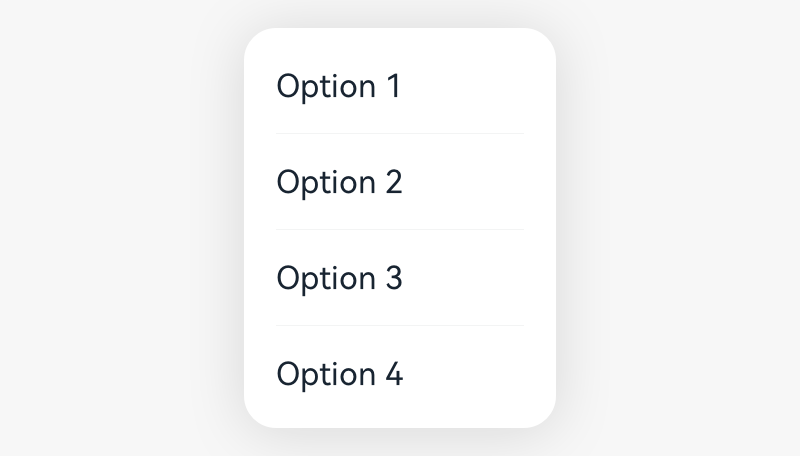 |  |  |
|[Menu](multimodal-menu.md)|  |  |

## Input Components

|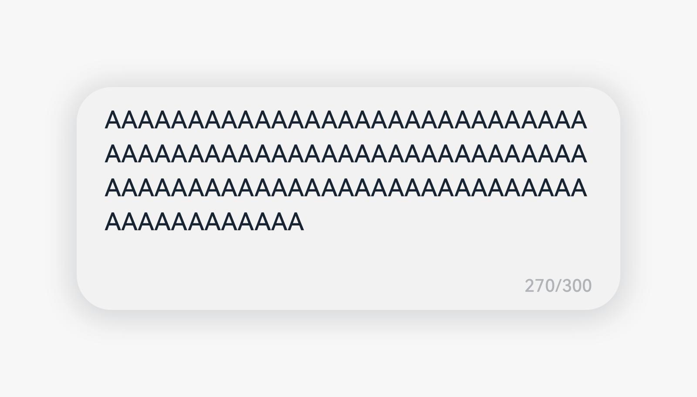 |  |
| -------- | -------- |
|[Text box](multimodal-text-box.md) |[Search box](multimodal-search-box.md)|  |

## Selection Components

|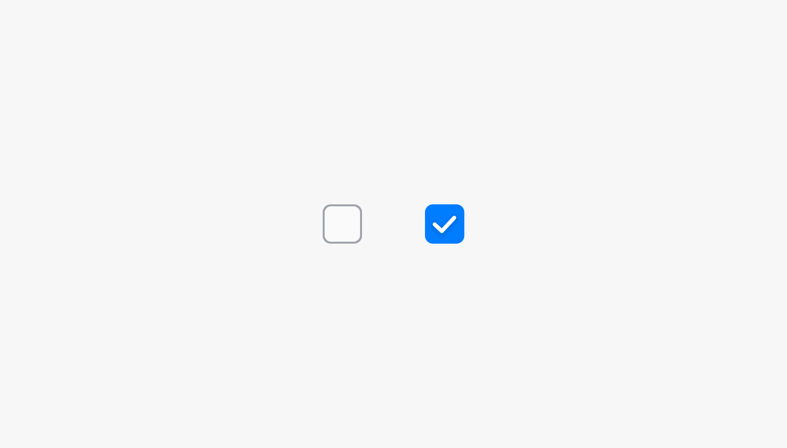 |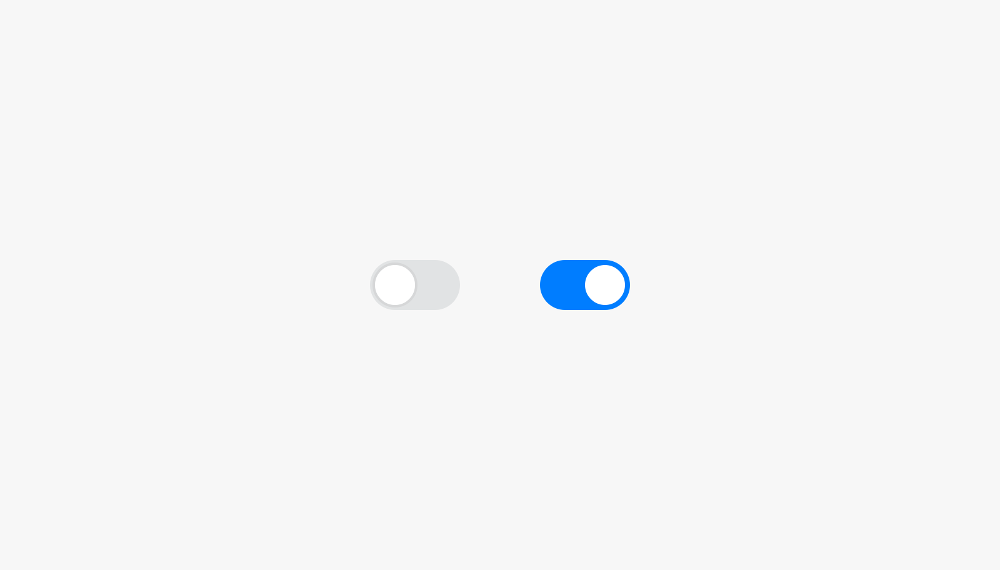 | |
| -------- | -------- | -------- |
| [Tick box](multimodal-tick-box.md)| [Toggle](multimodal-toggle.md)| [Radio button](multimodal-radio-button.md)|
| | 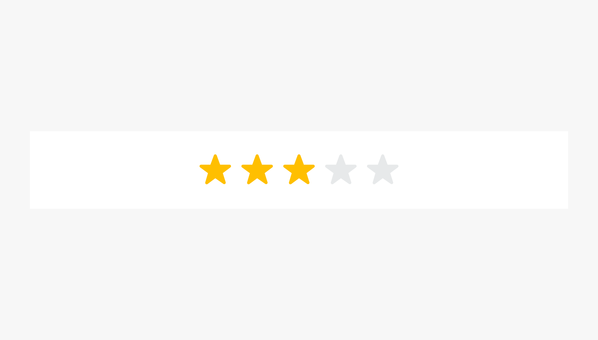|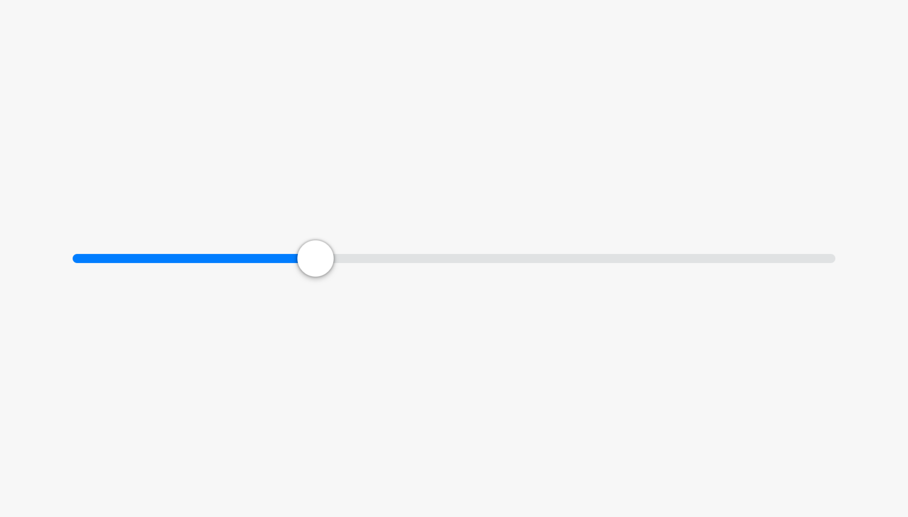 |
| [Check box](multimodal-check-box.md)|[Rating bar](multimodal-rating-bar.md)| [Slider](multimodal-slider.md)|
| | | |
|[Picker](multimodal-picker.md)|  |  |

## Container Components

| | |
| -------- | -------- |
|[Panel](multimodal-slidable-panel.md)| [Dialog](multimodal-dialog.md)|  |
