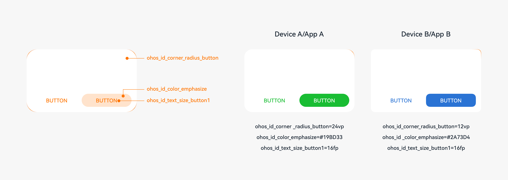

# Visual Basis

**Virtual Pixel**

A virtual pixel (vp) describes the virtual size of a device for an application. It is different from the unit used by the screen hardware, pixel (px). It provides a flexible way to adapt to the display effects of different screen densities.

The same vp value corresponds to different px values on screens with different pixel densities. The ratio between px and vp is referred to as the pixel density ratio, which is DPI/160. In other words, on an OpenHarmony device with a DPI of 160, the pixel density ratio is 1, meaning that 1 vp is equal to 1 px on that device.

The introduction of vp ensures that an element has the same visual size on devices with different pixel densities.

**8 vp Grid System**

You can use 8 vp grids as a basic unit to better plan the size, position, and alignment of elements on the screen to make the layout more hierarchical, orderly, and consistent among various forms of devices. You can also use 4 vp grids for small components (such as icons).

**Font Pixel**

By default, the font pixel (fp) size is the same as that of the virtual pixel size. That is, 1 fp = 1 vp. If you select a larger font size in **Settings**, the actual font size is the virtual pixel size multiplied by the scale coefficient. That is, 1 fp = 1 vp \* scale.

**Visual Attribute: Layered Parameters**

Layered parameters are visual attribute IDs defined on use scenarios. You can configure different values for different color themes and devices to implement multi-device adaptation. The layered parameters include color, font, rounded corner, spacing, shadow, blur, and scale. Their default implementations are provided as well. Devices, applications, and services can manage and customize visual attributes for different scenarios.

For example, IDs and default implementations are defined for dominant colors in different scenarios.

| **Dominant Color** |**Color Value**|**ID**|
|  --------  |  --------  |  --------  |
| Highlight color| \#007DFF | ohos_id_color_emphasize |
| Contrary highlight color| \#006CDE | ohos_id_color_emphasize_contrary |
| Warning color| \#FA2A2D | ohos_id_color_warning |
| Alert color| \#FF7500 | ohos_id_color_alert |
| Connected color| \#E84826 | ohos_id_color_handup |
| Connected color| \#00CB87 | ohos_id_color_connected |

For details about all layered parameters provided by OpenHarmony, see [Resources](design-resources.md).
