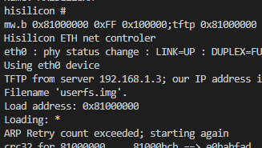

# Burning

## Mini and Small Systems

### "Error: Opening COMxx: Access denied" Is Displayed When I Start Burning

- **Symptom**

  After I click **Burn** and select a serial port, **Error: Opening COMxx: Access denied** is displayed.

  **Figure 1** Access denied error
  
  
  
- **Possible Causes**

  The serial port is in use.

- **Solution**

  1. Search for the terminal using serial-xx from the drop-down list in the **TERMINAL** panel.
  
     **Figure 2** Checking whether the serial port is in use
  
     

  2. Click the dustbin icon as shown below to disable the terminal using the serial port.
    
     **Figure 3** Disabling the terminal using the serial port

     

  3. Click **Burn**, select the serial port, and start burning images again.
    
     **Figure 4** Restarting the burning task

     

### The Image Failed To Be Burnt

- **Symptom**

  The image failed to be burnt over a serial port.

- **Possible Causes**
  
  The DevEco Device Tool plug-in is not restarted after being installed.

- **Solution**
  
  Restart DevEco Device Tool.

### No Command Output Is Displayed

- **Symptom**
  
  The serial port shows that the connection has been established. After the board is restarted, nothing is displayed when I press **Enter**.

- **Possible Cause 1**
  
  The serial port is connected incorrectly.

- **Solution**
  
  Change the serial port number.

  Start **Device Manager** to check whether the serial port connected to the board is the same as that connected to the terminal device. If the serial ports are different, perform step 1 in the **Running an Image** section to change the serial port number.

- **Possible Cause 2**
  
  The U-Boot of the board is damaged.

- **Solution**
  
  Burn the U-Boot.

  If the fault persists after you perform the preceding operations, the U-Boot of the board may be damaged. In this case, burn the U-Boot by performing the following steps:

   1. Obtain the U-Boot file.
      >  **NOTICE**
      > The U-Boot file of the two boards can be obtained from the following paths, respectively.
      > 
      > Hi3516D V300: **device\hisilicon\hispark_taurus\sdk_liteos\uboot\out\boot\u-boot-hi3516dv300.bin**
      > 
      > Hi3518E V300: **device\hisilicon\hispark_aries\sdk_liteos\uboot\out\boot\u-boot-hi3518ev300.bin**

  2. Burn the U-Boot file.
  
     Select the U-Boot files of the corresponding development board for burning. For details, see [Burning an Image](../quick-start/quickstart-ide-3516-burn.md).

  3. Log in to the serial port after the burning is complete.

     **Figure 5** Information displayed through the serial port after the U-Boot file is burnt

     

### Windows-based PC Failed to Be Connected to the Board

- **Symptom**

  The file image cannot be obtained after clicking **Burn** and selecting a serial port.

  **Figure 6** Failed to obtain the file image due to network disconnection
  
  

- **Possible Causes**

  The board is disconnected from the Windows-based PC.

  Windows Firewall does not allow Visual Studio Code to access the network.

- **Solution**

  1. Make sure the network cable is properly connected.

  2. Click **Windows Firewall**.
    
     **Figure 7** Setting the firewall
     
     

  3. Click **Firewall & network protection**. On the displayed page, click **Allow an app through the firewall**.
    
     **Figure 8** Firewall & network protection
     
     

  4. Select Visual Studio Code.
    
     **Figure 9** Selecting Visual Studio Code
    
     

  5. Select the **Private** and **Public** network access rights for Visual Studio Code.
    
     **Figure 10** Allowing Visual Studio Code to access the network
  
     

### The Development Board Failed to Be Identified by the Burning Tool

- **Symptom**

  During image burning, the burning tool displays a message indicating that no device is found.

- **Possible Causes**

  The cable between the Windows computer and the development board is not connected. (The cable required varies. In this example, the USB cable is used.) 

  The driver corresponding to the cable between the Windows computer and the development board is not installed.

- **Solution**

  1. Make sure the cable between the Windows computer and the development board is connected.

  2. Open Device Manager in Windows.

  3. Open the Universal Serial Bus controllers list.
    
  4. Check whether the USB device driver has been installed. If an alarm is displayed, the driver has not been installed.

  5. Depending on the Windows environment, install the desired USB device driver, such as FT23R USB UART Driver. Then try again.

  6. If any other issue occurs, consult the relevant FAQ entry.
  
