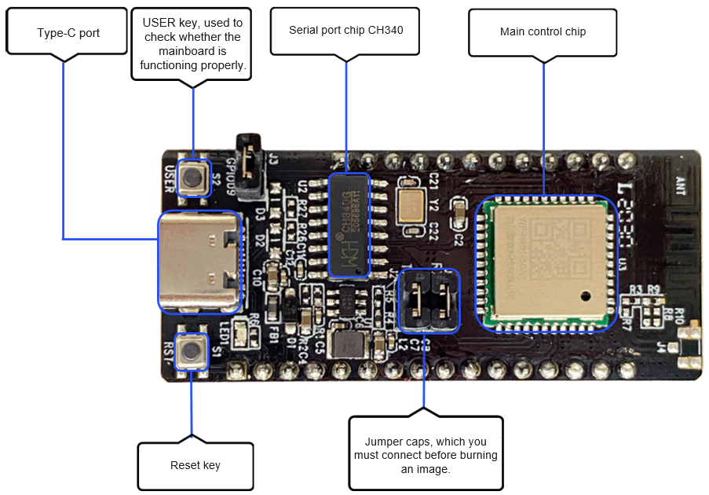
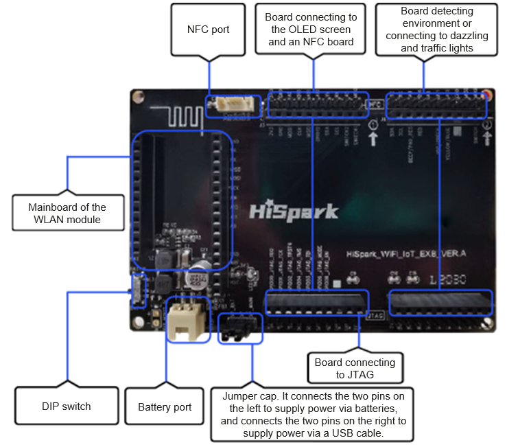
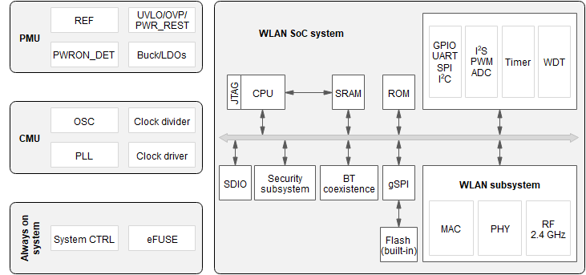

# Hi3861 Development Board

## Introduction

Packed in the 2 cm x 5 cm size, Hi3861 is a 2.4 GHz WLAN SoC with an IEEE 802.11b/g/n baseband and RF circuit. It supports OpenHarmony and allows for open and intuitive development and debugging.

**Figure 1** Hi3861 front view 

The Hi3861 development board can also be connected to the Hi3861 mother board to expand its peripheral capabilities. The following figure shows the Hi3861 mother board.

**Figure 2** Hi3861 rear view 

- The RF circuit includes modules such as the power amplifier (PA), low noise amplifier (LNA), RF Balun, antenna switch, and power management. It supports a standard bandwidth of 20 MHz and a narrow bandwidth of 5 MHz or 10 MHz, and provides a maximum rate of 72.2 Mbit/s at the physical layer.

- The Hi3861 WLAN baseband supports the orthogonal frequency division multiplexing (OFDM) technology and is backward compatible with the direct sequence spread spectrum (DSSS) and complementary code keying (CCK) technologies. In addition, the Hi3861 WLAN baseband supports various data rates specified in the IEEE 802.11 b/g/n protocol.

- The Hi3861 chip integrates the high-performance 32-bit microprocessor, hardware security engine, and various peripheral interfaces. The peripheral interfaces include the Synchronous Peripheral Interface (SPI), Universal Asynchronous Receiver & Transmitter (UART), the Inter-Integrated Circuit (I2C), Pulse Width Modulation (PWM), General Purpose Input/Output (GPIO) interface, and Analog to Digital Converter (ADC). The Hi3861 chip also supports the high-speed Secure Digital Input/Output (SDIO) 2.0 interface, with a maximum clock frequency of 50 MHz. This chip has a built-in static random access memory (SRAM) and flash memory, so that programs can run independently or run from a flash drive.

- The Hi3861 chip applies to Internet of Things (IoT) devices such as smart home appliances.

  **Figure 3** Functional block diagram of Hi3861 

## Resources and Constraints

The Hi3861 development board comes with a mere 2 MB of flash memory and 352 KB of RAM. When writing service code, pay attention to the resource usage efficiency.

## Specifications

**Table 1** Hi3861 specifications

| Item| Description|
| -------- | -------- |
| General specifications| - 1 x 1 2.4 GHz frequency band (ch1–ch14) - PHY supports IEEE 802.11b/g/n. - MAC supports IEEE802.11d/e/h/i/k/v/w. - Built-in PA and LNA; integrated TX/RX switch and Balun - Support for STA and AP modes. When functioning as an AP, it supports a maximum of 6 STAs. - Support for WFA WPA/WPA2 personal and WPS2.0. - 2/3/4-line PTA solution that coexists with BT/BLE chips. - Input voltage range: 2.3 V to 3.6 V - I/O power voltage: 1.8 V or 3.3 V - RF self-calibration - Low power consumption:   - Ultra Deep Sleep mode: 5 μA@3.3 V   - DTIM1: 1.5 mA \@3.3 V   - DTIM3: 0.8 mA \@3.3 V |
| PHY features| - All data rates of the IEEE802.11b/g/n single antenna - Supported maximum rate: 72.2 Mbps\@HT20 MCS7 - 20 MHz standard bandwidth and 5 MHz/10 MHz narrow bandwidth. -  STBC - Short-GI |
| MAC features| - A-MPDU and A-MSDU - Blk-ACK - QoS to meet the quality requirements of different services |
| CPU subsystem| -  High-performance 32-bit microprocessor with a maximum working frequency of 160 MHz - Embedded 352 KB of SRAM; 288 KB of ROM - Embedded 2 MB flash memory |
| Peripheral ports| - One SDIO interface, two SPI interfaces, two I2C interfaces, three UART interfaces, 15 GPIO interfaces, seven ADC inputs, six PWM interfaces, and one I2S interface (Note: These interfaces are all multiplexed.) - Frequency of the external main crystal: 40 MHz or 24 MHz|
| Others| - Package: QFN-32, 5 mm x 5 mm - Working temperature: -40°C to +85°C|

## Key Features

OpenHarmony provides a series of available capabilities based on Hi3861. The following table describes the available key components.

**Table 2** Key components

| Component| Capability|
| -------- | -------- |
| WLAN| Provides the WLAN service capability. For example, connecting to or disconnecting from a station or hotspot, and querying the status of a station or hotspot.|
| IoT controller| Provides the capability of operating peripherals, including the I2C, I2S, ADC, UART, SPI, SDIO, GPIO, PWM and flash memory.|
| DSoftBus| Provides the capabilities of device discovery and data transmission in the distributed network.|
| hichainsdk| Provides the capability of securely transferring data between devices when they are interconnected.|
| huks| Provides capabilities of key management, encryption, and decryption.|
| System service management| Provides a unified OpenHarmony service development framework based on the service-oriented architecture. |
| Boot| Provides the entry identifier for starting a system service. When the system service management is started, the function identified by bootstrap is called to start a system service.|
| System attribute| Provides capabilities of obtaining and setting system attributes.|
| Base library| Provides the common basic library capability, including file operations and KV storage management.|
| DFX | Provides the DFX capability, such as logging and printing.|
| XTS | Provides a set of certification test suites.|
