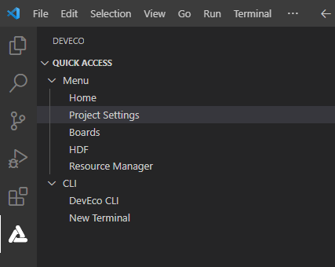

# Burning an Image

Burning is the process of downloading compiled program files to a development board to provide a basis for subsequent debugging. With the one-click burning function of DevEco Device Tool, you can burn images on development boards quickly and efficiently.

The images of Hi3861V100 are burnt in the Windows environment. After burning is initiated, DevEco Device Tool copies the target program files generated in the Ubuntu environment to the specified Windows directory in remote mode, and then burns the program files to Hi3861V100 using the Windows burning tool.

## Prerequisites

- [Source code building](quickstart-ide-3861-build.md) has been completed.

- The USB-serial adapter driver has been installed. For details, see [Installing the USB-Serial Adapter Driver](https://device.harmonyos.com/en/docs/documentation/guide/hi3861-drivers-0000001058153433).

## Procedure

1. Connect the computer and the target development board through the USB port. For details, see [Hi3861 Development Board](quickstart-appendix-hi3861.md).

2. In DevEco Device Tool, choose **REMOTE DEVELOPMENT** > **Local PC** to check the connection status between the remote computer (Ubuntu build environment) and the local computer (Windows build environment).
   - If  is displayed on the right of **Local PC**, the remote computer is connected to the local computer. In this case, no further action is required.
   - If  is displayed, click the connect icon. During the connection, DevEco Device Tool will restart. Therefore, to avoid task interruptions, do not connect to DevEco Device Tool when downloading or building source code.

   

3. Click **Project Settings** on the menu bar to access the Hi3861 V100 project configuration page.

   

4. On the **Tool Chain** tab page, set the Uploader burning tool. You can click **Install** on this page to install the tool online.

   >  **NOTE**
   >
   > If a later version of Uploader is available or another burning tool is required, select it in **Uploader** > **Use Custom Burn Tool**.

   

5. On the **hi3861** tab page, set the burning options. The settings are automatically saved.
   - **upload_port**: Select the serial port number obtained.
   - **upload_protocol**: Select the burning protocol **hiburn-serial**.
   - **upload_partitions**: Select the file for burning. To modify the burning settings for a specific file, click  next to the file.

   

6. Choose **PROJECT TASKS** > **hi3861** > **Upload** to start burning.

   

7. When the following information is displayed, press the RST key on the development board within 15 seconds to restart it.

   

   Wait until the burning is complete. When the following message is displayed, the burning is successful.

   
