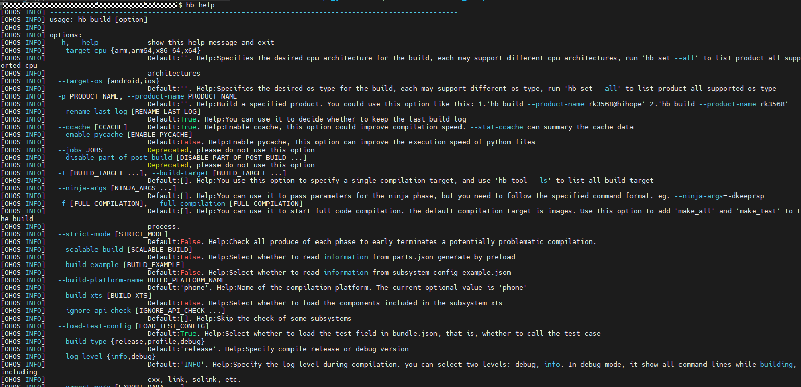

# Installing the Compilation Tools


For details about the functions of the OpenHarmony compilation and building module, see [Compilation and Building Guide](../subsystems/subsys-build-all.md).

Perform the following steps on Ubuntu.


## hb Installation

>  **NOTE**
>
> For details about how to install the proxy, see [Configuring the Proxy](quickstart-pkg-common-proxy.md).

1. Run the following command to install hb and update it to the latest version:
   
   ```shell
   python3 -m pip install --user build/hb
   ```

2. Set an environment variable.
     
   ```shell
   vim ~/.bashrc
   ```

     Copy the following command to the last line of the .bashrc file, save the file, and exit.
     
   ```shell
   export PATH=~/.local/bin:$PATH
   ```

     Update the environment variable.
     
   ```shell
   source ~/.bashrc
   ```

3. Run the **hb help** command in the source code directory. If the following information is displayed, the installation is successful:
     
   

>  **NOTICE**
> - To uninstall hb, run the following command:
>     
>   ```shell
>   python3 -m pip uninstall ohos-build   
>   ```
> 
> - If any issue occurs during the hb installation, see [FAQs](quickstart-pkg-common-hberr.md).


## Installing LLVM (Only Required for OpenHarmony_v1.x)

>  **NOTICE**
>
> When downloading source code under the OpenHarmony_v1.x branches or tags, perform the procedure described in this section to install LLVM 9.0.0.
>
> When downloading source code under the Master or non-OpenHarmony_v1.x branches or tags, skip this section. hb will automatically download the latest version of LLVM.

1. Start the Linux server.

2. [Download LLVM](https://repo.huaweicloud.com/harmonyos/compiler/clang/9.0.0-36191/linux/llvm-linux-9.0.0-36191.tar).

3. Decompress the LLVM installation package to **~/llvm**.
     
   ```shell
   tar -zxvf llvm.tar -C ~/
   ```

4. Set an environment variable.
     
   ```shell
   vim ~/.bashrc
   ```

   Copy the following command to the last line of the .bashrc file, save the file, and exit.

     
   ```shell
   export PATH=~/llvm/bin:$PATH
   ```

5. Validate the environment variable.
     
   ```shell
   source ~/.bashrc
   ```
