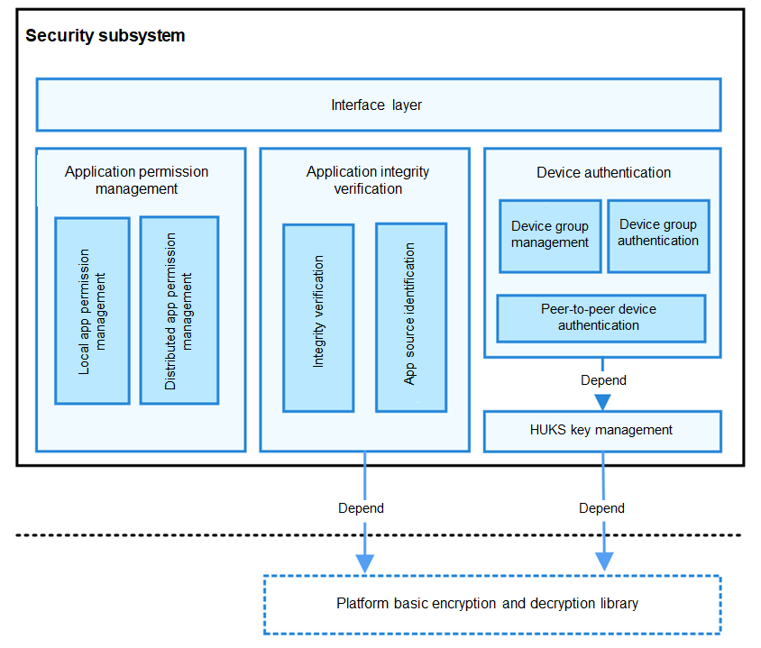

# Security<a name="EN-US_TOPIC_0000001087014383"></a>


## Introduction<a name="section11660541593"></a>

The security subsystem provides system, data, and application security capabilities to protect system and user data of OpenHarmony.

It implements application integrity verification, application permission management, device authentication, OpenHarmony Universal KeyStore (HUKS) key management, and data transfer management.

## Architecture<a name="section342962219551"></a>

**Figure 1** Security subsystem architecture<a name="fig4460722185514"></a> 



The security subsystem consists of the following functional modules:

- Interface layer: provides APIs to developers, some of which are only available for system applications

- Application permission management: implements permission management for the application framework subsystem and provides APIs for applications to request permissions and query the permission granting status.

- Application integrity verification: verifies application integrity during application signing and installation.
- Device authentication: provides key agreement and trusted device management capabilities for interconnections between devices in a distributed network.

- HUKS key management: provides the key management service for basic device authentication.

- Data transfer management: provides API definitions related to data transfer management and control.

## Directory Structure<a name="section92711824195113"></a>

```
/base/security
├── appverify                       # Application integrity verification
├── dataclassification              # Data transfer management
├── device_auth                     # Device authentication
├── huks                            # HUKS key management
└── permission                      # Permission management
```

## Constraints<a name="section7715171045219"></a>

-   In the current version, application permission management is available only for local applications. (The stub mode is used for joint commissioning of upper-layer distributed services.)
-   Device authentication includes authentication for devices with the same account and peer-to-peer device authentication. Currently, only the latter is available. (The stub mode is used for joint commissioning of upper-layer distributed services.)
-   OpenHarmony-specific certificates are used for application integrity verification. The corresponding public key certificates and private keys are preset in the open-source code repositories of OpenHarmony to provide offline signing and verification capabilities for the open-source community. The public key certificates and the corresponding private keys need to be replaced in commercial versions that are based on OpenHarmony.

## Usage<a name="section2057642312536"></a>

#### Application Permission Management

In OpenHarmony, applications and system services run in independent sandboxes. Both processes and data are isolated from each other to protect the security of application data. However, services or applications running in the sandboxes provide some APIs to implement specific functionalities. To access these APIs across processes, applications in other sandboxes need the required permissions, which are granted and managed based on a permission management mechanism.

Application permission management provides a mechanism for defining permissions, allowing system services and applications to define new permissions for their sensitive APIs. To access these APIs, other applications need the required permissions.

Application permission management also allows applications to request permissions that are defined by the system or other applications. Upon obtaining the permissions, applications can access the sensitive APIs provided by the system or other applications.

In addition, application permission management allows users to view and manage the permission granting status.

#### Application Integrity Verification

OpenHarmony allows installation of applications. To ensure the integrity and trustworthiness of the applications to be installed in OpenHarmony, the applications must be signed and their signatures must be verified.

After developing an application and generating the installation package during the application development process, you must sign the installation package to prevent it from being tampered with when released on devices. The OpenHarmony application integrity verification module provides the signature tool, specifications for generating the signing certificate, and required public key certificate for you to sign the application packages. A public key certificate and a corresponding private key are preset in OpenHarmony to easy your operation. You need to replace the public key certificate and private key in your commercial version of OpenHarmony.

In the application installation process, the OpenHarmony application framework subsystem installs applications. Upon receiving an application installation package, the application framework subsystem parses the signature of the installation package, and verifies the signature using the application integrity verification APIs. The application can be installed only after the verification is successful. During the verification, the application integrity verification module uses the preset public key certificate to verify the signature.

#### Device Authentication and HUKS

A unified device binding and authentication solution that covers 1+8+N devices is available. Generally, device authentication provides support for cross-device communication implemented by DSoftBus, rather than directly interacting with applications. Device authentication provides the following functionalities:

- Building and maintaining unified trust relationship for a group of devices using different accounts 

  Devices with different accounts can set up a local trust group after a trust relationship is built by certain means such as scanning a QR code. Services can call APIs to query the group information.

- Implementing unified device authentication 

  A unified authentication solution is provided to discover devices and perform connection authentication and key agreement for encrypted, end-to-end sessions through DSoftBus for the devices in a trust group.

HUKS provides credentials for device authentication and algorithms for key agreement protocols.

#### Data Transfer Management

In OpenHarmony, the data transfer management module provides cross-device data transfer management and control policies for distributed services. The data transfer management module defines a sef of APIs to provide management and control policies for cross-device data transfer and obtain the highest risk level of data to be sent to the peer device.

## Repositories Involved<a name="section155556361910"></a>

Security subsystem

[security_dataclassification](https://gitee.com/openharmony/security_dataclassification)

[security_access_token](https://gitee.com/openharmony/security_access_token)

[security_huks](https://gitee.com/openharmony/security_huks)

[security_selinux](https://gitee.com/openharmony/security_selinux)

[security](https://gitee.com/openharmony/security)

[security_device_auth](https://gitee.com/openharmony/security_device_auth)

[security_permission_lite](https://gitee.com/openharmony/security_permission_lite)

[security_device_security_level](https://gitee.com/openharmony/security_device_security_level)

[security_appverify](https://gitee.com/openharmony/security_appverify)

[security_itrustee_ree_lite](https://gitee.com/openharmony/security_itrustee_ree_lite)
