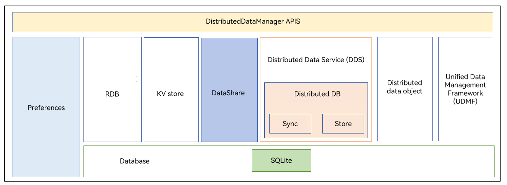

# Distributed Data Management


## Introduction

**Distributed Data Management Subsystem**

The Distributed Data Management subsystem can persistently store various structured data of a single device. It also supports data synchronization and sharing across devices. With the Distributed Data Management subsystem, application data can be seamlessly processed across devices, ensuring consistent user experience for the same application across devices.


**Subsystem Architecture**

**Figure 1** Architecture




## Directory Structure

Level 1 and 2 directories of the distributed data management subsystem:

```
distributeddatamgr/         # Distributed Data Management subsystem
├── data_object             # Distributed data object
└── data_share              # DataShare
└── datamgr_service         # Data service
└── kv_store                # Key-value (KV) store
└── preferences             # Preferences
└── relational_store        # Relational database (RDB) store

third_party/                # Open-source software
├── flatbuffers             # FlatBuffers code
└── sqlite                  # SQLite code
```

## Module Description

### Distributed Data Object

The distributed data object management framework is an object-oriented in-memory data management framework. It provides APIs for basic data object management, such as creating, querying, deleting, modifying, and subscribing to in-memory objects. Moreover, it provides distributed capabilities to implement data object collaboration for the same application between multiple devices that form a Super Device.

The **Distributed Data Object** module provides JS APIs to help you use distributed data objects like using local data objects. The distributed data objects support basic data types, such as number, string, and Boolean, as well as complex data types, such as array and nested basic types.

### DataShare

The **DataShare** module allows an application to manage its own data and share data with other applications. Currently, data can be shared only between applications on the same device.

### DDS

The Distributed Data Service (DDS) implements database collaboration across devices for applications. The DDS isolates data based on a triplet of the account, application, and database. The DDS synchronizes data between trusted devices, delivering a consistent data access experience on different devices.

### Preferences

The **Preferences** module allows quick access to data in KV pairs and storage of a small amount of data for local applications. The data is stored in local files in KV pairs and loaded in memory, which allows for faster access and higher processing efficiency. Preferences provide non-relational data storage and are not suitable for storing a large amount of data.

1.  The **Preferences** module provides APIs for **preferences** operations.
2.  You can use **getPreferences()** to load the content of a specified file to a **Preferences** instance. Each file has only one **Preferences** instance. The system stores the instance data in memory through a static container until the application removes the instance from the memory or deletes the file.
3.  After obtaining a **Preferences** instance, the application can call the APIs of **Preferences** to read data from or write data to the **Preferences** instance, and call **flush()** to save the instance data to a file.

### RDB Store

The RDB manages data based on relational models. The OpenHarmony RDB module provides a complete mechanism for managing local databases based on the underlying SQLite.

With the SQLite as the persistence engine, the RDB module supports all SQLite features, including transactions, indexes, views, triggers, foreign keys, parameterized queries, prepared SQL statements, and more.


## Repositories Involved

Distributed Data Management Subsystem

[distributeddatamgr\_data_object](https://gitee.com/openharmony/distributeddatamgr_data_object)

[distributeddatamgr\_data_share](https://gitee.com/openharmony/distributeddatamgr_data_share)

[distributeddatamgr\_preferences](https://gitee.com/openharmony/distributeddatamgr_preferences)

[distributeddatamgr\_relational_store](https://gitee.com/openharmony/distributeddatamgr_relational_store)

[distributeddatamgr\_kv_store](https://gitee.com/openharmony/distributeddatamgr_kv_store)

[third\_party\_sqlite](https://gitee.com/openharmony/third_party_sqlite)

[third\_party\_flatbuffers](https://gitee.com/openharmony/third_party_flatbuffers)
