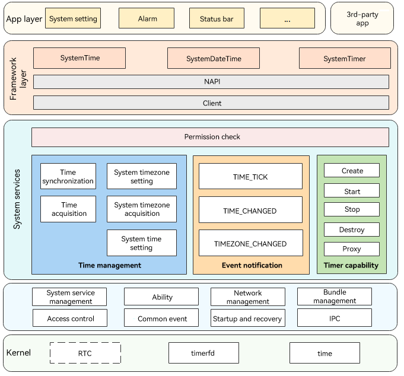

# Time and Time Zone Subsystem

## Introduction

 The time and time zone subsystem provides OpenHarmony with the capability of managing the system time, time zone, and timing.

-   **Time and time zone management**

    Manages the system time and time zone in a unified manner, including setting and obtaining the system time, date, and time zone, and obtaining the system startup time.

-   **Timing management**

    Provides the system timer capability, including creating, starting, stopping, and destroying timers. There are three types of timers: system startup timer, system time timer, and wakeup timer.


## System Architecture

**Figure 1** Architecture of the time and time zone subsystem




## Directory Structure

The source code of the time and time zone subsystem is stored in the **/base/time** directory.

The directory structure is as follows:

```
/base/time/time_service
├── etc                      # Process configuration files
├── figures                  # Architecture diagram
├── framework/js/napi        # JS APIs that are parsed to NAPIs
├── interfaces/inner_api     # APIs provided for external systems
├── services                 # Service implementation
│   └── profile              # System service and process configuration files
└── utils                    # Utilities, for example, log utility
```

## Repositories Involved

[time_service](https://gitee.com/openharmony/time_time_service)
