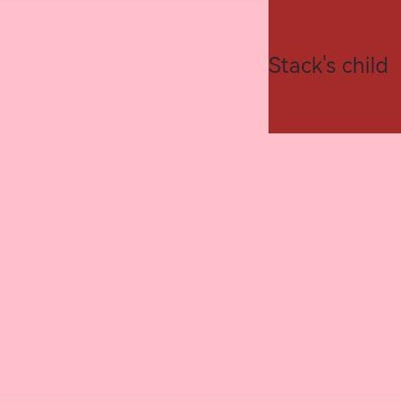
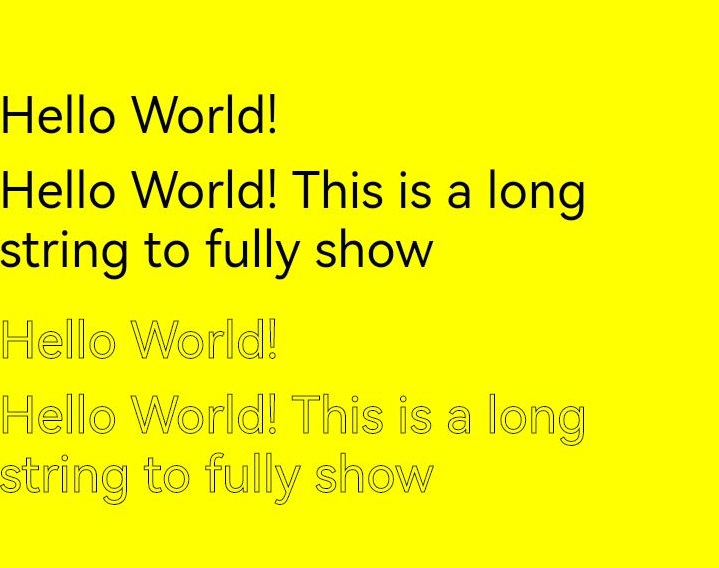

# ArkUI Subsystem Changelog

## cl.arkui.1 Change in the Priority of alignContent and align Attributes for the \<Stack> Component

Changed the priority of **alignContent** and **align** as follows:

API version 9 and earlier: The universal attribute **align** prevails.

API version 10 and later: The last set attribute prevails.

When two attributes provide the same functions, the last set attribute takes effect. This rule applies to **alignContent** and **align**, both of which set the alignment mode when used for the **\<Stack>** component.

**Example**
```ts
// xxx.ets
@Entry
@Component
struct StackExample {
  build() {
    Stack({alignContent:Alignment.Start}){
      Text("Stack's child").backgroundColor(Color.Brown).height("100").width(100)
    }
    .width(300).height(300)
    .backgroundColor(Color.Pink)
    .align(Alignment.Center)
    .alignContent(Alignment.TopEnd)
  }
}
```

API version 9 and earlier: Child components are arranged based on the universal attribute **align**.


API version 10 and later: Child components are arranged based on the **alignContent** attribute, which is set at a later time than **align**.



**Change Impact**

When both **alignContent** and **align** attributes are set, the last set attribute prevails.

## cl.arkui.2 Behavior Change of the fillText and strokeText APIs of the \<Canvas> Component


When the **fillText** and **strokeText** APIs are used to draw text, no text wrapping occurs.

**Example**
```ts
// xxx.ets
@Entry
@Component
struct FillText {
  private settings: RenderingContextSettings = new RenderingContextSettings(true)
  private context: CanvasRenderingContext2D = new CanvasRenderingContext2D(this.settings)

  build() {
    Flex({ direction: FlexDirection.Column, alignItems: ItemAlign.Center, justifyContent: FlexAlign.Center }) {
      Canvas(this.context)
        .width('100%')
        .height('100%')
        .backgroundColor('#ffff00')
        .onReady(() =>{
          this.context.font = '50px sans-serif'
          this.context.fillText("Hello World!", 0, 100)
          this.context.fillText("Hello World! This is a long string to fully show", 0, 150)
          this.context.strokeText("Hello World!", 0, 250)
          this.context.strokeText("Hello World! This is a long string to fully show", 0, 300)
        })
    }
    .width('100%')
    .height('100%')
  }
}
```

API version 9 and earlier: When the **fillText** and **strokeText** APIs are used to draw text, the text is wrapped based on the component width.



API version 10 and later: When the **fillText** and **strokeText** APIs are used to draw text, no text wrapping occurs.


**Change Impact**

The text appearance is affected now that the text is not wrapped based on the component width.
