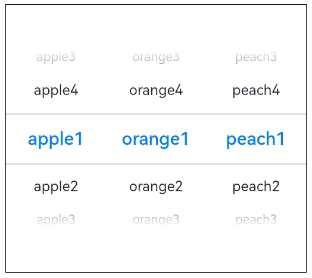

# ArkUI Subsystem Changelog

## cl.arkui.1 Default Layout Behavior Change for TextPicker Content

**Access Level**

Public API

**Reason for Change**

The layout drawing logic of **TextPicker** was inconsistent with that of **DatePicker** and **TimePicker**. When the component's height was set too large, the number of scrollable options displayed would exceed 5, causing an abnormal fade effect at the top and bottom edges.

**Change Impact**

This change is a compatible change.

Before the change, the total height of the scrollable options in **TextPicker** is the same as the component's height, and the scroll event responds throughout the entire component.


After the change, when the **TextPicker** component's height is too large (greater than the height required for five scrollable options), the overall height of the component remains unchanged, but a maximum of 5 scrollable options will be displayed, centered vertically within the component. The remaining area will be filled with blank space, and gesture events will only respond within the scrollable option area.



**API Level**

8

**Change Since**

OpenHarmony SDK 5.0.0.17

**Key API/Component Changes**

**TextPicker** component

**Adaptation Guide**

The default behavior has changed, no adaptation is needed, but you should ensure that the new behavior does not cause issues with the overall application logic.

## cl.arkui.2 Dialog Box Closure Behavior Change During Page Route Transition

**Access Level**

Public API

**Reason for Change**

In the hierarchy, pages and dialog boxes are at the same level and are independent of each other. Dialog boxes should not be closed automatically during page navigation, and the closure behavior of the dialog box should be controlled by the developer as needed.

**Change Impact**

This change is a non-compatible change.

Before the change, if a page with dialog boxes has navigation performed, the page content would change, and the last dialog box would also be closed automatically.

After the change,if a page with dialog boxes has navigation performed, the page content would change, but the dialog will no longer be closed automatically, meaning the dialog box will always remain on top of the page and will not disappear.

**API Level**

9

**Change Since**

OpenHarmony SDK 5.0.0.17, effective since API version 12

**Key API/Component Changes**

Router, Dialog

**Adaptation Guide**

To close all dialog boxes on the current page during route redirection, you can manually close them by calling the dialog box's **close** method before route redirection.

The sample code is as follows:
```ts
import router from '@ohos.router';
// Record all dialog boxes on the current page.
const dialogs: Map<string, CustomDialogController> = new Map();

@CustomDialog
struct CustomDialogExample {
  controllerTwo?: CustomDialogController
  build() {
    Column() {
      Button('Redirect')
        .onClick(() => {
          // Close all dialog boxes on the current page.
          dialogs.forEach((controller, name) => {
            controller.close();
          })
          // Route redirection
          router.pushUrl({url: 'pages/Index'})
        })
    }
  }
}

@Entry
@Component
struct CustomDialogUser {
  dialogController: CustomDialogController | null = new CustomDialogController({
    builder: CustomDialogExample(),
  })
  build() {
    Column() {
      Button('Open Dialog Box')
        .onClick(() => {
          if (this.dialogController != null) {
            // Open the dialog box.
            this.dialogController.open()
            // Record the current dialog box.
            dialogs.set('first', this.dialogController)
          }
        })
    }
  }
}
```

## cl.arkui.3 syncLoad Effect Change for Image Component

**Access Level**

Public API

**Reason for Change**

Some implementation scenarios on the application side require the **Image** component to support asynchronous loading of pixel maps.

**Change Impact**

This change is a non-compatible change.

**syncLoad** is an attribute of the **Image** component used to set whether the image is loaded synchronously.

Before API version 12, regardless of whether **syncLoad** is set to **false** or **true**, the **Image** component always loaded pixel maps synchronously in the main thread.

Since API version 12, the **Image** component loads pixel maps synchronously or asynchronously according to **syncLoad**. If this attribute is not set, the default value **false** is used. Asynchronous loading will occur in an asynchronous thread, and there may be a flicker when loading pixel maps.

**API Level**

12

**Change Since**

OpenHarmony SDK 5.0.0.17

**Example**

N/A

**Key API/Component Changes**

**Image** component

**Adaptation Guide**

If your application requires the **Image** component to load pixel maps synchronously, **syncLoad** must be set to **true**.
