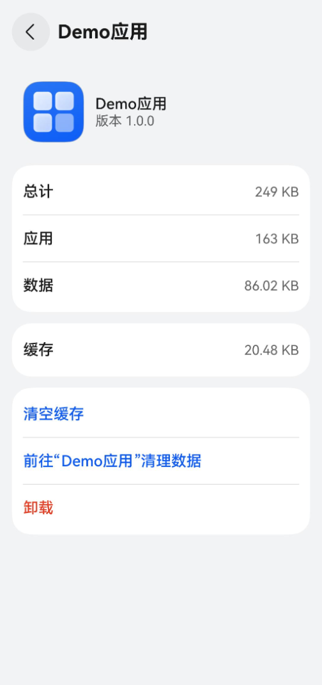

# 应用链接说明

## uris标签说明
当在[module.json5](../quick-start/module-configuration-file.md)文件的[skills字段](../quick-start/module-configuration-file.md#skills标签)中声明uris时，主要包含如下字段。

> **说明：**
>
> - 通过浏览器拉起应用页面时，浏览器会将uri中scheme和host中的大写字母自动转化为小写字母，导致无法正确匹配应用。因此建议scheme和host中不要包含大写字母。
> - path、pathStartWith、pathRegex的取值前后均不需要加斜杠`/`。例如对于应用链接`https://developer.huawei.com/consumer/cn/support`，path字段应配置为`consumer/cn/support`。

- scheme：协议名称。常见的取值有http、https、file、ftp等，也可以自定义。
- host：域名或IP地址。例如域名`developer.huawei.com`或IP地址`127.0.0.1`。
- port：端口号。例如`developer.huawei.com:80`后面的80即为端口号。
- path：路径，表示域名服务器上的目录或文件路径，该字段在scheme存在时才有意义。path字段不支持通配符，如果需要使用通配符，可以采用pathRegex字段。
    

- pathStartWith：路径前缀，该字段在scheme存在时才有意义，表示域名服务器上的目录或文件路径的前缀，用于前缀匹配。
- pathRegex：路径正则，该字段在scheme存在时才有意义，表示域名服务器上的目录或文件路径的正则表达式，用于正则匹配。
- [linkFeature](#linkfeature标签说明)：应用的功能类型（如文件打开、分享、导航等）。取值为长度不超过127字节的字符串，不支持中文。

### URL的基本格式

按照配置的字段不同，uris可以拼接为不同的URL表达式。其中，scheme为必选字段，其他字段仅当scheme存在时才有意义。

- 只配置scheme：`scheme://`
- 只配置scheme和host：`scheme://host`
- 只配置scheme、host和port：`scheme://host:port`
- 当配置了path、pathStartWith或pathRegex字段时，组成的表达式如下。
    三方应用组件配置的scheme不能与系统应用重复，否则会导致无法通过该uri拉起三方应用组件。 
    - **全路径表达式**：`scheme://host:port/path`
    - **路径前缀表达式**：`scheme://host:port/pathStartWith`
    - **路径正则表达式**：`scheme://host:port/pathRegex`

> **说明：**
> - 三方应用组件配置的scheme不能与系统应用重复，否则会导致无法通过该uri拉起三方应用组件。 
> - 如果多个应用的URL配置相同，应用跳转时匹配到同多个应用，则会拉起应用选择框。为了更好的用户体验，开发者可以通过链接的path字段去区分同一域名下的不同应用，如链接`https://www.example.com/path1`拉起目标应用1，链接`https://www.example.com/path2`拉起目标应用2。


### linkFeature标签说明

> **说明：**
>
> 同一Bundle中声明的linkFeature数量不能超过150个。 


目标应用在linkFeature字段中申明功能类型，并通过应用市场上架审核后，可以提升应用跳转体验。主要用于以下两种场景：

1. 支持系统识别同类应用：当调用方拉起垂类应用（例如导航类应用）时，系统会根据linkFeature字段识别到匹配的应用，并在应用面板中展现。

    |值|说明|
    |---|---|
    |AppStorageMgmt|指示清理应用沙箱目录中缓存数据的功能|
    |FileOpen|指示打开处理文件的功能|
    |Navigation|指示导航功能|
    |RoutePlan|指示路线规划功能|
    |PlaceSearch|指示地点搜索功能|

2. 跳转一键返回能力：用户从A应用跳转至B应用的某个功能界面后，B应用调用[一键返回能力](../reference/apis-ability-kit/js-apis-inner-application-uiAbilityContext.md#backtocallerabilitywithresult12)，可以支持用户直接返回A应用，无问询弹窗。例如：A应用跳转至B应用的支付界面，若B应用已申请了支付的linkfeature，则用户在B应用内完成操作后，可一键返回A应用。

    |值|说明|
    |---|---|
    |Login|指示登录、授权登录等功能|
    |Pay|指示支付页面、收银台等功能|
    |Share|指示分享功能|

## 配置示例


### 授权登录场景

```json
"uris": [
    {
        "scheme": "https",
        "host": "developer.huawei.com",
        "path": "consumer",
        "linkFeature": "Login"  
    }
]
```

### 清理应用沙箱缓存数据场景

通过“设置 > 存储”可以选择进入某个应用的应用详情页，该页面默认会包含“清空缓存”选项，用于清除当前应用的所有缓存数据。

如果开发者实现了自定义数据清理页面，并希望能够在应用详情页提供跳转入口，可以通过配置linkFeature字段进行接入。

1. 在[module.json5配置文件](../quick-start/module-configuration-file.md)中，对实现了数据清理功能的Ability添加如下skills配置。 

   其中，linkFeature字段必须配置为AppStorageMgmt，其他字段取值请根据实际情况修改为实际值。

    ```json
    {
      "name": "ClearAbility",
      "srcEntry": "./ets/clearability/ClearAbility.ets",
      "description": "$string:ClearAbility_desc",
      "icon": "$media:layered_image",
      "label": "$string:ClearAbility_label",
      "skills": [
        {
          "uris": [
            {
              "scheme": "storage",
              "host": "developer.huawei.com",
              "path": "clearcache",
              "linkFeature": "AppStorageMgmt"
            }
          ]
        }
      ]
    }
    ```

2. 功能验证。

   1. 在手机的“设置 > 存储”页面，选择当前应用，进入应用详情页。
   2. 点击“前往xx清理数据”的选项，即可跳转至对应的缓存数据清理页面。

效果图如下：


