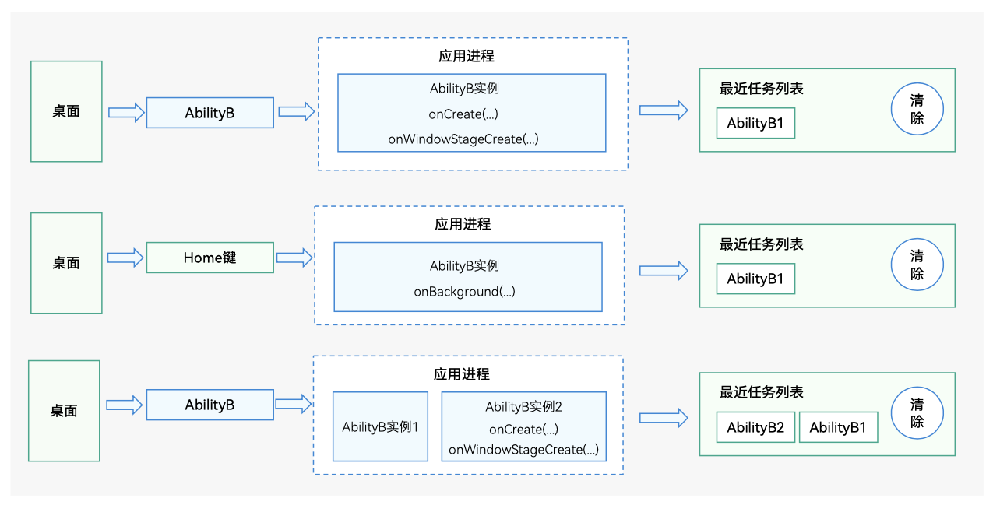

# 任务（Mission）与启动模式

如前文所述，一个UIAbility实例对应一个任务。UIAbility实例个数与UIAbility配置的启动模式有关。在FA模型下，通过config.json配置文件中的“launchType”属性配置；在Stage模型下，通过[module.json5配置文件](../quick-start/module-configuration-file.md)中的“launchType”属性配置。

  下面介绍了任务管理如何实现以下三种启动模式UIAbility组件的管理：
- singleton：单实例模式，应用在运行时只存在一个该UIAbility实例。
  
  **图1** 任务与singleton模式  
  
  
- multiton：多实例模式，每次调用[startAbility()](../reference/apis-ability-kit/js-apis-inner-application-uiAbilityContext.md#startability)方法，都会在应用进程中创建一个该UIAbility实例。
  
  **图2** 任务与multiton模式  
  
  
- specified：指定实例模式，由[AbilityStage](abilitystage.md)的[onAcceptWant()](../reference/apis-ability-kit/js-apis-app-ability-abilityStage.md#onacceptwant)决定是否创建新的UIAbility实例。
  
  **图3** 任务与specified模式  
  

每个UIAbility实例都对应了一个最近任务列表中看到的Mission（任务）。

每个UIAbility实例对应的Mission都保留有该UIAbility实例的快照（Snapshot），UIAbility实例销毁后，Mission信息（包括UIAbility信息和任务快照）依然会保留，直到用户删除该任务。

> **说明：**
>
> specified模式只在Stage模型上支持，FA模型不支持。
