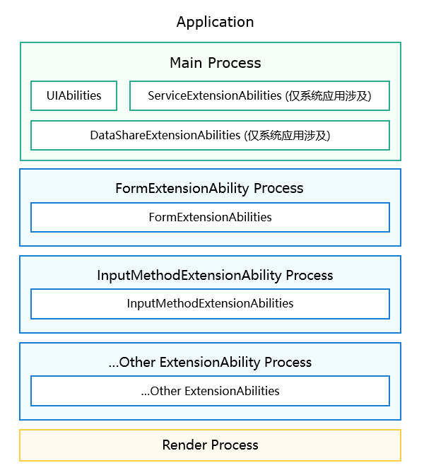
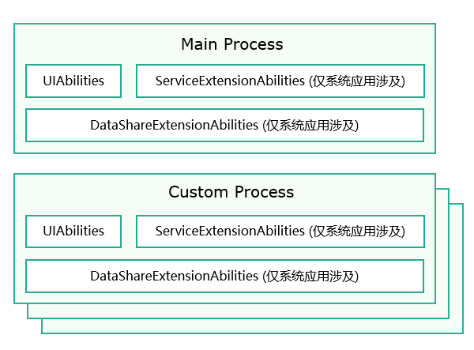

# 进程模型

进程是系统进行资源分配的基本单位，是操作系统结构的基础。系统的进程模型如下图所示。

- 通常情况下，应用中（同一Bundle名称）的所有UIAbility<!--Del-->、ServiceExtensionAbility和DataShareExtensionAbility<!--DelEnd-->均是运行在同一个独立进程（主进程）中，如下图中绿色部分的“Main Process”。
- 应用中（同一Bundle名称）的所有同一类型ExtensionAbility<!--Del-->（除ServiceExtensionAbility和DataShareExtensionAbility外）<!--DelEnd-->均是运行在一个独立进程中，如下图中蓝色部分的“FormExtensionAbility Process”、“InputMethodExtensionAbility Process”、其他ExtensionAbility Process。
- WebView拥有独立的渲染进程，如下图中黄色部分的“Render Process”。

> **说明**：
>
> 仅2in1设备支持将HAP和UIAbility设置为独立进程，设置方法如下：
> - 如果需要指定某个HAP运行在独立进程中，可以在module.json5文件中将isolationMode字段配置为isolationOnly（只在独立进程中运行）或者isolationFirst（优先在独立进程中运行）。
> - 如果需要指定某个UIAbility运行在独立进程中，可以在module.json5文件中将isolationProcess字段配置为true，同时需要在[onNewProcessRequest](../reference/apis-ability-kit/js-apis-app-ability-abilityStage.md)回调中返回一个唯一的进程标识符。

**图1** 进程模型示意图  

> 说明：
>
> - 仅系统应用支持构建ServiceExtensionAbility和DataShareExtensionAbility。
> - 执行`hdc shell`命令，进入设备的shell命令行。在shell命令行中，执行`ps -ef`命令，可以查看所有正在运行的进程信息。

在上述模型基础上，对于系统应用可以通过申请多进程权限（如下图所示），为指定HAP配置一个自定义进程名，该HAP中的UIAbility<!--Del-->、DataShareExtensionAbility、ServiceExtensionAbility<!--DelEnd-->就会运行在自定义进程中<!--Del-->，具体申请方式请参考[应用特权配置指南](../../device-dev/subsystems/subsys-app-privilege-config-guide.md)<!--DelEnd-->。不同的HAP可以通过配置[module.json5](../quick-start/module-configuration-file.md#配置文件标签)中的process属性，使HAP运行在不同进程中。

**图2** 多进程示意图  

基于当前的进程模型，针对应用间和应用内存在多个进程的情况，系统提供了如下进程间通信机制：

[公共事件机制](../basic-services/common-event/common-event-overview.md)：多用于一对多的通信场景，公共事件发布者可能存在多个订阅者同时接收事件。

