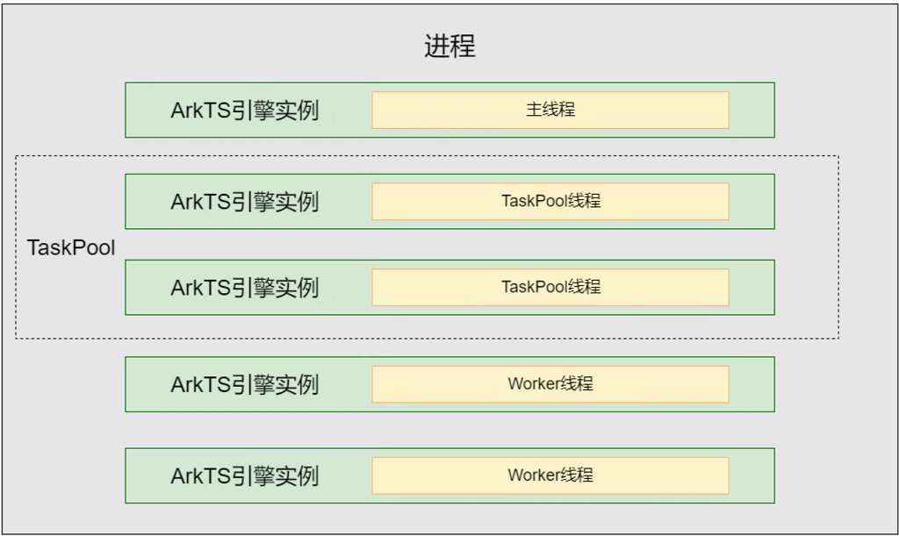

# 线程模型概述

在OpenHarmony应用中，每个进程都会有一个主线程，主线程具有以下职责：

1. 执行UI绘制。
2. 管理主线程的ArkTS引擎实例，使多个UIAbility组件能够运行在其之上。
3. 管理其他线程（例如Worker线程）的ArkTS引擎实例，例如启动和终止其他线程。
4. 分发交互事件。
5. 处理应用代码的回调，包括事件处理和生命周期管理。
6. 接收Worker线程发送的消息。

除了主线程外，还有一类独立的Worker线程，用于执行耗时操作。Worker线程在主线程中创建，与主线程相互独立，但不能直接操作UI。最多可以创建8个Worker线程。  

基于OpenHarmony的线程模型，不同的业务功能运行在不同的线程上，业务功能的交互就需要线程间通信。同一个进程内，线程间通信目前主要有Emitter和Worker两种方式，其中Emitter主要适用于线程间的事件同步，Worker主要用于新开一个线程执行耗时任务。

> **说明：**
>
> - Stage模型只提供了主线程和Worker线程，Emitter主要用于主线程和Worker线程、Worker线程和Worker线程之间的事件同步。
> - UIAbility组件与UI均在主线程中，他们之间的数据同步请参见[UIAbility组件与UI的数据同步](uiability-data-sync-with-ui.md)。
> - 执行`hdc shell`命令，进入设备的shell命令行。在shell命令行中，执行`ps -p <pid> -T`命令，可以查看指定应用进程的线程信息。其中，`<pid>`为需要指定的应用进程的[进程ID](process-model-stage.md)。
