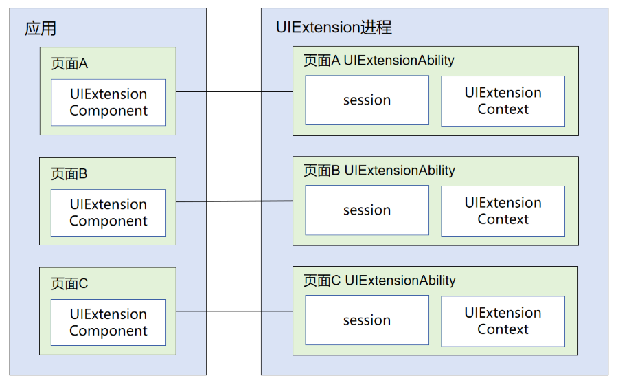
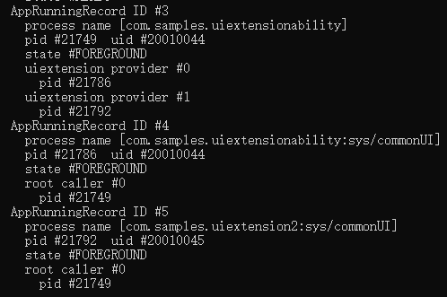
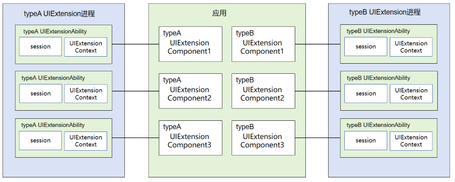
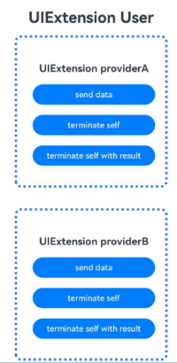
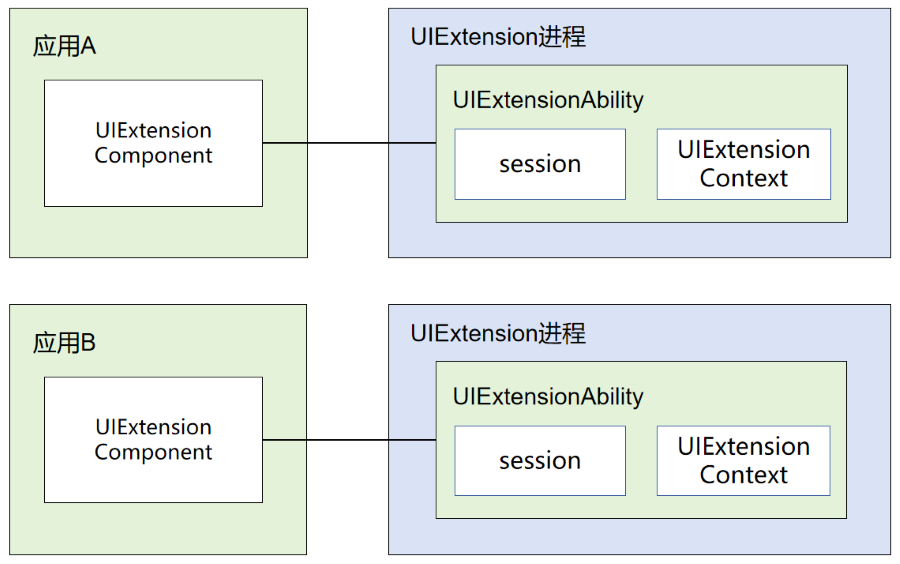
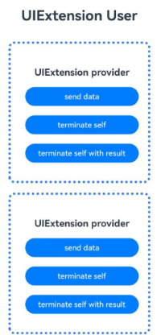
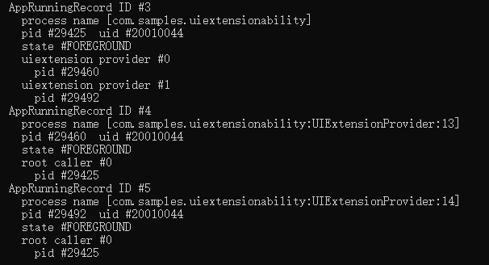

# UIExtensionAbility

## 概述

[UIExtensionAbility](../reference/apis-ability-kit/js-apis-app-ability-uiExtensionAbility.md)是UI类型的ExtensionAbility，常用于有进程隔离诉求的系统弹窗、状态栏、胶囊等模块化开发的场景。有嵌入式显示与系统弹窗两种形式。
- 嵌入式显示启动需要与[UIExtensionComponent](../reference/apis-arkui/arkui-ts/ts-container-ui-extension-component-sys.md)一起配合使用，开发者可以在UIAbility的页面中通过UIExtensionComponent嵌入提供方应用的UIExtensionAbility提供的UI。UIExtensionAbility会在独立于UIAbility的进程中运行，完成其页面的布局和渲染。
- 系统弹窗启动形式需要调用指定接口[requestModalUIExtensionAbility](../reference/apis-ability-kit/js-apis-inner-application-serviceExtensionContext-sys.md#serviceextensioncontextrequestmodaluiextension11)或调用应用封装的指定接口启动UIExtensionAbility。

## 约束限制
- 当前"sys/commonUI"、"sysDialog"和"sysPicker"类型的UIExtensionAbility仅支持系统应用使用，更详细的UIExtensionAbility类型介绍及对应权限管控可参见：[module.json5配置文件](../quick-start/module-configuration-file.md)。
- UIExtensionAbility仅支持拥有前台窗口的应用拉起，处于后台运行的应用无法拉起UIExtensionAbility。

## 生命周期
[UIExtensionAbility](../reference/apis-ability-kit/js-apis-app-ability-uiExtensionAbility.md)提供了[onCreate](../reference/apis-ability-kit/js-apis-app-ability-uiExtensionAbility.md#uiextensionabilityoncreate)、[onSessionCreate](../reference/apis-ability-kit/js-apis-app-ability-uiExtensionAbility.md#uiextensionabilityonsessioncreate)、[onSessionDestroy](../reference/apis-ability-kit/js-apis-app-ability-uiExtensionAbility.md#uiextensionabilityonsessiondestroy)、[onForeground](../reference/apis-ability-kit/js-apis-app-ability-uiExtensionAbility.md#uiextensionabilityonforeground)、[onBackground](../reference/apis-ability-kit/js-apis-app-ability-uiExtensionAbility.md#uiextensionabilityonbackground)和[onDestroy](../reference/apis-ability-kit/js-apis-app-ability-uiExtensionAbility.md#uiextensionabilityondestroy)生命周期回调，根据需要重写对应的回调方法。

- **onCreate**：当UIExtensionAbility创建时回调，执行初始化业务逻辑操作。
- **onSessionCreate**：当UIExtensionAbility界面内容对象创建后调用。
- **onSessionDestroy**：当UIExtensionAbility界面内容对象销毁后调用。
- **onForeground**：当UIExtensionAbility从后台转到前台时触发。
- **onBackground**：当UIExtensionAbility从前台转到后台时触发。
- **onDestroy**：当UIExtensionAbility销毁时回调，可以执行资源清理等操作。

## 选择合适的UIExtensionAbility进程模型
[UIExtensionAbility](../reference/apis-ability-kit/js-apis-app-ability-uiExtensionAbility.md)支持多实例，每个嵌入式显示对应一个UIExtensionAbility实例。多实例场景下默认是多进程，可配置多进程模型。
当应用中存在多个UIExtensionAbility实例，这些实例可以为多个独立进程，也可以共用同一个进程，还可以分为多组、同组实例共用同一个进程。通过[module.json5](../quick-start/module-configuration-file.md)配置文件中的extensionProcessMode字段，即可为选择对应的进程模型，三种模型对比如下：
| 进程模型 | extensionProcessMode字段配置 | 说明 |
| --------| --------| --------|
| 同一bundle中所有UIExtensionAbility共进程 |bundle|	UIExtensionAbility实例之间的通信无需跨IPC通信；实例之间的状态不独立，会存在相互影响。|
| 相同name的UIExtensionAbility共进程 | type |将同UIExtensionAbility类配置在同一个进程下，便于应用针对UIExtensionAbility类型对实例进行管理。|
| 每个UIExtensionAbility为独立进程 | instance | UIExtensionAbility实例之间的状态不会彼此影响，安全性更高；实例之间只能通过跨进程进行通信。 |
### Bundle中的所有UIExtensionAbility共进程
同一个bundle下的[UIExtensionAbility](../reference/apis-ability-kit/js-apis-app-ability-uiExtensionAbility.md)配置在同一个进程中，便于多实例间的通信。需要关注的是，各个实例之间的状态会彼此影响，当进程中的一个实例异常退出，将导致进程中所有的实例也都会退出。

**图1** bundle模型配置示意图



**Index.ets示例代码如下：**
```ts
@Entry
@Component
struct Index {
  @State message: string = 'UIExtension UserA';
  private myProxy: UIExtensionProxy | undefined = undefined;

  build() {
    Row() {
      Column() {
        Text(this.message)
          .fontSize(30)
          .size({ width: '100%', height: '50' })
          .fontWeight(FontWeight.Bold)
          .textAlign(TextAlign.Center)

        UIExtensionComponent(
          {
            bundleName: 'com.samples.uiextensionability',
            abilityName: 'UIExtensionProvider',
            moduleName: 'entry',
            parameters: {
              'ability.want.params.uiExtensionType': 'sys/commonUI',
            }
          })
          .onRemoteReady((proxy) => {
            this.myProxy = proxy;
          })
          .onReceive((data) => {
            this.message = JSON.stringify(data);
          })
          .onResult((data) => {
            this.message = JSON.stringify(data);
          })
          .onRelease((code) => {
            this.message = "release code:" + code;
          })
          .offset({ x: 0, y: 10 })
          .size({ width: 300, height: 300 })
          .border({ width: 5, color: 0x317AF7, radius: 10, style: BorderStyle.Dotted })

        UIExtensionComponent(
          {
            bundleName: 'com.samples.uiextension2',
            abilityName: 'UIExtensionProviderB',
            moduleName: 'entry',
            parameters: {
              'ability.want.params.uiExtensionType': 'sys/commonUI',
            }
          })
          .onRemoteReady((proxy) => {
            this.myProxy = proxy;
          })
          .onReceive((data) => {
            this.message = JSON.stringify(data);
          })
          .onResult((data) => {
            this.message = JSON.stringify(data);
          })
          .onRelease((code) => {
            this.message = "release code:" + code;
          })
          .offset({ x: 0, y: 50 })
          .size({ width: 300, height: 300 })
          .border({ width: 5, color: 0x317AF7, radius: 10, style: BorderStyle.Dotted })
      }
      .width('100%')
    }
    .height('100%')
  }
}
```
**图2** 根据上述代码，生成的Index页面如下：


采用该进程模型，进程名格式为：
process name [{bundleName}：{UIExtensionAbility的类型}]
例如，process name [com.ohos.intentexecutedemo:xxx]。

**图3** 进程模型展示



### 同UIExtensionAbility类的所有UIExtensionAbility共进程
根据[UIExtensionAbility](../reference/apis-ability-kit/js-apis-app-ability-uiExtensionAbility.md)类进行分配进程，拉起多个同样的UIExtensionAbility实例时，这些实例将配置在同一个进程中。将同UIExtensionAbility类配置在同一个进程下，方便应用针对UIExtensionAbility类型对实例进行管理。

**图4** type模型配置示意图



**Index.ets示例代码如下：**
```ts
@Entry
@Component
struct Index {
  @State message: string = 'UIExtension User';
  private myProxy: UIExtensionProxy | undefined = undefined;

  build() {
    Row() {
      Column() {
        Text(this.message)
          .fontSize(30)
          .size({ width: '100%', height: '50' })
          .fontWeight(FontWeight.Bold)
          .textAlign(TextAlign.Center)

        UIExtensionComponent(
          {
            bundleName: 'com.samples.uiextensionability',
            abilityName: 'UIExtensionProviderA',
            moduleName: 'entry',
            parameters: {
              'ability.want.params.uiExtensionType': 'sys/commonUI',
            }
          })
          .onRemoteReady((proxy) => {
            this.myProxy = proxy;
          })
          .onReceive((data) => {
            this.message = JSON.stringify(data);
          })
          .onResult((data) => {
            this.message = JSON.stringify(data);
          })
          .onRelease((code) => {
            this.message = "release code:" + code;
          })
          .offset({ x: 0, y: 10 })
          .size({ width: 300, height: 300 })
          .border({ width: 5, color: 0x317AF7, radius: 10, style: BorderStyle.Dotted })

        UIExtensionComponent(
          {
            bundleName: 'com.samples.uiextensionability',
            abilityName: 'UIExtensionProviderB',
            moduleName: 'entry',
            parameters: {
              'ability.want.params.uiExtensionType': 'sys/commonUI',
            }
          })
          .onRemoteReady((proxy) => {
            this.myProxy = proxy;
          })
          .onReceive((data) => {
            this.message = JSON.stringify(data);
          })
          .onResult((data) => {
            this.message = JSON.stringify(data);
          })
          .onRelease((code) => {
            this.message = "release code:" + code;
          })
          .offset({ x: 0, y: 50 })
          .size({ width: 300, height: 300 })
          .border({ width: 5, color: 0x317AF7, radius: 10, style: BorderStyle.Dotted })
      }
      .width('100%')
    }
    .height('100%')
  }
}
```
**图5** 根据上述代码，生成的Index页面如下：



采用该进程模型，进程名格式为：
process name [{bundleName}：{UIExtensionAbility名}]
例如，process name [com.ohos.intentexecutedemo:xxx]。

**图6** 进程模型展示


### UIExtensionAbility实例独立进程
根据[UIExtensionAbility](../reference/apis-ability-kit/js-apis-app-ability-uiExtensionAbility.md)实例进行分配进程，配置了instance的UIExtensionAbility实例，将每个实例独立一个进程。独立进程的场景下，UIExtensionAbility实例之间只能通过跨进程进行通信，但实例之间的状态不会彼此影响，安全性更高。

**图7** instance模型配置示意图




**Index.ets示例代码如下：**
```ts
@Entry
@Component
struct Index {
  @State message: string = 'UIExtension User'
  private myProxy: UIExtensionProxy | undefined = undefined;

  build() {
    Row() {
      Column() {
        Text(this.message)
          .fontSize(30)
          .size({ width: '100%', height: '50' })
          .fontWeight(FontWeight.Bold)
          .textAlign(TextAlign.Center)

        UIExtensionComponent(
          {
            bundleName: 'com.samples.uiextensionability',
            abilityName: 'UIExtensionProvider',
            moduleName: 'entry',
            parameters: {
              'ability.want.params.uiExtensionType': 'sys/commonUI',
            }
          })
          .onRemoteReady((proxy) => {
            this.myProxy = proxy;
          })
          .onReceive((data) => {
            this.message = JSON.stringify(data);
          })
          .onResult((data) => {
            this.message = JSON.stringify(data);
          })
          .onRelease((code) => {
            this.message = "release code:" + code;
          })
          .offset({ x: 0, y: 10 })
          .size({ width: 300, height: 300 })
          .border({ width: 5, color: 0x317AF7, radius: 10, style: BorderStyle.Dotted })

        UIExtensionComponent(
          {
            bundleName: 'com.samples.uiextensionability',
            abilityName: 'UIExtensionProvider',
            moduleName: 'entry',
            parameters: {
              'ability.want.params.uiExtensionType': 'sys/commonUI',
            }
          })
          .onRemoteReady((proxy) => {
            this.myProxy = proxy;
          })
          .onReceive((data) => {
            this.message = JSON.stringify(data);
          })
          .onResult((data) => {
            this.message = JSON.stringify(data);
          })
          .onRelease((code) => {
            this.message = "release code:" + code;
          })
          .offset({ x: 0, y: 50 })
          .size({ width: 300, height: 300 })
          .border({ width: 5, color: 0x317AF7, radius: 10, style: BorderStyle.Dotted })
      }
      .width('100%')
    }
    .height('100%')
  }
}
```
**图8** 根据上述代码，生成的Index页面如下：



采用该进程模型，进程名格式为：
process name [{bundleName}：{UIExtensionAbility的类型}: {实例后缀}]
例如，process name [com.ohos.intentexecutedemo:xxx:n]。

**图9** 进程模型展示



UIExtensionAbility通过[UIExtensionContext](../reference/apis-ability-kit/js-apis-inner-application-uiExtensionContext.md)和[UIExtensionContentSession](../reference/apis-ability-kit/js-apis-app-ability-uiExtensionContentSession.md)提供相关能力。本文描述中称被启动的UIExtensionAbility为提供方，称启动UIExtensionAbility的[UIExtensionComponent](../reference/apis-arkui/arkui-ts/ts-container-ui-extension-component-sys.md)组件为使用方。

## 开发步骤

为了便于表述，本例中将提供[UIExtensionAbility](../reference/apis-ability-kit/js-apis-app-ability-uiExtensionAbility.md)能力的一方称为提供方，将启动UIExtensionAbility的一方称为使用方，本例中使用方通过[UIExtensionComponent](../reference/apis-arkui/arkui-ts/ts-container-ui-extension-component-sys.md)容器启动UIExtensionAbility。系统弹框形式的使用方开发示例可参考文档：[requestModalUIExtension](../reference/apis-ability-kit/js-apis-inner-application-serviceExtensionContext-sys.md#serviceextensioncontextrequestmodaluiextension11)。

### 开发UIExtensionAbility提供方

开发者在实现一个[UIExtensionAbility](../reference/apis-ability-kit/js-apis-app-ability-uiExtensionAbility.md)提供方时，需要在DevEco Studio工程中手动新建一个UIExtensionAbility，具体步骤如下。

1. 在工程Module对应的ets目录下，右键选择“New &gt; Directory”，新建一个目录并命名为uiextensionability。

2. 在uiextensionability目录，右键选择“New &gt; File”，新建一个.ets文件并命名为UIExtensionAbility.ets。

3. 打开UIExtensionAbility.ets，导入UIExtensionAbility的依赖包，自定义类继承UIExtensionAbility并实现[onCreate](../reference/apis-ability-kit/js-apis-app-ability-uiExtensionAbility.md#uiextensionabilityoncreate)、[onSessionCreate](../reference/apis-ability-kit/js-apis-app-ability-uiExtensionAbility.md#uiextensionabilityonsessioncreate)、[onSessionDestroy](../reference/apis-ability-kit/js-apis-app-ability-uiExtensionAbility.md#uiextensionabilityonsessiondestroy)、[onForeground](../reference/apis-ability-kit/js-apis-app-ability-uiExtensionAbility.md#uiextensionabilityonforeground)、[onBackground](../reference/apis-ability-kit/js-apis-app-ability-uiExtensionAbility.md#uiextensionabilityonbackground)和[onDestroy](../reference/apis-ability-kit/js-apis-app-ability-uiExtensionAbility.md#uiextensionabilityondestroy)生命周期回调。

    ```ts
    import { Want, UIExtensionAbility, UIExtensionContentSession } from '@kit.AbilityKit';

    const TAG: string = '[testTag] UIExtAbility';

    export default class UIExtAbility extends UIExtensionAbility {
      onCreate() {
        console.log(TAG, `onCreate`);
      }

      onForeground() {
        console.log(TAG, `onForeground`);
      }

      onBackground() {
        console.log(TAG, `onBackground`);
      }

      onDestroy() {
        console.log(TAG, `onDestroy`);
      }

      onSessionCreate(want: Want, session: UIExtensionContentSession) {
        console.log(TAG, `onSessionCreate, want: ${JSON.stringify(want)}}`);
        let storage: LocalStorage = new LocalStorage();
        storage.setOrCreate('session', session);
        session.loadContent('pages/Extension', storage);
      }

      onSessionDestroy(session: UIExtensionContentSession) {
        console.log(TAG, `onSessionDestroy`);
      }
    }
    ```

4. [UIExtensionAbility](../reference/apis-ability-kit/js-apis-app-ability-uiExtensionAbility.md)的[onSessionCreate](../reference/apis-ability-kit/js-apis-app-ability-uiExtensionAbility.md#uiextensionabilityonsessioncreate)中加载了入口页面文件pages/extension.ets, 并在entry\src\main\resources\base\profile\main_pages.json文件中添加"pages/Extension"声明，extension.ets内容如下。

    ```ts
    import { UIExtensionContentSession } from '@kit.AbilityKit';

    let storage = LocalStorage.GetShared();
    const TAG: string = `[testTag] ExtensionPage`;

    @Entry(storage)
    @Component
    struct Extension {
      @State message: string = `UIExtension provider`;
      private session: UIExtensionContentSession | undefined = storage.get<UIExtensionContentSession>('session');

      onPageShow() {
        console.info(TAG, 'show');
      }

      build() {
        Row() {
          Column() {
            Text(this.message)
              .fontSize(30)
              .fontWeight(FontWeight.Bold)
              .textAlign(TextAlign.Center)

            Button("send data")
              .width('80%')
              .type(ButtonType.Capsule)
              .margin({ top: 20 })
              .onClick(() => {
                this.session?.sendData({ "data": 543321 });
              })

            Button("terminate self")
              .width('80%')
              .type(ButtonType.Capsule)
              .margin({ top: 20 })
              .onClick(() => {
                this.session?.terminateSelf();
                storage.clear();
              })

            Button("terminate self with result")
              .width('80%')
              .type(ButtonType.Capsule)
              .margin({ top: 20 })
              .onClick(() => {
                this.session?.terminateSelfWithResult({
                  resultCode: 0,
                  want: {
                    bundleName: "com.example.uiextensiondemo",
                    parameters: { "result": 123456 }
                  }
                })
              })
          }
        }
        .height('100%')
      }
    }
    ```

5. 在工程Module对应的[module.json5配置文件](../quick-start/module-configuration-file.md)中注册[UIExtensionAbility](../reference/apis-ability-kit/js-apis-app-ability-uiExtensionAbility.md)，type标签需要设置为UIExtensionAbility中配置的对应类型，srcEntry标签表示当前UIExtensionAbility组件所对应的代码路径。extensionProcessMode标签标识多实例的进程模型，此处以"bundle"为例。

    ```json
    {
      "module": {
        "extensionAbilities": [
          {
            "name": "UIExtensionProvider",
            "srcEntry": "./ets/uiextensionability/UIExtensionAbility.ets",
            "description": "UIExtensionAbility",
            "type": "sys/commonUI",
            "exported": true,
            "extensionProcessMode": "bundle"
          },
        ]
      }
    }
    ```
## 开发UIExtensionAbility使用方

开发者可以在[UIAbility](../reference/apis-ability-kit/js-apis-app-ability-uiAbility.md)的页面中通过[UIExtensionComponent](../reference/apis-arkui/arkui-ts/ts-container-ui-extension-component-sys.md)容器加载自己应用内的[UIExtensionAbility](../reference/apis-ability-kit/js-apis-app-ability-uiExtensionAbility.md)。
如在首页文件：pages/Index.ets中添加如下内容。

```ts
@Entry
@Component
struct Index {
  @State message: string = 'UIExtension User';
  private myProxy: UIExtensionProxy | undefined = undefined;

  build() {
    Row() {
      Column() {
        Text(this.message)
          .fontSize(30)
          .size({ width: '100%', height: '50' })
          .fontWeight(FontWeight.Bold)
          .textAlign(TextAlign.Center)

        UIExtensionComponent(
          {
            bundleName: 'com.example.uiextensiondemo',
            abilityName: 'UIExtensionProvider',
            moduleName: 'entry',
            parameters: {
              'ability.want.params.uiExtensionType': 'sys/commonUI',
            }
          })
          .onRemoteReady((proxy) => {
            this.myProxy = proxy;
          })
          .onReceive((data) => {
            this.message = JSON.stringify(data);
          })
          .onResult((data) => {
            this.message = JSON.stringify(data);
          })
          .onRelease((code) => {
            this.message = "release code:" + code;
          })
          .offset({ x: 0, y: 30 })
          .size({ width: 300, height: 300 })
          .border({ width: 5, color: 0x317AF7, radius: 10, style: BorderStyle.Dotted })

        Button("sendData")
          .type(ButtonType.Capsule)
          .offset({ x: 0, y: 60 })
          .width('80%')
          .type(ButtonType.Capsule)
          .margin({
            top: 20
          })
          .onClick(() => {
            this.myProxy?.send({
              "data": 123456,
              "message": "data from component"
            })
          })
      }
      .width('100%')
    }
    .height('100%')
  }
}
```