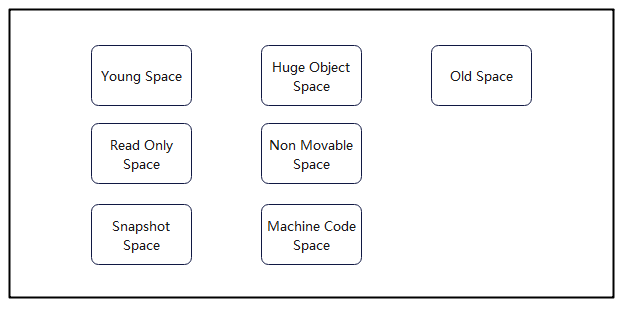
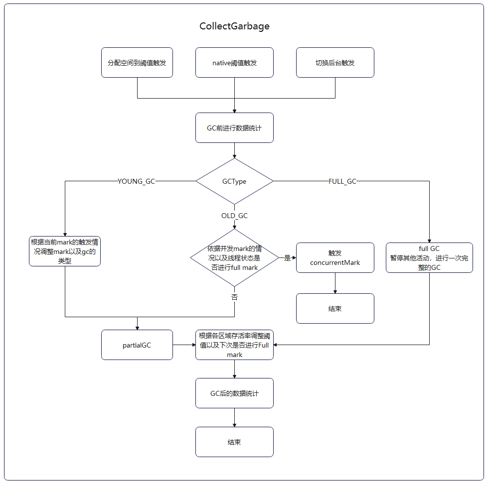

# GC垃圾回收

GC（全称 Garbage Collection），即垃圾回收。在计算机领域，GC是指识别并释放内存中的不再使用的对象，以回收内存空间。当前主流编程语言实现的GC算法主要分为两大类：引用计数和对象追踪（即Tracing GC）。

## GC算法简述

### GC的类型

#### 引用计数

当对象B指向对象A时，A的引用计数加1；当该指向断开时，A的引用计数减1。如果A的引用计数为0，回收对象A。  

- 优点：引用计数算法设计简单，内存回收及时，在对象成为垃圾时立即回收，因此无需引入单独的暂停业务代码（Stop The World，STW）阶段。
- 缺点：对对象操作时插入计数环节，增加了内存分配和赋值的开销，影响程序性能。更严重的是存在由循环引用导致的内存泄漏问题。
```
class Parent {
  constructor() {
    this.child = null;
  }
  child: Child | null = null;
}

class Child {
  constructor() {
    this.parent = null;
  }
  parent: Parent | null = null;
}

function main() {
  let parent: Parent = new Parent();
  let child: Child = new Child();
  parent.child = child;
  child.parent = parent;
}
```
在上述代码中，对象parent被对象child持有，parent的引用计数加1。同时，child也被parent持有，child的引用计数也加1。这导致了循环引用，直到main函数结束，parent和child仍无法释放，从而引发内存泄漏。
#### 对象追踪


根对象包括程序运行中的栈内对象和全局对象等当前时刻一定存活的对象。被根对象引用的对象也是存活状态。通过遍历可以找到所有存活的对象。如图所示，从根对象开始遍历对象及其域，所有可达的对象标记为蓝色，即为活对象；剩下的不可达对象标记为黄色，即为垃圾。
- 优点：对象追踪算法可以解决循环引用的问题，且对内存的分配和赋值没有额外的开销。
- 缺点：和引用计数算法相反，对象追踪算法较为复杂，且有短暂的STW阶段。此外，回收会有延迟，导致比较多的浮动垃圾。

引用计数和对象追踪算法各有优劣。由于引用计数存在内存泄漏问题，ArkTS运行时选择基于对象追踪（即Tracing GC）算法设计GC。

### 对象追踪的三种类型

对象追踪算法通过遍历对象图标记出垃圾，而根据垃圾回收方式的不同，对象追踪可以分为三种基本类型：标记-清扫回收、标记-复制回收、标记-整理回收。以下图示中蓝色标记为可达对象，黄色标记为不可达对象。

#### 标记-清扫回收


  
完成对象图遍历后，擦除不可达对象内容，并将其放入空闲队列，以便下次对象分配。  
该回收方式不搬移对象，因此效率高。但因回收对象内存地址不连续，会导致内存碎片化，降低分配效率。极端情况下，即使有大量空闲内存，也可能无法放入较大的对象。  

#### 标记-复制回收


遍历对象图时，将可达对象复制到新内存空间。遍历完成后，一次回收旧内存空间。  
这种方式可以解决内存碎片问题，并通过一次遍历完成整个GC过程，效率较高。但在极端情况下，需要预留一半的内存空间以确保所有活动对象可以被拷贝，导致空间利用率较低。  

#### 标记-整理回收


完成对象图遍历后，将可达对象（蓝色）往本区域（或指定区域）的头部空闲位置复制，然后将已经完成复制的对象回收整理到空闲队列中。  
这种回收方式既解决了“标记-清扫回收”导致的大量内存碎片问题，同时避免了“标记-复制回收”浪费一半内存空间的缺点，但性能开销比“标记-复制回收”高。  
### HPP GC

HPP GC（High Performance Partial Garbage Collection），即高性能部分垃圾回收，其中“High Performance”主要体现在三方面，分代模型、混合算法和GC流程优化。在算法方面，HPP GC会根据不同对象区域、采取不同的回收方式。

#### 分代模型

ArkTS运行时采用传统的分代模型，将对象进行分类。考虑到大多数新分配的对象都会在一次GC之后被回收，而大多数经过多次GC之后依然存活的对象会继续存活，ArkTS运行时将对象划分为年轻代对象和老年代对象，并将对象分配到不同的空间。


ArkTS运行时将新分配的对象直接分配到年轻代（Young Space）的From空间。经过一次GC后依然存活的对象，会移动到To空间。而经过再次GC后依然存活的对象，会被移动到老年代（Old Space）。

#### 混合算法

HPP GC是部分复制、部分整理和部分清扫的混合算法，根据年轻代和老年代对象特点采取不同的回收方式。  

- 部分复制
考虑到年轻代对象生命周期短、回收频繁且大小有限，ArkTS运行时对年轻代对象采用“标记-复制回收”算法。
- 部分整理+部分清扫
根据老年代对象的特点，引入启发式Collection Set（简称CSet）选择算法。此选择算法的基本原理是：在标记阶段对每个区域的存活对象进行大小统计，然后在回收阶段优先选出存活对象少、回收代价小的区域进行对象整理回收，再对剩下的区域进行清扫回收。

回收策略如下：

- 根据设定的区域存活对象大小阈值，将满足条件的区域纳入初步的CSet队列，并根据存活率进行从低到高的排序（注：存活率=存活对象大小/区域大小）。

- 根据设定的释放区域个数阈值，选出最终的CSet队列，进行整理回收。

- 对未被选入CSet队列的区域进行清扫回收。

启发式CSet选择算法结合了“标记-整理回收”和“标记-清扫回收”算法的优点，避免了内存碎片问题，同时提升了性能。

#### 流程优化

HPP GC流程中引入了大量的并发和并行优化，以减少对应用性能的影响。采用了并发+并行标记（Marking）、并发+并行清扫（Sweep）、并行复制/整理（Evacuation）、并行回改（Update）和并发清理（Clear）执行GC任务。

## Heap结构及其配置参数

### Heap结构



- SemiSpace：年轻代（Young Generation），存放新创建出来的对象，存活率低，主要使用copying算法进行内存回收。
- OldSpace：老年代（Old Generation），存放年轻代多次回收仍存活的对象会被移动到该空间，根据场景混合多种算法进行内存回收。
- HugeObjectSpace：大对象空间，使用单独的Region存放一个大对象的空间。
- ReadOnlySpace：只读空间，存放运行期间的只读数据。
- NonMovableSpace：不可移动空间，存放不可移动的对象。
- SnapshotSpace：快照空间，转储堆快照时使用的空间。
- MachineCodeSpace：机器码空间，存放程序机器码。

注：每个空间由一个或多个Region进行分区域管理，Region是空间向内存分配器申请的单位。

### 相关参数

> **注意：**
> 
> 以下参数未提示可配置的均为不可配置项，由系统自行设定。

根据系统分配堆空间总大小64MB-128MB/128MB-256MB/大于256MB的三个范围，以下参数系统会设置不同的大小。如果表格内范围仅有一个值，则表示该参数值不随堆空间总大小变化。手机设备堆空间总大小默认为大于256MB。  
开发者可以查阅[hidebug接口文档](../reference/apis-performance-analysis-kit/js-apis-hidebug.md)，使用相关接口查询内存信息。
#### 堆大小相关参数

| 参数名 | 范围 | 作用 |
| --- | --- | --- |
| HeapSize | 448MB | 主线程默认堆空间总大小，小内存设备会依据实际内存池大小修正。 |
| SemiSpaceSize | 2MB-4MB/2MB-8MB/2MB-16MB | SemiSpace空间大小。 |
| NonmovableSpaceSize | 2MB/6MB/64MB | NonmovableSpace空间大小。 |
| SnapshotSpaceSize | 512KB | 快照空间大小。 |
| MachineCodeSpaceSize | 2MB | 机器码空间大小。 |

#### worker线程堆上限

| 参数名 | 范围 | 作用 |
| --- | --- | --- |
| HeapSize  | 768 MB | worker类型线程堆空间大小。 |

#### Semi Space
heap中生成两个Semi Space供copying使用。
| 参数名 | 范围 | 作用 |
| --- | --- | --- |
| semiSpaceSize | 2MB-4MB/2MB-8MB/2MB-16MB | SemiSpace空间大小，会根据堆总大小有不同的范围限制。 |
| semiSpaceTriggerConcurrentMark | 1M/1.5M/1.5M| 首次单独触发Semi Space的并发mark的界限值，超过该值则触发。 |
| semiSpaceStepOvershootSize| 2MB | 允许过冲最大大小。 |

#### Old Space 和 Huge Object Space
初始化时均设定为Heap剩余未分配空间的大小，默认手机设备主线程OldSpaceSize上限接近350MB。

| 参数名 | 范围 | 作用 |
| --- | --- | --- |
| oldSpaceOvershootSize | 4MB/8MB/8MB | OldSpace允许过冲最大大小。 |

#### 其他空间

| 参数名 | 范围 | 作用 |
| --- | --- | --- |
| defaultReadOnlySpaceSize | 256 KB | ReadOnlySpace默认空间大小。 |
| defaultNonMovableSpaceSize | 2 MB/6 MB/64 MB | NonMovableSpace默认空间大小。|
| defaultSnapshotSpaceSize | 512 KB/512 KB/ 4 MB | SnapshotSpace默认空间大小。|
| defaultMachineCodeSpaceSize | 2 MB/2 MB/8 MB | MachineCodeSpace默认空间大小。|

#### 解释器栈大小

| 参数名 | 范围 | 作用 |
| --- | --- | --- |
| maxStackSize | 128KB | 控制解释器栈大小。 |

#### 并发参数

| 参数名 | 值 | 作用 |
| --- | --- | --- |
| gcThreadNum | 7 | gc线程数量，默认为7。可通过`gc-thread-num`参数自行设定该参数值。 |
| MIN_TASKPOOL_THREAD_NUM | 3 | 线程池最小线程数。 |
| MAX_TASKPOOL_THREAD_NUM | 7 | 线程池最大线程数。 |

注：该线程池主要用于执行GC流程中的并发任务。线程池初始化时，会综合参考gcThreadNum和线程数的上下限。如果gcThreadNum为负值，线程池的线程数将初始化为CPU核心数的一半。

#### 其他参数

| 参数名 | 值 | 作用 |
| --- | --- | --- |
| minAllocLimitGrowingStep | 2M/4M/8M | heap整体重新计算空间大小限制时，控制oldSpace、heapObject和globalNative的最小增长步长。 |
| minGrowingStep | 4M/8M/16M | 调整oldSpace的最小增长步长。 |
| longPauseTime | 40ms | 判断是否为超长GC界限，超长GC会触发完整GC日志信息打印，方便开发者定位分析。可通过`gc-long-paused-time`进行配置。 |

## GC流程



### HPP GC的类型

#### Young GC

- **触发机制**：年轻代GC触发阈值在2MB-16MB变化，根据分配速度和存活率等会变化。
- **说明**：主要回收semi space新分配的年轻代对象。
- **场景**：前台场景。
- **日志关键词**：`[ HPP YoungGC ]`

#### Old GC

- **触发机制**：老年代GC触发阈值在20MB-300多MB变化，大部分情况，第一次Old GC的阈值在20M左右，之后会根据对象存活率，内存占用大小进行阈值调整。
- **说明**：对年轻代和部分老年代空间做整理压缩，其他空间做sweep清理。触发频率比年轻代GC低很多，由于会做全量mark，因此GC时间会比年轻代GC长，单次耗时约5ms~10ms。
- **场景**：前台场景。
- **日志关键词**：`[ HPP OldGC ]`

#### Full GC

- **触发机制**：不会由内存阈值触发。应用切换后台之后，如果预测能回收的对象尺寸大于2M会触发一次Full GC。DumpHeapSnapshot 和 AllocationTracker 工具默认会触发Full GC。Native 接口和ArkTS 也有接口可以触发。
- **说明**：会对年轻代和老年代做全量压缩，主要用于性能不敏感场景，最大限度回收内存空间。
- **场景**：后台场景。
- **日志关键词**：`[ CompressGC ]`

此后的Smart GC或IDLE GC都会从上述三种GC中选择。

### 触发策略

#### 空间阈值触发GC

- 函数方法：`AllocateYoungOrHugeObject`，`AllocateHugeObject`等分配函数。
- 限制参数：对应的空间阈值。
- 说明：对象申请空间到达对应空间阈值时触发GC。
- 典型日志：日志可区分GCReason::ALLOCATION_LIMIT。

#### native绑定大小达到阈值触发GC

- 函数方法：`GlobalNativeSizeLargerThanLimit`
- 限制参数：`globalSpaceNativeLimit`。
- 说明：影响是否进行全量mark，以及是否开始并发mark。

#### 切换后台触发GC

- 函数方法：`ChangeGCParams`
- 说明：切换后台后主动触发一次Full GC。
- 典型日志：`app is inBackground` 和 `app is not inBackground`。
  GC 日志中可区分GCReason::SWITCH_BACKGROUND。

### 执行策略

#### ConcurrentMark

- 函数方法：`TryTriggerConcurrentMarking`
- 说明：尝试触发并发mark，将遍历对象进行标记的任务交由线程池中并发运行，减少UI主线程挂起时间。
- 典型日志：`fullMarkRequested`，`trigger full mark`，`Trigger the first full mark`，`Trigger full mark`，`Trigger the first semi mark`，`Trigger semi mark`。

#### new space GC前后的阈值调整

- 函数方法：`AdjustCapacity`
- 说明：GC后调整SemiSpace的触发水线，优化空间结构。
- 典型日志：无直接日志，可以通过GC统计日志看出，GC前young space的阈值有动态调整。

#### 第一次OldGC后阈值的调整

- 函数方法：`AdjustOldSpaceLimit`
- 说明：根据最小增长步长以及平均存活率调整OldSpace阈值限制。
- 日志关键词：`AdjustOldSpaceLimit`。

#### 第二次及以后的OldGC对old Space/global space阈值调整，以及增长因子的调整

- 函数方法：`RecomputeLimits`
- 说明：根据当前GC统计的数据变化，重新计算并调整`newOldSpaceLimit`、`newGlobalSpaceLimit`、`globalSpaceNativeLimit`和增长因子。
- 日志关键词：`RecomputeLimits`。

#### PartialGC的CSet 选择策略

- 函数方法：`OldSpace::SelectCSet()`
- 说明：PartialGC执行时采用该策略，优先选择存活对象数量少、回收代价小的Region进行GC。
- 典型日志：
    - `Select CSet failure: number is too few`
    - `Max evacuation size is 6_MB. The CSet Region number`
    - `Select CSet success: number is`

## SharedHeap

### SharedHeap结构


- SharedOldSpace：共享老年代空间（这里并不区分年轻代老年代），存放一般的共享对象。
- SharedHugeObjectSpace：共享大对象空间，使用单独的Region存放一个大对象的空间。
- SharedReadOnlySpace：共享只读空间，存放运行期间的只读数据。
- SharedNonMovableSpace：共享不可移动空间，存放不可移动的对象。

注：SharedHeap用于线程间共享对象，提高效率并节省内存。共享堆不单独属于任何线程，保存具有共享价值的对象，提高对象的存活率，去除了SemiSpace类型。

## 特性

### Smart GC

#### 特性介绍

在应用性能敏感场景，通过将线程（SmartGC对worker线程和taskpool线程不生效）GC触发水线临时调整到线程的堆最大值（主线程线程默认448MB），尽量避免触发GC导致应用掉帧。如果敏感场景持续时间过久，对象分配已经达到了堆最大值，则还是会触发GC，且这次GC由于积累的对象太多，GC时间会相对较久。

#### 支持敏感场景

- 应用冷启动（默认支持）。
- 应用滑动。
- 应用点击页面跳转。
- 超长帧。

当前该特性使能由系统侧进行管控，三方应用暂无接口直接调用。

日志关键词: `SmartGC`。

#### 交互流程


标记性能敏感场景，在进入和退出性能敏感场景时，在堆上标记，避免不必要的GC，维持高性能表现。

## 日志解释

### 开启全量日志

默认情况下，详细的GC日志仅在GC耗时超过40毫秒时才会打印。若需开启所有GC执行的日志，需使用命令在设备中开启。

**使用样例：**

```shell
# 设置开启GC全量日志参数，开启参数为0x905d，关闭GC全量日志，设置为默认值为0x105c
hdc shell param set persist.ark.properties 0x905d
# 重启生效
hdc shell reboot
```

### 典型日志

以下日志统计了GC完整执行后的信息，不同GC类型可能有所差异。开发者可以在导出的日志文件中搜索关键词`[gc]`查看GC相关日志，或搜索关键词`ArkCompiler`查看更全面的虚拟机相关日志。

```
// GC前对象实际占用大小（Region实际占用大小）->GC后对象实际占用大小（Region实际占用大小），总耗时（+concurrentMark耗时），GC触发原因。
C03F00/ArkCompiler: [gc]  [ CompressGC ] 26.1164 (35) -> 7.10049 (10.5) MB, 160.626(+0)ms, Switch to background
// GC运行时的各种状态以及应用名称
C03F00/ArkCompiler: [gc] IsInBackground: 1; SensitiveStatus: 0; OnStartupEvent: 0; BundleName: com.example.demo;
// GC运行时的各阶段耗时统计
C03F00/ArkCompiler: [gc] /***************** GC Duration statistic: ****************/
C03F00/ArkCompiler: [gc] TotalGC:                 160.626 ms
C03F00/ArkCompiler: Initialize:              0.179   ms
C03F00/ArkCompiler: Mark:                    159.204 ms
C03F00/ArkCompiler: MarkRoots:               6.925   ms
C03F00/ArkCompiler: ProcessMarkStack:        158.99  ms
C03F00/ArkCompiler: Sweep:                   0.957   ms
C03F00/ArkCompiler: Finish:                  0.277   ms
// GC后各个部分占用的内存大小
C03F00/ArkCompiler: [gc] /****************** GC Memory statistic: *****************/
C03F00/ArkCompiler: [gc] AllSpaces        used:  7270.9KB     committed:   10752KB
C03F00/ArkCompiler: ActiveSemiSpace  used:       0KB     committed:     256KB
C03F00/ArkCompiler: OldSpace         used:  4966.9KB     committed:    5888KB
C03F00/ArkCompiler: HugeObjectSpace  used:    2304KB     committed:    2304KB
C03F00/ArkCompiler: NonMovableSpace  used:       0KB     committed:    2304KB
C03F00/ArkCompiler: MachineCodeSpace used:       0KB     committed:       0KB
C03F00/ArkCompiler: HugeMachineCodeSpace used:       0KB     committed:       0KB
C03F00/ArkCompiler: SnapshotSpace    used:       0KB     committed:       0KB
C03F00/ArkCompiler: AppSpawnSpace    used: 4736.34KB     committed:    4864KB
C03F00/ArkCompiler: [gc] Anno memory usage size:  45      MB
C03F00/ArkCompiler: Native memory usage size:2.99652 MB
C03F00/ArkCompiler: NativeBindingSize:       0.577148KB
C03F00/ArkCompiler: ArrayBufferNativeSize:   0.0117188KB
C03F00/ArkCompiler: RegExpByteCodeNativeSize:0.280273KB
C03F00/ArkCompiler: ChunkNativeSize:         19096   KB
C03F00/ArkCompiler: [gc] Heap alive rate:         0.202871
// 该虚拟机的此类型GC的整体统计
C03F00/ArkCompiler: [gc] /***************** GC summary statistic: *****************/
C03F00/ArkCompiler: [gc] CompressGC occurs count  6
C03F00/ArkCompiler: CompressGC max pause:    2672.33 ms
C03F00/ArkCompiler: CompressGC min pause:    160.626 ms
C03F00/ArkCompiler: CompressGC average pause:1076.06 ms
C03F00/ArkCompiler: Heap average alive rate: 0.635325
```

- gc类型：[HPP YoungGC]、[HPP OldGC]、[CompressGC]、[SharedGC]。
- TotalGC：总耗时。其下相应为各个阶段对应的耗时，基本的包括`Initialize`、`Mark`、`MarkRoots`、`ProcessMarkStack`、`Sweep`、`Finish`，实际根据不同的GC流程不同会有不同的阶段。
- IsInBackground：是否在后台场景，1：为后台场景，0：非后台场景。
- SensitiveStatus：是否为敏感场景，1：为敏感场景，0：非敏感场景。
- OnStartupEvent：是否为冷启动场景，1：为冷启动场景，0：非冷启动场景。
- used：当前已分配的对象实际占用的内存空间大小。
- committed：当前实际分配给heap内存空间的大小。由于各空间按Region分配，而Region通常不会被对象完全占满，因此committedSize大于等于usedSize。hugeSpace会完全相等，因为每个对象单独占用一个Region。
- Anno memory usage size：当前进程所有堆申请的内存大小，包括heap与sharedHeap。
- Native memory usage size：当前进程所申请的Native内存大小。
- NativeBindingSize：当前进程堆内对象绑定的Native内存大小。
- ArrayBufferNativeSize：当前进程申请的数组缓存Native内存大小。
- RegExpByteCodeNativeSize：当前进程申请的正则表达式字节码Native内存大小。
- ChunkNativeSize：当前进程申请的ChunkNative内存大小。
- Heap alive rate：堆内对象的存活率。

## GC开发者调试接口

> **注意：**
> 
> 以下接口仅供调试使用，非正式对外SDK接口，不应在应用正式版本中使用。

### ArkTools.hintGC()

- 调用方式：`ArkTools.hintGC()`
- 接口类型：ArkTS接口。
- 作用：调用后，VM主动判断是否适合进行full GC。如果后台场景中内存预期存活率低于设定值，则触发full GC；若判断为敏感状态，则不触发。
- 使用场景：开发者提示系统进行GC。
- 典型日志：无直接日志，仅可区分外部触发（`GCReason::TRIGGER_BY_JS`）。


**使用参考：**

```ts
// 首先需要声明接口
declare class ArkTools {
     static hintGC(): void;
}

@Entry
@Component
struct Index {
  @State message: string = 'Hello World';
  build() {
  Row() {
    Column() {
      Text(this.message)
        .fontSize(50)
        .fontWeight(FontWeight.Bold)
      Button("触发HintGC").onClick((event: ClickEvent) => {
          ArkTools.hintGC();  //方法内直接调用
      })
    }
    .width('100%')
  }
  .height('100%')
}
}
```

## GC常见问题

### GC稳定性问题排查指导

GC稳定性问题大多由两种异常引起：一是非法多线程操作导致的对象异常。二是踩内存问题导致的存储的指针异常。这两种问题在GC任务中的表现通常为堆栈中的地址访问异常。 

可通过线程名称和堆栈内的方法来识别GC任务：`OS_GC_Thread`线程主要执行GC任务和PGO相关任务（采集型任务）；或者通过堆栈内包含`GCTask`等关键词识别GC任务。GC任务上报地址异常类型的崩溃时，开发者应首先应排查非法多线程问题和踩内存问题。 

- 检测非法多线程操作：[方舟运行时检测](https://developer.huawei.com/consumer/cn/doc/harmonyos-guides/ide-multi-thread-check)。
- 检测踩内存问题：[HWASan检测](https://developer.huawei.com/consumer/cn/doc/harmonyos-guides/ide-hwasan)。

以下示例仅列举部分情况，实际问题上报的地址异常类型多种多样，此处不再赘述。

对象异常问题典型堆栈信息： 

0xffff000000000048为对象异常偏移出错。

``` text
Reason:Signal:SIGSEGV(SEGV_MAPERR)@0xffff000000000048 
Fault thread info:
Tid:6490, Name:OS_GC_Thread
#00 pc 0000000000507310 /system/lib64/platformsdk/libark_jsruntime.so(panda::ecmascript::JSHClass::SizeFromJSHClass(panda::ecmascript::TaggedObject*)+0)(a3d1ba664de66d31faed07d711ee1299)
#01 pc 0000000000521f94 /system/lib64/platformsdk/libark_jsruntime.so(panda::ecmascript::CompressGCMarker::EvacuateObject(unsigned int, panda::ecmascript::TaggedObject*, panda::ecmascript::MarkWord const&, panda::ecmascript::ObjectSlot)+80)(a3d1ba664de66d31faed07d711ee1299)
#02 pc 0000000000521ee4 /system/lib64/platformsdk/libark_jsruntime.so(panda::ecmascript::CompressGCMarker::MarkObject(unsigned int, panda::ecmascript::TaggedObject*, panda::ecmascript::ObjectSlot)+372)(a3d1ba664de66d31faed07d711ee1299)
#03 pc 0000000000523e40 /system/lib64/platformsdk/libark_jsruntime.so(a3d1ba664de66d31faed07d711ee1299)
#04 pc 0000000000516d74 /system/lib64/platformsdk/libark_jsruntime.so(a3d1ba664de66d31faed07d711ee1299)
#05 pc 00000000005206d4 /system/lib64/platformsdk/libark_jsruntime.so(panda::ecmascript::CompressGCMarker::ProcessMarkStack(unsigned int)+160)(a3d1ba664de66d31faed07d711ee1299)
#06 pc 000000000050460c /system/lib64/platformsdk/libark_jsruntime.so(panda::ecmascript::Heap::ParallelGCTask::Run(unsigned int)+228)(a3d1ba664de66d31faed07d711ee1299)
#07 pc 000000000064f648 /system/lib64/platformsdk/libark_jsruntime.so(panda::ecmascript::Runner::Run(unsigned int)+188)(a3d1ba664de66d31faed07d711ee1299)
#08 pc 000000000064f718 /system/lib64/platformsdk/libark_jsruntime.so(a3d1ba664de66d31faed07d711ee1299)
#09 pc 00000000001ba6b8 /system/lib/ld-musl-aarch64.so.1(start+236)(8102fa8a64ba5e1e9f2257469d3fb251)
```
指针异常问题典型堆栈信息：

0x000056c2fffc0008为指针异常，正常指针地址为40位有效地址。

``` text
Reason:Signal:SIGSEGV(SEGV_MAPERR)@0x000056c2fffc0008 
Fault thread info:
Tid:2936, Name:OS_GC_Thread
#00 pc 00000000004d2ec0 /system/lib64/platformsdk/libark_jsruntime.so(733f61d2f51e825872484cc344970fe5)
#01 pc 00000000004c6cac /system/lib64/platformsdk/libark_jsruntime.so(733f61d2f51e825872484cc344970fe5)
#02 pc 00000000004cd180 /system/lib64/platformsdk/libark_jsruntime.so(panda::ecmascript::NonMovableMarker::ProcessMarkStack(unsigned int)+256)(733f61d2f51e825872484cc344970fe5)
#03 pc 000000000049d108 /system/lib64/platformsdk/libark_jsruntime.so(panda::ecmascript::ConcurrentMarker::ProcessConcurrentMarkTask(unsigned int)+52)(733f61d2f51e825872484cc344970fe5)
#04 pc 00000000004b6620 /system/lib64/platformsdk/libark_jsruntime.so(panda::ecmascript::Heap::ParallelGCTask::Run(unsigned int)+236)(733f61d2f51e825872484cc344970fe5)
#05 pc 00000000005d6e60 /system/lib64/platformsdk/libark_jsruntime.so(panda::ecmascript::Runner::Run(unsigned int)+168)(733f61d2f51e825872484cc344970fe5)
#06 pc 00000000005d6f30 /system/lib64/platformsdk/libark_jsruntime.so(733f61d2f51e825872484cc344970fe5)
#07 pc 00000000001bdb84 /system/lib/ld-musl-aarch64.so.1(start+236)(e65f5c83306cf9c7dd4643794946ab9f)
```