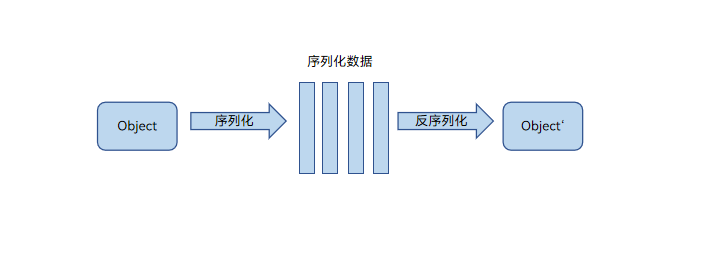

# ArkTS线程间通信概述

线程间通信指的是并发多线程间存在的数据交换行为。由于ArkTS语言兼容TS/JS，其运行时的实现与其它所有的JS引擎一样，都是基于Actor内存隔离的并发模型提供并发能力。

对于不同的数据对象，在ArkTS线程间通信的行为是有差异的，比如普通JS对象、ArrayBuffer对象、SharedArrayBuffer对象等，跨线程的行为是不一致的，包括序列化反序列化拷贝、数据转移、数据共享等不同行为。

以JS对象为例，其在并发任务间的通信采用了标准的Structure Clone算法（序列化反序列化），通过序列化将JS对象转成与引擎无关的数据（字符串或内存块等），在另一个并发实例通过反序列化，还原成与原JS对象内容一致的新对象，因此通常需要经过深拷贝，效率较低。除了支持JS标准的序列化反序列化能力外，还支持绑定Native的JS对象传输及[Sendable对象](arkts-sendable.md)的共享能力。

ArkTS目前主要提供两种并发能力支持线程间通信：TaskPool和Worker。

- Worker是Actor并发模型标准的跨线程通信API，与Web Worker或者Node.js Worker的使用方式基本一致。

- TaskPool提供了功能更强、并发编程更简易的任务池API。其中TaskPool涉及跨并发实例的对象传递行为与Worker一致，还是采用了标准的Structured Clone算法，并发通信的对象越大，耗时就越长。

基于ArkTS提供的TaskPool及Worker并发接口，支持多种线程间通信能力，可以满足开发者的不同[线程间通信场景](independent-time-consuming-task.md)。比如：独立的耗时任务场景、多个耗时任务场景、TaskPool线程与宿主线程通信场景、Worker线程和宿主线程的异步通信场景、Worker同步调用宿主线程的接口等场景。同时，基于[Node-API](../napi/napi-introduction.md)提供的机制，支持C++线程跨线程调用ArkTS接口。

图1 序列化反序列化原理图

