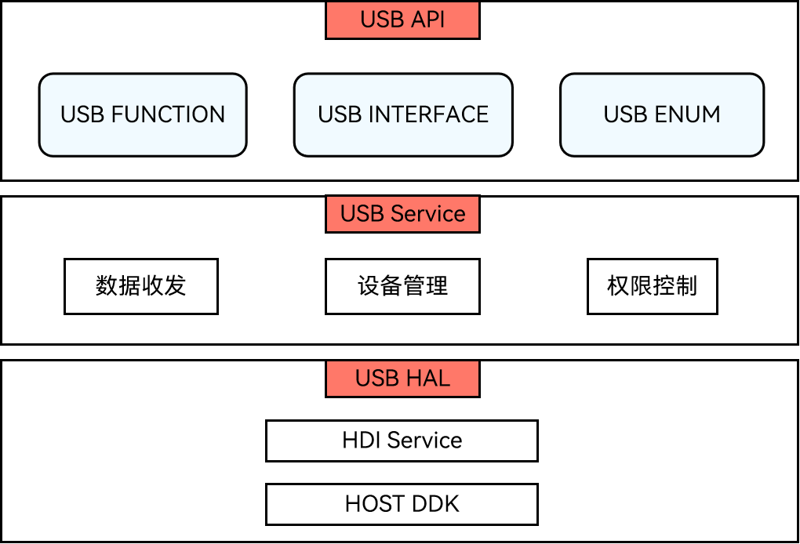

# USB服务开发概述

## 基本概念

USB服务是应用访问底层的一种设备抽象概念，分为主机（Host）、设备（Device）。
在Host模式下，开发者根据提供的USB API，可以获取设备列表、控制设备访问权限、以及与连接的设备进行数据传输、控制命令传输等。其中数据传输分为同步和异步两种传输模式，支持中断传输、实时传输、批量传输等传输类型。在进行数据传输之前，需要先进行获取设备列表、通过设备访问权限校验、打开或连接设备、声明占用设备接口等操作。

## 运作机制

USB服务系统包含USB API、USB Service、USB HAL。

**图1** USB服务运作机制

- USB API：提供USB的基础API，主要包含查询USB设备列表、批量数据传输、控制命令传输、权限控制等。

- USB Service：主要实现HAL层数据的接收、解析、分发以及对设备的管理等。

- USB HAL层：提供给用户态可直接调用的驱动能力接口。
