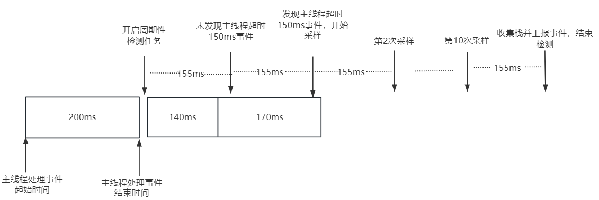
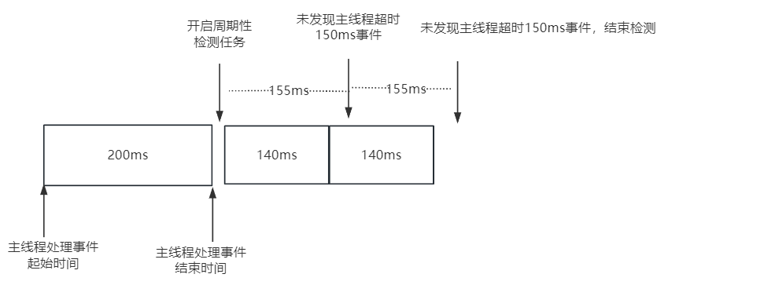

# 主线程超时事件介绍

HiAppEvent提供接口用于订阅主线程超时事件。

- [订阅主线程超时事件（ArkTS）](hiappevent-watcher-mainthreadjank-events-arkts.md)
- [订阅主线程超时事件（C/C++）](hiappevent-watcher-mainthreadjank-events-ndk.md)

主线程超时事件信息中params属性的详细描述如下：

**params属性：**

| 名称    | 类型   | 说明                       |
| ------- | ------ | ------------------------- |
| time     | number | 事件触发时间，单位为毫秒。 |
| bundle_version | string | 应用版本。 |
| bundle_name | string | 应用名称。 |
| pid | number | 应用的进程id。|
| uid | number | 应用的用户id。 |
| begin_time | number | 主线程任务开始时间。 |
| end_time | number | 主线程任务结束时间。 |
| external_log| string[] | 主线程超时日志文件路径。**为避免目录空间超限（限制参考log_over_limit），导致新生成的日志文件写入失败，日志文件处理完后请及时删除。** |
| log_over_limit| boolean | 生成的主线程超时日志文件与已存在的日志文件总大小是否超过10M上限。true表示超过上限，日志写入失败；false表示未超过上限。|

## 主线程超时事件时间规格

1. 启动时间

    主线程超时采样栈（150ms < 主线程处理时长 < 450ms）。**同一个应用的PID一个生命周期仅会触发一次主线程超时事件采样栈。**
  
    主线程超时采样Trace（主线程处理时长 > 450ms）。**同一个应用的UID一天仅会触发一次主线程超时事件采样trace。**

    > **注意：**
    >
    > 启动主线程超时检测抓取trace的功能的前提：**开发者使用nolog版本，开发者模式处于关闭状态**；
    >
    > log和nolog版本：在手机中，点击设置——搜索关键字“关于本机”——软件版本进行查看。log版本会以log结尾；
    >
    > 关闭开发者模式后， 可能无法使用DevEco Studio。因此，可以提前安装应用，再关闭开发者模式。

2. 抓栈时间

    主线程处理事件超时后，开始执行周期性任务检测，每隔155ms检测主线程是否再次发生超时事件(1 <= 检测次数 <= 2)，共三种情况：

    (1) 第一次检测发现超时事件，开始执行堆栈采样，每隔155ms采样一次，共采样10次堆栈，第11次收集堆栈并上报事件，结束检测。

      

    (2) 第一次检测未发生超时事件，第二次检测发现超时事件，开始执行堆栈采样，每隔155ms采样一次，共采样10次堆栈，第11次收集堆栈并上报事件，结束检测。

      

    (3) 两次检测均未发现超时事件，结束检测。

      

3. 抓trace时间  

   主线程超时抓Trace调用录制函数后，每隔150ms检测主线程是否再次发生超时事件(检测次数 = 20)，其中，只要在20个间隔检测时，有一次主线程事件超时150ms，3s检测结束后落盘trace。

   (1) 20次检测均未发生主线程超时150ms事件。

   

   (2) 20次检测至少有一次发生主线程超时150ms事件。

   

## 主线程超时事件规格

1. 日志老化规格

    一般情况，栈文件的大小为7-10KB，trace文件大小为3-6M。应用沙箱内的watchdog目录最大保存10M内容，超出后，需要用户手动清理文件。目录地址：/data/app/el2/100/log/应用bundle name/watchdog。

2. 事件里如何获取日志：从external_logs中获取日志路径。

3. 抓栈功能目前只支持ARM64架构，抓栈结果为解析后的混合栈信息，包含native帧和JS帧。

   抓栈结果部分示例如下：

   ```text
    9 #00 pc 0000757c /system/bin/appspawn(55679d09bcdea35bb1e0d4e1d9a3e58f)
        9 #01 pc 000731c0 /system/lib/ld-musl-aarch64.so.1(add9e521e4eaf5cb009d4260f3b69ccd)
            9 #02 pc 000090a9 /system/bin/appspawn(main+396)(55679d09bcdea35bb1e0d4e1d9a3e58f)
                9 #03 pc 0000ab5d /system/bin/appspawn(AppSpawnRun+100)(55679d09bcdea35bb1e0d4e1d9a3e58f)
                    9 #04 pc 0000e7f1 /system/lib/chipset-pub-sdk/libbegetutil.z.so(RunLoop_+200)(52ace27d827ad482439bf32cc75bb17b)
                    ......
                                            9 #21 pc 00107aec /system/lib/ld-musl-aarch64.so.1(__pthread_cond_timedwait+628)(add9e521e4eaf5cb009d4260f3b69ccd)
    1 #00 pc 00032e67 /system/lib/platformsdk/libmmi-util.z.so(OHOS::MMI::UDSSocket::OnReadPackets(OHOS::MMI::CircleStreamBuffer&, std::__h::function<void (OHOS::MMI::NetPacket&)>)+158)(99e56bc765f9208f7b7ba8b268886a59)
        1 #01 pc 0000312e5 /system/lib/platformsdk/libmmi-client.z.so(OHOS::MMI::ClientMsgHandler::OnMsgHandler(OHOS::MMI::UDSClient const&, OHOS::MMI::NetPacket&)+340)(66ac85e964777ae89f0c26c339093cd1)
            1 #02 pc 0003016b /system/lib/platformsdk/libmmi-client.z.so(OHOS::MMI::ClientMsgHandler::OnPointerEvent(OHOS::MMI::UDSClient const&, OHOS::MMI::NetPacket&)+1222)(66ac85e964777ae89f0c26c339093cd1)
                1 #03 pc 0003b96b /system/lib/platformsdk/libmmi-client.z.so(OHOS::MMI::InputManagerImpl::OnPointerEvent(std::__h::shared_ptr<OHOS::MMI::PointerEvent>)+1370)(66ac85e964777ae89f0c26c339093cd1)
                    1 #04 pc 00095903 /system/lib/platformsdk/libwm.z.so(OHOS::Rosen::InputEventListener::OnInputEvent(std::__h::shared_ptr<OHOS::MMI::PointerEvent>) const+478)(9c40c5f416d6f830435126998fbcad42)
                    ......
                                            1 #21 pc 003f5c55 /system/lib/platformsdk/libark_jsruntime.so(4e6a2651ec80a7f639233f414d6486fe)
                                                1 #22 at anonymous (/entry/build/default/cache/default/default@CompileArkTS/esmodule/debug/entry/src/main/ets/pages/Index.js:67:17)
                                                    1 #23 at wait2 (/entry/build/default/cache/default/default@CompileArkTS/esmodule/debug/entry/src/main/ets/pages/Index.js:16:12)
                                                    ......
   ```

   每次抓栈拷贝16KB主线程调用栈信息进行回栈解析，所以每一次抓栈结果最多可以展示进程16KB调用信息，共进行10次，重复栈帧会聚合在一起，不同调用层次通过行缩进进行区分，最终以树型方式进行展示。当抓栈失败（如主线程阻塞在内核或信号被屏蔽等情况）时，将会输出"/proc/self/wchan"文件内容。

   展示结果中每一行表示一个栈信息，每一行栈帧信息所表示的意义可以按如下方式解读：

   native帧格式如下：

   ```text
    9 #02 pc 000090a9 /system/bin/appspawn(main+396)(55679d09bcdea35bb1e0d4e1d9a3e58f)
    ^  ^       ^               ^              ^                   ^ 
    1  2       3               4              5                   6

    1 表示采样到此帧的次数
    2 表示帧的调用层级，行缩进大小与该层级对应，所有同一层级帧采样到的次数和不大于10次，#00采样次数和为10(设置采样的次数)
    3 为native帧PC值
    4 表示调用的文件路径
    5 调用的函数名及代码行偏移(unstripped版本，stripped版本可能没有)
    6 so文件md5值
   ```

   JS帧格式如下：

   ```text
    1 #23 at wait2 (/entry/build/default/cache/default/XXX/entry/src/main/ets/pages/Index.js:16:12)
    ^  ^    ^               ^
    1  2    3               4

    1 表示采样到此帧的次数，同样最大为采样次数
    2 表示帧的调用层级，与native帧意义相同
    3 表示调用函数名wait2
    4 表示调用函数所在的路径，文件及行列号
   ```

4. trace规格简介

    trace大小为1-5M，对于trace文件的解析可以使用[smpartperf在线工具](https://www.smartperf.host)进行解读。

    导入trace文件后页面解读：从上往下主要展示时间轴、cpu使用率、cpu使用情况、进程间通讯数据的方法调用情况、进程、线程和方法调用情况，由此可以在事件维度上对这些数据进行直观展示。

    更多对trace文件使用的介绍可以参考：[web端加载trace说明](https://gitee.com/openharmony/developtools_smartperf_host/blob/master/ide/src/doc/md/quickstart_systemtrace.md)。
