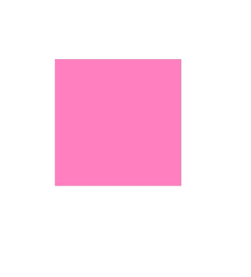
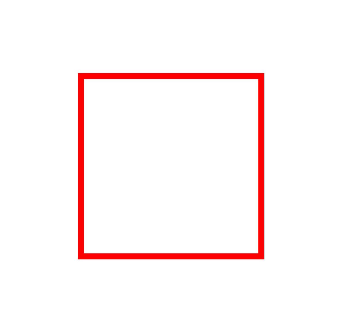

# 复杂绘制效果（C/C++）


除了基础填充颜色、描边颜色和一些样式设置的绘制效果外，还支持通过画刷和画笔实现更多复杂的绘制效果。比如：


- 混合模式。

- 路径效果，如虚线效果。

- 着色器效果，如线性渐变、径向渐变等。

- 滤波效果，如模糊效果等。


## 混合模式

混合模式可以用于画笔或画刷，它定义了如何将源像素（要绘制的内容）与目标像素（已存在于画布上的内容）进行组合。

可以使用OH_Drawing_BrushSetBlendMode()接口将混合模式应用于画刷中，使用OH_Drawing_PenSetBlendMode接口将混合模式应用于画笔中。这两个接口都需要接受一个参数OH_Drawing_BlendMode，即混合模式的类型，具体可参考[BlendMode](../reference/apis-arkgraphics2d/js-apis-graphics-drawing.md#blendmode)。

此处以使用画刷设置叠加混合模式为例（为了防止混合模式的效果被背景色干扰，示例中的canvas并未设置背景色，使用的是默认的黑色背景），关键示例和效果示意图如下所示：

```c++
// 创建画刷对象
OH_Drawing_Brush* brush = OH_Drawing_BrushCreate();
// 设置目标像素颜色
OH_Drawing_BrushSetColor(brush, OH_Drawing_ColorSetArgb(0xFF, 0xFF, 0x00, 0x00));
// 将目标像素的画刷效果设置到Canvas中
OH_Drawing_CanvasAttachBrush(canvas, brush);
// 创建矩形对象
OH_Drawing_Rect *rect = OH_Drawing_RectCreate(100, 100, 600, 600);
// 绘制矩形（目标像素）
OH_Drawing_CanvasDrawRect(canvas, rect);
// 设置源像素颜色
OH_Drawing_BrushSetColor(brush, OH_Drawing_ColorSetArgb(0xFF, 0x00, 0x00, 0xFF));
// 设置混合模式为叠加模式
OH_Drawing_BrushSetBlendMode(brush, OH_Drawing_BlendMode::BLEND_MODE_PLUS);
// 将源像素的画刷效果设置到Canvas中
OH_Drawing_CanvasAttachBrush(canvas, brush);
// 创建圆心的点对象
OH_Drawing_Point *point = OH_Drawing_PointCreate(600, 600);
// 绘制圆（源像素）
OH_Drawing_CanvasDrawCircle(canvas, point, 300);
// 去除掉画布中的画刷
OH_Drawing_CanvasDetachBrush(canvas);
// 销毁各类对象
OH_Drawing_RectDestroy(rect);
OH_Drawing_BrushDestroy(brush);
OH_Drawing_PointDestroy(point);
```


## 路径效果

路径效果如虚线效果，只用于画笔。

可使用OH_Drawing_CreateDashPathEffect()接口设置路径效果。接口接受3个参数，分别为：

- 浮点数数组intervals：表示虚线或者点线的间隔。

- 整数count：表示intervals数组中的元素数量。

- 浮点数phase：表示在intervals数组中的偏移量，即从数组的哪个位置开始应用虚线或点线效果。

此处以绘制矩形虚线路径效果为例，关键示例和效果示意图如下所示：

```c++
// 创建画笔
OH_Drawing_Pen *pen = OH_Drawing_PenCreate();
// 设置画笔描边颜色
OH_Drawing_PenSetColor(pen, 0xffff0000);
// 设置画笔线宽
OH_Drawing_PenSetWidth(pen, 10);
// 表示10px的实线，5px的间隔，2px的实线，5px的间隔，以此循环
float intervals[] = {10, 5, 2, 5};
// 设置虚线路径效果
OH_Drawing_PathEffect *pathEffect = OH_Drawing_CreateDashPathEffect(intervals, 4, 0.0); 
OH_Drawing_PenSetPathEffect(pen, pathEffect);
// 在画布上设置画笔，请确保已获取得到画布对象
OH_Drawing_CanvasAttachPen(canvas, pen); 
// 创建矩形
OH_Drawing_Rect *rect = OH_Drawing_RectCreate(300, 300, 900, 900);
// 绘制矩形
OH_Drawing_CanvasDrawRect(canvas, rect); 
// 去除掉画布中的画笔
OH_Drawing_CanvasDetachPen(canvas);
// 销毁各类对象
OH_Drawing_PenDestroy(pen);
OH_Drawing_RectDestroy(rect);
OH_Drawing_PathEffectDestroy(pathEffect);
```

| 不设置虚线路径效果的示意图 | 设置虚线效果的示意图 |
| -------- | -------- |
|  |  |


## 着色器效果

着色器效果基于画刷或画笔实现，可使用OH_Drawing_BrushSetShaderEffect()接口设置画刷的着色器效果，或者使用 OH_Drawing_PenSetShaderEffect接口设置画笔的着色器效果。当前支持不同的着色器效果，如线性渐变着色器效果、径向渐变着色器效果、扇形渐变着色器效果。

着色器相关接口和具体参数的说明请见[drawing_shader_effect](../reference/apis-arkgraphics2d/capi-drawing-shader-effect-h.md)。


### 线性渐变着色器效果

可使用OH_Drawing_ShaderEffectCreateLinearGradient()接口创建想要设置的线性渐变着色器效果。接口接受6个参数，分别为开始点、结束点、颜色数组、相对位置数组、颜色数组的大小以及平铺模式。

- 开始点和结束点用来确定渐变方向。

- 颜色数组用于存储渐变使用到的颜色。

- 相对位置数组则用于确定每种颜色在渐变中的相对位置，如果相对位置为空，颜色将会被均匀地分布在开始点和结束点之间。

- 平铺模式用于确定如何在渐变区域之外继续渐变效果，平铺模式分为以下4类：
  - CLAMP：当图像超出其原始边界时，复制边缘颜色。
  - REPEAT：在水平和垂直方向上重复图像。
  - MIRROR：在水平和垂直方向上重复图像，并在相邻的图像之间交替使用镜像图像。
  - DECAL：只在原始域内绘制，在其他地方返回透明黑色。

此处以绘制矩形并使用画刷设置线性渐变着色器效果为例，关键示例和效果示意图如下所示：

```c++
// 开始点
OH_Drawing_Point *startPt = OH_Drawing_PointCreate(20, 20);
// 结束点
OH_Drawing_Point *endPt = OH_Drawing_PointCreate(900, 900);
// 颜色数组
uint32_t colors[] = {0xFFFFFF00, 0xFFFF0000, 0xFF0000FF};
// 相对位置数组
float pos[] = {0.0f, 0.5f, 1.0f};
// 创建线性渐变着色器效果
OH_Drawing_ShaderEffect *colorShaderEffect =
    OH_Drawing_ShaderEffectCreateLinearGradient(startPt, endPt, colors, pos, 3, OH_Drawing_TileMode::CLAMP);
// 创建画刷对象
OH_Drawing_Brush* brush = OH_Drawing_BrushCreate();
// 基于画刷设置着色器效果
OH_Drawing_BrushSetShaderEffect(brush, colorShaderEffect); 
// 在画布上设置画刷，请确保已获取得到画布对象
OH_Drawing_CanvasAttachBrush(canvas, brush); 
OH_Drawing_Rect *rect = OH_Drawing_RectCreate(100, 100, 900, 900);
 // 绘制矩形
OH_Drawing_CanvasDrawRect(canvas, rect);
// 去除掉画布中的画刷
OH_Drawing_CanvasDetachBrush(canvas);
// 销毁各类对象
OH_Drawing_BrushDestroy(brush);
OH_Drawing_RectDestroy(rect);
OH_Drawing_ShaderEffectDestroy(colorShaderEffect);
OH_Drawing_PointDestroy(startPt);
OH_Drawing_PointDestroy(endPt);
```

此例绘制的具有线性渐变着色器效果的矩形如下所示：


### 径向渐变着色器效果

可使用OH_Drawing_ShaderEffectCreateRadialGradient()接口创建想要设置的径向渐变着色器效果。接口接受6个参数，分别为圆心坐标（centerPt）、半径（radius）、颜色数组（colors）、相对位置数组（pos）、颜色和位置的数量（size）以及平铺模式（OH_Drawing_TileMode）。

其实现方式与线性渐变着色器类似，不同的是，径向渐变是由圆心开始向外径向渐变的。

此处以绘制矩形并使用画刷设置径向渐变着色器效果为例，关键示例和效果示意图如下所示：

```c++
// 圆心坐标
OH_Drawing_Point *centerPt = OH_Drawing_PointCreate(500, 500);
// 半径
float radius = 600;
// 颜色数组
uint32_t gColors[] = {0xFFFF0000, 0xFF00FF00, 0xFF0000FF};
// 相对位置数组
float_t gPos[] = {0.0f, 0.25f, 0.75f};
// 创建径向渐变着色器效果
OH_Drawing_ShaderEffect *colorShaderEffect =
    OH_Drawing_ShaderEffectCreateRadialGradient(centerPt, radius, gColors, gPos, 3, OH_Drawing_TileMode::REPEAT);
// 创建画刷对象
OH_Drawing_Brush* brush = OH_Drawing_BrushCreate();
// 基于画刷设置着色器效果
OH_Drawing_BrushSetShaderEffect(brush, colorShaderEffect); 
// 在画布上设置画刷，请确保已获取得到画布对象
OH_Drawing_CanvasAttachBrush(canvas, brush); 
OH_Drawing_Rect *rect = OH_Drawing_RectCreate(100, 100, 900, 900);
 // 绘制矩形
OH_Drawing_CanvasDrawRect(canvas, rect);
// 去除掉画布中的画刷
OH_Drawing_CanvasDetachBrush(canvas);
// 销毁各类对象
OH_Drawing_BrushDestroy(brush);
OH_Drawing_RectDestroy(rect);
OH_Drawing_ShaderEffectDestroy(colorShaderEffect);
OH_Drawing_PointDestroy(centerPt);
```

此例绘制的具有径向渐变着色器效果的矩形如下所示：


### 扇形渐变着色器效果

可使用OH_Drawing_ShaderEffectCreateSweepGradient()接口创建想要设置的扇形渐变着色器效果。接口接受5个参数，分别是中心点、颜色数组、相对位置数组、颜色和相对位置的数量以及平铺模式。

其实现方式也与线性渐变着色器类似，不同的是，扇形渐变是在围绕中心点旋转的过程中渐变。

此处以绘制矩形并使用画刷设置扇形渐变着色器效果为例，关键示例和效果示意图如下所示：

```c++
// 中心点
OH_Drawing_Point *centerPt = OH_Drawing_PointCreate(500, 500);
// 颜色数组
uint32_t colors[3] = {0xFF00FFFF, 0xFFFF00FF, 0xFFFFFF00};
// 相对位置数组
float pos[3] = {0.0f, 0.5f, 1.0f};
// 创建扇形渐变着色器效果
OH_Drawing_ShaderEffect* colorShaderEffect =
    OH_Drawing_ShaderEffectCreateSweepGradient(centerPt, colors, pos, 3, OH_Drawing_TileMode::CLAMP);
// 创建画刷对象
OH_Drawing_Brush* brush = OH_Drawing_BrushCreate();
// 基于画刷设置着色器效果
OH_Drawing_BrushSetShaderEffect(brush, colorShaderEffect); 
// 在画布上设置画刷，请确保已获取得到画布对象
OH_Drawing_CanvasAttachBrush(canvas, brush); 
OH_Drawing_Rect *rect = OH_Drawing_RectCreate(100, 100, 900, 900);
 // 绘制矩形
OH_Drawing_CanvasDrawRect(canvas, rect);
// 去除掉画布中的画刷
OH_Drawing_CanvasDetachBrush(canvas);
// 销毁各类对象
OH_Drawing_BrushDestroy(brush);
OH_Drawing_RectDestroy(rect);
OH_Drawing_ShaderEffectDestroy(colorShaderEffect);
OH_Drawing_PointDestroy(centerPt);
```

此例绘制的具有扇形渐变着色器效果的矩形如下所示：


## 滤波器效果

滤波器效果可基于画刷或画笔实现。可使用OH_Drawing_PenSetFilter()接口设置画笔的滤波器效果，或者使用OH_Drawing_BrushSetFilter()接口设置画刷的滤波器效果。当前支持不同的滤波器效果，比如图像滤波器、颜色滤波器、蒙版滤波器。

滤波器相关接口和具体参数的说明请见[drawing_filter.h](../reference/apis-arkgraphics2d/capi-drawing-filter-h.md)。


### 颜色滤波器效果

颜色滤波器可基于画笔或画刷实现，颜色滤波器的相关接口和具体参数的说明请见[drawing_color_filter.h](../reference/apis-arkgraphics2d/capi-drawing-color-filter-h.md)。

目前可实现多种颜色滤波器，包括如下：

- 具有混合模式的颜色滤波器。

- 具有5x4颜色矩阵的颜色滤波器。

- 将SRGB的伽玛曲线应用到RGB颜色通道的颜色滤波器。

- 将RGB颜色通道应用于SRGB的伽玛曲线的颜色滤波器。

- 将其输入的亮度值乘以透明度通道， 并将红色、绿色和蓝色通道设置为零的颜色滤波器。

- 由两个颜色滤波器组合而成的颜色滤波器。

此处以具有5x4颜色矩阵的颜色滤波器为例。

可使用OH_Drawing_ColorFilterCreateMatrix()接口创建具有5x4颜色矩阵的颜色滤波器。接口接受1个参数，表示为颜色矩阵，它是一个长度为20的浮点数数组。数组格式如下：

[ a0, a1, a2, a3, a4 ]

[ b0, b1, b2, b3, b4 ]

[ c0, c1, c2, c3, c4 ]

[ d0, d1, d2, d3, d4 ]

对于每个原始的像素颜色色值（R, G, B, A），变换后的色值（R', G', B', A'）计算公式为：

R' = a0\*R + a1\*G + a2\*B + a3\*A + a4

G' = b0\*R + b1\*G + b2\*B + b3\*A + b4

B' = c0\*R + c1\*G + c2\*B + c3\*A + c4

A' = d0\*R + d1\*G + d2\*B + d3\*A + d4

此处以绘制矩形并使用画刷设置具有5x4颜色矩阵的颜色滤波器效果为例，关键示例和效果示意图如下所示：

```c++
// 创建画刷
OH_Drawing_Brush *brush = OH_Drawing_BrushCreate();
// 设置画刷抗锯齿
OH_Drawing_BrushSetAntiAlias(brush, true);
// 设置画刷填充颜色
OH_Drawing_BrushSetColor(brush, 0xffff0000);
// 设置颜色矩阵
const float matrix[20] = {
    1, 0, 0, 0, 0,
    0, 1, 0, 0, 0,
    0, 0, 0.5f, 0.5f, 0,
    0, 0, 0.5f, 0.5f, 0
}; 

// 创建滤波器颜色
OH_Drawing_ColorFilter* colorFilter = OH_Drawing_ColorFilterCreateMatrix(matrix); 
// 创建一个滤波器对象
OH_Drawing_Filter *filter = OH_Drawing_FilterCreate();
// 为滤波器对象设置颜色滤波器
OH_Drawing_FilterSetColorFilter(filter, colorFilter);
// 设置画刷的滤波器效果
OH_Drawing_BrushSetFilter(brush, filter);
// 在画布上设置画刷，请确保已获取得到画布对象
OH_Drawing_CanvasAttachBrush(canvas, brush);
// 创建矩形
OH_Drawing_Rect *rect = OH_Drawing_RectCreate(300, 300, 900, 900);
// 绘制矩形
OH_Drawing_CanvasDrawRect(canvas, rect); 
// 去除掉画布中的画刷
OH_Drawing_CanvasDetachBrush(canvas);
// 销毁各类对象
OH_Drawing_BrushDestroy(brush);
OH_Drawing_ColorFilterDestroy(colorFilter);
OH_Drawing_RectDestroy(rect);
OH_Drawing_FilterDestroy(filter);
```

| 不设置颜色滤波器效果的示意图 | 设置5x4颜色矩阵的颜色滤波器效果的示意图 |
| -------- | -------- |
|  |  |


### 图像滤波器效果

图像滤波器可基于画笔或画刷来实现，图像滤波器的相关接口和具体参数的说明请见[drawing_image_filter.h](../reference/apis-arkgraphics2d/capi-drawing-image-filter-h.md)。

目前只支持两种图像滤波器：

- 基于颜色滤波器的图像滤波器。
  可通过OH_Drawing_ImageFilterCreateFromColorFilter()接口实现，接口接受2个参数，颜色滤波器colorFilter和图像滤波器input，即把颜色滤波器的效果叠加到图像滤波器input上，input可为空，input为空则只添加颜色滤波器效果。

- 具有模糊效果的图像滤波器。
  可通过OH_Drawing_ImageFilterCreateBlur()接口实现，接口接受4个参数，分别为X轴上的模糊标准差、Y轴上的模糊标准差、平铺模式和图像滤波器（input）。

  最终效果即为在输入的图像滤波器（input）的基础上进行模糊化处理，即滤波器效果可叠加，input可为空，input为空则只添加模糊效果。

此处以绘制矩形并使用画笔添加模糊效果的图像滤波器效果为例，关键示例和效果示意图如下所示：

```c++
// 创建画笔
OH_Drawing_Pen *pen = OH_Drawing_PenCreate();
// 设置画笔抗锯齿
OH_Drawing_PenSetAntiAlias(pen, true);
// 设置画笔描边颜色
OH_Drawing_PenSetColor(pen, 0xffff0000);
// 设置画笔线宽
OH_Drawing_PenSetWidth(pen, 20);
// 创建图像滤波器实现模糊效果
OH_Drawing_ImageFilter *imageFilter =
    OH_Drawing_ImageFilterCreateBlur(20.0f, 20.0f, OH_Drawing_TileMode::CLAMP, nullptr); 
// 创建一个滤波器对象
OH_Drawing_Filter *filter = OH_Drawing_FilterCreate();
// 为滤波器对象设置图像滤波器
OH_Drawing_FilterSetImageFilter(filter, imageFilter);
// 设置画笔的滤波器效果
OH_Drawing_PenSetFilter(pen, filter);
// 在画布上设置画笔，请确保已获取得到画布对象
OH_Drawing_CanvasAttachPen(canvas, pen); 
// 创建矩形
OH_Drawing_Rect *rect = OH_Drawing_RectCreate(300, 300, 900, 900);
// 绘制矩形
OH_Drawing_CanvasDrawRect(canvas, rect); 
// 去除掉画布中的画笔
OH_Drawing_CanvasDetachPen(canvas);
// 销毁各类对象
OH_Drawing_PenDestroy(pen);
OH_Drawing_ImageFilterDestroy(imageFilter);
OH_Drawing_RectDestroy(rect);
OH_Drawing_FilterDestroy(filter);
```

| 不设置图像滤波器效果的示意图 | 设置图像滤波器效果的示意图 |
| -------- | -------- |
|  |  |


### 蒙版滤波器效果

蒙版滤波器的模糊效果仅对透明度和形状边缘进行模糊处理，相对于图像滤波器的模糊效果来说计算成本更低。

蒙版滤波器可基于画笔或画刷实现，蒙版滤波器的相关接口和具体参数的说明请见[drawing_mask_filter.h](../reference/apis-arkgraphics2d/capi-drawing-mask-filter-h.md)。

可使用H_Drawing_MaskFilterCreateBlur()接口创建想要设置具有模糊效果的蒙版滤波器。接口接受3个参数，分别为：

- blurType：用于指定要应用的模糊类型，详细分类请参考[BlurType](../reference/apis-arkgraphics2d/js-apis-graphics-drawing.md#blurtype12)。

- sigma：用于指定要应用的高斯模糊的标准差，标准差必须大于0。

- respectCTM：指定模糊的标准差是否会被CTM（coordinate transformation matrix，坐标变换矩阵）修改，默认为true，表示会被对应修改。

此处以绘制矩形并使用画笔设置蒙版滤波器效果为例，关键示例和效果示意图如下所示：

```c++
// 创建画笔
OH_Drawing_Pen *pen = OH_Drawing_PenCreate();
// 设置画笔抗锯齿
OH_Drawing_PenSetAntiAlias(pen, true);
// 设置画笔描边颜色
OH_Drawing_PenSetColor(pen, 0xffff0000);
// 设置画笔线宽
OH_Drawing_PenSetWidth(pen, 20);
// 创建蒙版滤波器
OH_Drawing_MaskFilter *maskFilter = OH_Drawing_MaskFilterCreateBlur(OH_Drawing_BlurType::NORMAL, 20, true); 
// 创建一个滤波器对象
OH_Drawing_Filter *filter = OH_Drawing_FilterCreate();
// 为滤波器对象设置蒙版滤波器
OH_Drawing_FilterSetMaskFilter(filter, maskFilter);
// 设置画笔的滤波器效果
OH_Drawing_PenSetFilter(pen, filter);
// 在画布上设置画笔，请确保已获取得到画布对象
OH_Drawing_CanvasAttachPen(canvas, pen); 
// 创建矩形
OH_Drawing_Rect *rect = OH_Drawing_RectCreate(300, 300, 900, 900);
// 绘制矩形
OH_Drawing_CanvasDrawRect(canvas, rect); 
// 去除掉画布中的画笔
OH_Drawing_CanvasDetachPen(canvas);
// 销毁各类对象
OH_Drawing_PenDestroy(pen);
OH_Drawing_MaskFilterDestroy(maskFilter);
OH_Drawing_RectDestroy(rect);
OH_Drawing_FilterDestroy(filter);
```

| 不设置蒙版滤波器效果的示意图 | 设置蒙版滤波器效果的示意图 |
| -------- | -------- |
|  |  |

<!--RP1-->
## 相关实例

针对Drawing(C/C++)的开发，有以下相关实例可供参考：

- [NDKGraphicsDraw (API14)](https://gitee.com/openharmony/applications_app_samples/tree/master/code/DocsSample/Drawing/NDKGraphicsDraw)
<!--RP1End-->