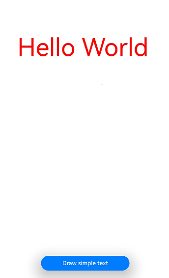

# 简单文本绘制与显示（ArkTS）

## 场景介绍

在一个简单的用户界面中，可能只需要展示几行静态文本，例如标签、按钮上的文字、菜单项或状态栏中的提示信息。此时，开发者只需要选择合适的字体、大小和颜色即可完成渲染。

## 相关属性

此场景示例，涉及到的文本样式属性如下，具体及更多文本样式可参考[TextStyle](../reference/apis-arkgraphics2d/js-apis-graphics-text.md#textstyle)。

- color：字体颜色，默认为白色。请注意与画布颜色进行区分，以保证文本的正常显示。

- fontSize：字体大小，浮点数，默认为14.0，单位为物理像素px。


## 开发步骤

1. 通过context获取到Canvas画布对象。

   ```ts
   let canvas = context.canvas;
   ```

2. 初始化文本样式，此处设置字体颜色为红色，字体大小为50。

   ```ts
   let myTextStyle: text.TextStyle = {
     // 文本颜色
     color: {
       alpha: 255,
       red: 255,
       green: 0,
       blue: 0
     },
     // 文本大小
     fontSize: 50
   };
   ```

3. 初始化段落样式。

   ```ts
   // 设置段落样式
   let myParagraphStyle: text.ParagraphStyle = {
     textStyle: myTextStyle,
   };
   ```

4. 初始化段落对象，并添加文本。

   ```ts
   let fontCollection = text.FontCollection.getGlobalInstance();
   let paragraphBuilder = new text.ParagraphBuilder(myParagraphStyle, fontCollection);
   // 更新文本样式
   paragraphBuilder.pushStyle(myTextStyle);
   // 添加文本
   paragraphBuilder.addText("Hello World");
   ```

5. 排版段落并进行文本绘制。

   ```ts
   // 生成段落
   let paragraph = paragraphBuilder.build();
   // 布局
   paragraph.layoutSync(1250);
   // 绘制文本
   paragraph.paint(canvas, 10, 0);
   ```


## 完整示例

```ts
import { NodeController, FrameNode, RenderNode, DrawContext } from '@kit.ArkUI'
import { UIContext } from '@kit.ArkUI'
import { drawing } from '@kit.ArkGraphics2D'
import { text } from '@kit.ArkGraphics2D'
import { image } from '@kit.ImageKit'
import { common2D } from '@kit.ArkGraphics2D'

// 创建一个MyRenderNode类，并绘制文本。
class MyRenderNode extends RenderNode {
  async draw(context: DrawContext) {
    
    // 绘制代码逻辑写在这里
    let canvas = context.canvas;
    
    let myTextStyle: text.TextStyle = {
      // 文本颜色
      color: {
        alpha: 255,
        red: 255,
        green: 0,
        blue: 0
      },
      // 文本大小
      fontSize: 100
    };
    
    let myParagraphStyle: text.ParagraphStyle = {
      textStyle: myTextStyle,
    };
    let fontCollection = text.FontCollection.getGlobalInstance();
    let paragraphBuilder = new text.ParagraphBuilder(myParagraphStyle, fontCollection);
    // 更新文本样式
    paragraphBuilder.pushStyle(myTextStyle);
    // 添加文本
    paragraphBuilder.addText("Hello World");

    // 生成段落
    let paragraph = paragraphBuilder.build();
    // 布局
    paragraph.layoutSync(1250);
    // 绘制文本
    paragraph.paint(canvas, 10, 800);
  }
}

// 创建一个MyRenderNode对象
const textNode = new MyRenderNode()
// 定义newNode的像素格式
textNode.frame = {
  x: 0,
  y: 100,
  width: 1250,
  height: 800
}
textNode.pivot = { x: 0.2, y: 0.8 }
textNode.scale = { x: 1, y: 1 }

class MyNodeController extends NodeController {
  private rootNode: FrameNode | null = null;

  makeNode(uiContext: UIContext): FrameNode {
    this.rootNode = new FrameNode(uiContext)
    if (this.rootNode == null) {
      return this.rootNode
    }
    const renderNode = this.rootNode.getRenderNode()
    if (renderNode != null) {
      renderNode.frame = {
        x: 0,
        y: 0,
        width: 10,
        height: 500
      }
      renderNode.pivot = { x: 50, y: 50 }
    }
    return this.rootNode
  }

  addNode(node: RenderNode): void {
    if (this.rootNode == null) {
      return
    }
    const renderNode = this.rootNode.getRenderNode()
    if (renderNode != null) {
      renderNode.appendChild(node)
    }
  }

  clearNodes(): void {
    if (this.rootNode == null) {
      return
    }
    const renderNode = this.rootNode.getRenderNode()
    if (renderNode != null) {
      renderNode.clearChildren()
    }
  }
}

let myNodeController: MyNodeController = new MyNodeController()

async function performTask() {
  myNodeController.clearNodes()
  myNodeController.addNode(textNode)
}

@Entry
@Component
struct Font08 {
  @State src: Resource = $r('app.media.startIcon')
  build() {
    Column() {
      Row() {
        NodeContainer(myNodeController)
          .height('100%')
          .width('100%')
        Image(this.src)
          .width('0%').height('0%')
          .onComplete(
            () => {
              performTask();
            })
      }
      .width('100%')
    }
  }
}
```

## 效果展示


