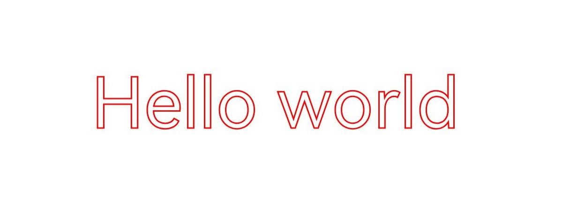

# 字块绘制（C/C++）


## 场景介绍

字块（TextBlob）是指文本的集合。无论是单个的文字还是大块的文本，都可以通过字块来绘制。

本节聚焦于文字的绘制效果，除了基本的字块绘制之外，还可以给文字添加各种绘制效果。常见的字块绘制场景包括[文字描边](#文字描边)、[文字渐变](#文字渐变)等，更多效果请见[绘制效果](drawing-effect-overview.md)。


## 基本字块绘制

使用OH_Drawing_CanvasDrawTextBlob()接口绘制字块，接口接受4个参数，分别为：画布Canvas对象、字块对象、文字基线左端点的x坐标和y坐标。


画布Canvas对象具体可见[画布的获取与绘制结果的显示（C/C++）](canvas-get-result-draw-c.md)。


字块对象可以通过多种方式创建得到，详细的字块创建方式请参考[drawing_text_blob.h](../reference/apis-arkgraphics2d/drawing__text__blob_8h.md)。


此处以使用OH_Drawing_TextBlobCreateFromString()接口创建字块为例，接口接受3个参数，分别为：


- 需要显示的文本字符串内容。

- 指向OH_Drawing_Font字体对象的指针。OH_Drawing_Font用于设置和获取字体的各种属性，如字体大小、文本样式、字体对齐方式、字体渲染方式、字体描边方式等，详细的API介绍请参考[draw_font](../reference/apis-arkgraphics2d/drawing__font_8h.md)。

- 文本编码方式。


简单示例和示意图如下所示：


```c++
// 创建字体对象
OH_Drawing_Font *font = OH_Drawing_FontCreate();
// 设置字体大小
OH_Drawing_FontSetTextSize(font, 100);
// 需要绘制的文字
const char *str = "Hello world";
// 创建字块对象
OH_Drawing_TextBlob *textBlob =
    OH_Drawing_TextBlobCreateFromString(str, font, OH_Drawing_TextEncoding::TEXT_ENCODING_UTF8);
// 绘制字块
OH_Drawing_CanvasDrawTextBlob(canvas, textBlob, 200, 800); 
// 释放字块对象
OH_Drawing_TextBlobDestroy(textBlob);
// 释放字体对象
OH_Drawing_FontDestroy(font);
```


## 文字描边

基于基本的字块绘制，还可以通过画笔实现文字描边效果，描边效果的更多介绍请参考[描边效果](basic-drawing-effect-c.md#描边效果)。

文字描边的简要示例和示意图如下：

```c++
// 创建画笔
OH_Drawing_Pen *pen = OH_Drawing_PenCreate();
// 设置抗锯齿
OH_Drawing_PenSetAntiAlias(pen, true);
// 设置描边颜色
OH_Drawing_PenSetColor(pen, OH_Drawing_ColorSetArgb(0xFF, 0xFF, 0x00, 0x00));
// 设置描边线宽
OH_Drawing_PenSetWidth(pen, 3);
// 设置画笔描边效果
OH_Drawing_CanvasAttachPen(canvas, pen);
// 创建字型对象
OH_Drawing_Font *font = OH_Drawing_FontCreate();
// 设置字体大小
OH_Drawing_FontSetTextSize(font, 150);
const char *str = "Hello world";
// 创建字块对象
OH_Drawing_TextBlob *textBlob =
    OH_Drawing_TextBlobCreateFromString(str, font, OH_Drawing_TextEncoding::TEXT_ENCODING_UTF8);
// 绘制字块
OH_Drawing_CanvasDrawTextBlob(canvas, textBlob, 200, 800);
// 去除描边效果
OH_Drawing_CanvasDetachPen(canvas);
// 销毁各类对象
OH_Drawing_TextBlobDestroy(textBlob);
OH_Drawing_FontDestroy(font);
OH_Drawing_PenDestroy(pen);
```




## 文字渐变

基于基本字块绘制，还可以通过着色器实现文字渐变的效果，着色器的更多介绍请参考[着色器效果](complex-drawing-effect-c.md#着色器效果)。

以下为文字添加了线性渐变着色器效果的简要示例和示意图：

```c++
// 开始点
OH_Drawing_Point *startPt = OH_Drawing_PointCreate(100, 100);
// 结束点
OH_Drawing_Point *endPt = OH_Drawing_PointCreate(900, 900);
// 颜色数组
uint32_t colors[] = {0xFFFFFF00, 0xFFFF0000, 0xFF0000FF};
// 相对位置数组
float pos[] = {0.0f, 0.5f, 1.0f};
// 创建线性渐变着色器效果
OH_Drawing_ShaderEffect *colorShaderEffect =
    OH_Drawing_ShaderEffectCreateLinearGradient(startPt, endPt, colors, pos, 3, OH_Drawing_TileMode::CLAMP);
// 创建画刷对象
OH_Drawing_Brush *brush = OH_Drawing_BrushCreate();
// 基于画刷设置着色器效果
OH_Drawing_BrushSetShaderEffect(brush, colorShaderEffect);
// 设置画刷填充效果
OH_Drawing_CanvasAttachBrush(canvas, brush);
// 创建字型对象
OH_Drawing_Font *font = OH_Drawing_FontCreate();
// 设置字体大小
OH_Drawing_FontSetTextSize(font, 150);
const char *str = "Hello world";
// 创建字块对象
OH_Drawing_TextBlob *textBlob =
    OH_Drawing_TextBlobCreateFromString(str, font, OH_Drawing_TextEncoding::TEXT_ENCODING_UTF8);
// 绘制字块
OH_Drawing_CanvasDrawTextBlob(canvas, textBlob, 200, 800);
// 取消填充效果
OH_Drawing_CanvasDetachBrush(canvas);
// 销毁各类对象
OH_Drawing_TextBlobDestroy(textBlob);
OH_Drawing_FontDestroy(font);
OH_Drawing_BrushDestroy(brush);
```


