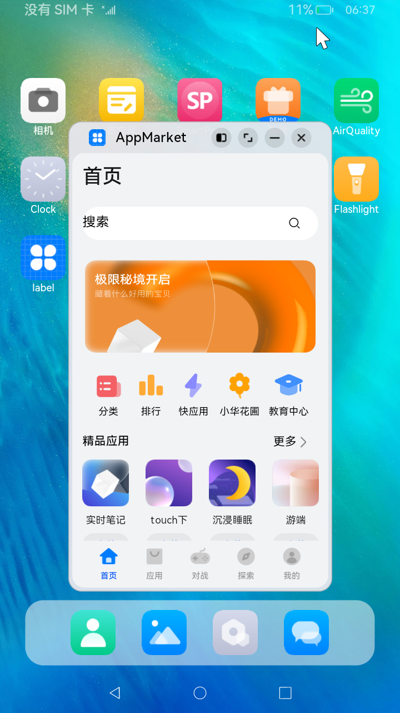
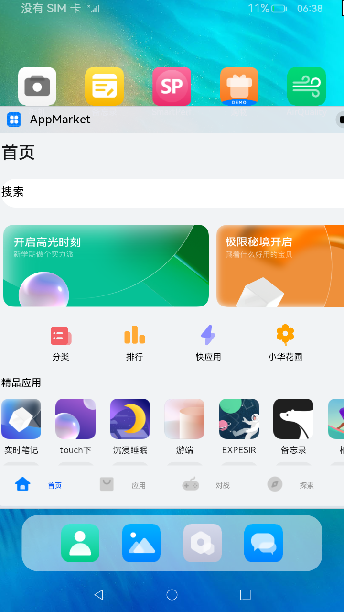
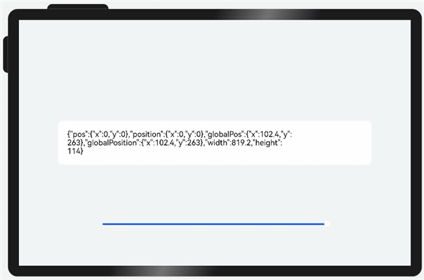

# 常见问题


## 如何查询设备类型

设备类型分为default（默认设备）、tablet、tv、wearable、2in1等，有多种查询设备类型的方式。

1. 通过命令行的方式查询设备类型。
   通过命令行查询指定系统参数（const.product.devicetype）进而确定设备类型，详见[系统参数介绍](../../../device-dev/subsystems/subsys-boot-init-sysparam.md)。

   
   ```shell
    # 方法一
    hdc shell param get "const.product.devicetype"
    # 方法二
    hdc shell cat /etc/param/ohos.para | grep const.product.devicetype
   ```

2. 在应用开发过程中查询设备类型。
   - 通过deviceInfo查询设备类型，deviceInfo中各个字段的含义请参考[设备信息](../../reference/apis/js-apis-device-info.md)。
     
      ```typescript
       import deviceInfo from'@ohos.deviceInfo'
      
       @Entry
       @Component
       struct GetDeviceTypeSample {
         @State deviceType:string='unknown'
      
         aboutToAppear() {
           this.deviceType= deviceInfo.deviceType
         }
      
         build() {
           Column() {
             Text(this.deviceType).fontSize(24)
           }
           .width('100%')
           .height('100%')
         }
      }
      ```


## 如何在不同设备上为Ability配置不同的启动模式

应用由一个或多个Ability组成，Ability支持单实例、多实例和指定实例3种[启动模式](../../application-models/uiability-launch-type.md)，启动模式可以在[配置文件（module.json5）](../../quick-start/module-configuration-file.md)中通过launchType字段配置。启动模式对应Ability被启动时的行为，对启动模式的详细说明如下：

| 启动模式 | 描述 | 说明 |
| -------- | -------- | -------- |
| multiton | 多实例 | 每次startAbility都会启动一个新的实例。 |
| singleton | 单实例 | 系统中最多只可以存在一个实例，startAbility时，如果系统中已存在相应的Ability实例，则复用该实例。 |
| specified | 指定实例 | 运行时由Ability内部业务决定是否创建多实例。 |

默认设备屏幕尺寸较小，采用multiton启动模式不仅无法给用户提供便利，反而可能消耗更多系统资源，故通常采用singleton启动模式。平板屏幕尺寸较大且可能支持自由窗口，对于文档编辑、网页浏览等场景，使用multiton启动模式可以提升用户体验。

本文中将默认设备和平板等归为同一泛类，推荐同一泛类的设备共用HAP包，同时本文也介绍了如何通过自适应布局能力和响应式布局能力开发出适配不同设备的页面。这里将补充介绍，如何实现Ability在不同设备上以不同的模式启动。

launchType字段配置为specified时，系统会根据AbilityStage的onAcceptWant的返回值确定是否创建新的实例。对于同一个应用，如果key已经存在，则复用该key对应的Ability，如果key不存在则新创建Ability。

可以将配置文件中的launchType字段配置为specified，同时在应用中加入如下代码以实现目标效果。

- 非平板设备，直接将设备类型作为key，保证每次启动的key相同，即以单实例模式运行。

- 平板设备，将设备类型与毫秒级时间戳叠加作为key，保证每次启动的key不同，即以多实例模式运行。

  
```typescript
// MyAbilityStage.ts
import AbilityStage from "@ohos.application.AbilityStage"
import deviceInfo from'@ohos.deviceInfo'

export default class MyAbilityStage extends AbilityStage {
    ...
    private generateKey(): string {
        // 如果是平板，则将设备类型和毫秒级时间戳叠加作为key，保证每次启动的key都不同
        if (deviceInfo.deviceType === 'tablet') {
            return deviceInfo.deviceType + (new Date()).valueOf()
        }
        // 如果不是平板，直接以设备类型作为key，每次启动的key相同
        return deviceInfo.deviceType
    }
    onAcceptWant(want) {
        return this.generateKey()
    }
}
```


## 如何开启自由窗口

开发板上的自由窗口功能默认是关闭的，可以通过如下方式开启自由窗口功能。


```shell
# 取出开发板中的窗口配置文件，并将文件中的<decor enable="false"></decor>修改为<decor enable="true"></decor>
hdc file recv system/etc/window/resources/window_manager_config.xml ./
# 以可读写的模式重新挂载根目录，并更新开发板中的配置文件
hdc shell mount -o rw,remount /
hdc file send window_manager_config.xml system/etc/window/resources/window_manager_config.xml
# 重启开发板，配置生效
hdc shell reboot
```

开发板屏幕较小，通过手指操作窗口较为不便，建议外接鼠标进行操作。

- 鼠标在应用顶部悬停，即可召唤出窗口工具栏。

- 点击窗口工具栏中的缩放按钮（从左到右第二个），即可让应用以自由窗口的模式显示。

- 在自由窗口模式下，可以通过拖动应用窗口的边框或顶角，改变窗口尺寸同时触发应用显示刷新。
  在调整窗口尺寸的过程中，窗口尺寸可能超出屏幕尺寸。此时应用显示正常，但受限于屏幕尺寸，在屏幕中只能看到应用部分区域的显示。可以通过移动窗口位置，查看应用其它区域的显示。

  | 窗口操作按钮 | 悬浮窗口显示 | 调整窗口尺寸及位置查看不同的效果 | 
  | -------- | -------- | -------- |
  |  |  |  | 


## 如何限制自由窗口的尺寸调节范围

自适应布局可以保证窗口尺寸在一定范围内变化时，页面的显示是正常的。当窗口尺寸变化较大时，就需要额外借助响应式布局能力（如断点等）调整页面结构以保证显示正常。通常每个断点都需要开发者精心适配以获得最佳的显示效果，考虑到设计及开发成本等实际因素的限制，应用不可能适配从零到正无穷的所有窗口宽度。

不同设备或不同设备状态，系统默认的自由窗口尺寸的调节范围可能不同。开发者可以在[应用配置文件](../../quick-start/module-configuration-file.md)中限制应用中各个Ability的自由窗口尺寸调节范围，配置文件中影响自由窗口尺寸调节范围的字段如下表所示。

| 配置文件字段 | 数据类型 | 描述 | 
| -------- | -------- | -------- |
| minWindowWidth | 数值 | 标识该ability支持的最小的窗口宽度,&nbsp;宽度单位为vp。 | 
| minWindowHeight | 数值 | 标识该ability支持的最小的窗口高度,&nbsp;高度单位为vp。 | 
| maxWindowWidth | 数值 | 标识该ability支持的最大的窗口宽度，宽度单位为vp。 | 
| maxWindowHeight | 数值 | 标识该ability支持的最大的窗口高度,&nbsp;高度单位为vp。 | 
| minWindowRatio | 数值 | 标识该ability支持的最小的宽高比。 | 
| maxWindowRatio | 数值 | 标识该ability支持的最大的宽高比。 | 

如下所示，通过配置文件分别限制自由窗口的最大和最小尺寸。


```
{
  "module": {
    ...
    "abilities": [
      {
        ...        
        "minWindowWidth": 320,
        "minWindowHeight": 240,
        "maxWindowWidth": 1440,
        "maxWindowHeight": 900,
        "minWindowRatio": 0.5,
        "maxWindowRatio": 2,
      }
    ]
  }
}
```

## 如何获取组件的尺寸

实际开发过程中，开发者可能有获取页面中某个组件或某块区域的尺寸的诉求，以便通过手动计算等进行更精确的布局计算及优化。

开发者可以通过[组件区域变化事件](../../reference/arkui-ts/ts-universal-component-area-change-event.md)（即组件显示的尺寸、位置等发生变化时触发的事件）来获取指定组件的尺寸。

如下所示，通过onAreaChange事件获取Row组件（页面中白色区域）的尺寸。



```
@Entry
@Component
struct OnAreaChangeSample {
  @State rate: number = 0.8
  @State info: string = ''

  // 底部滑块，可以通过拖拽滑块改变容器尺寸
  @Builder slider() {
    Slider({ value: this.rate * 100, min: 30, max: 80, style: SliderStyle.OutSet })
      .blockColor(Color.White)
      .width('60%')
      .onChange((value: number) => {
        this.rate = value / 100;
      })
      .position({ x: '20%', y: '80%' })
  }

  build() {
    Column() {
      Column() {
        Row() {
          Text(this.info).fontSize(20).lineHeight(22)
        }
        .borderRadius(12)
        .padding(24)
        .backgroundColor('#FFFFFF')
        .width(this.rate * 100 + '%')
        .onAreaChange((oldValue: Area, newValue: Area) => {
          this.info = JSON.stringify(newValue)
        })
      }

      this.slider()
    }
    .width('100%')
    .height('100%')
    .backgroundColor('#F1F3F5')
    .justifyContent(FlexAlign.Center)
  }
}
```

