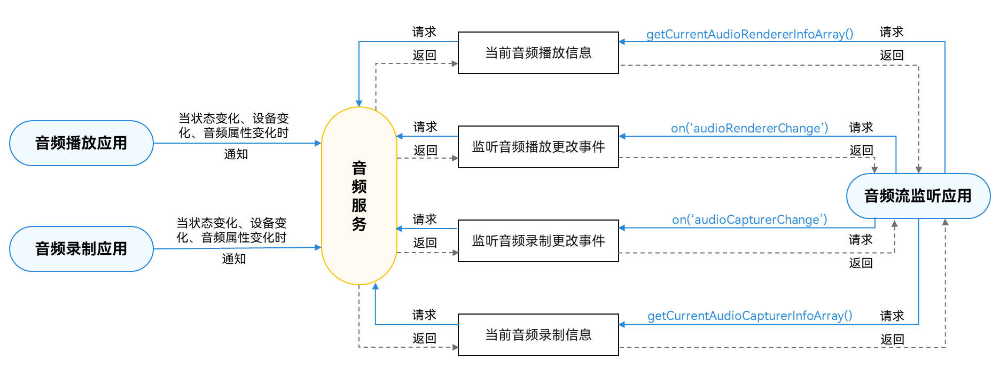

# 音频播放流管理

对于播放音频类的应用，开发者需要关注该应用的音频流的状态以做出相应的操作，比如监听到状态为播放中/暂停时，及时改变播放按钮的UI显示。

## 读取或监听应用内音频流状态变化

参考[使用AudioRenderer开发音频播放功能](using-audiorenderer-for-playback.md)或[audio.createAudioRenderer](../../reference/apis-audio-kit/js-apis-audio.md#audiocreateaudiorenderer8)，完成AudioRenderer的创建，然后可以通过以下两种方式查看音频流状态的变化：

- 方法1：直接查看AudioRenderer的[state](../../reference/apis-audio-kit/js-apis-audio.md#属性)：
    
  ```ts
  import audio from '@ohos.multimedia.audio';
  
  let audioRendererState: audio.AudioState = audioRenderer.state;
  console.info(`Current state is: ${audioRendererState }`)
  ```

- 方法2：注册stateChange监听AudioRenderer的状态变化：
    
  ```ts
  import audio from '@ohos.multimedia.audio';
  
  audioRenderer.on('stateChange', (rendererState: audio.AudioState) => {
    console.info(`State change to: ${rendererState}`)
  });
  ```

获取state后可对照[AudioState](../../reference/apis-audio-kit/js-apis-audio.md#audiostate8)来进行相应的操作，比如更改暂停播放按钮的显示等。

## 读取或监听所有音频流的变化

如果部分应用需要查询获取所有音频流的变化信息，可以通过AudioStreamManager读取或监听所有音频流的变化。

> **说明：**
> 
> 对于标记为系统接口（system api）的音频流变化信息需要系统级别应用才可查看，若应用不是系统应用，将无法获取准确信息。

如下为音频流管理调用关系图：



在进行应用开发的过程中，开发者需要使用getStreamManager()创建一个AudioStreamManager实例，进而通过该实例管理音频流。开发者可通过调用on('audioRendererChange')监听音频流的变化，在音频流状态变化、设备变化时获得通知。同时可通过off('audioRendererChange')取消相关事件的监听。另外，开发者可以主动调用getCurrentAudioRendererInfoArray()来查询播放流的唯一ID、播放流客户端的UID、音频流状态等信息。

详细API含义可参考[音频管理API文档AudioStreamManager](../../reference/apis-audio-kit/js-apis-audio.md#audiostreammanager9)。

## 开发步骤及注意事项

1. 创建AudioStreamManager实例。
   在使用AudioStreamManager的API前，需要使用getStreamManager()创建一个AudioStreamManager实例。

   ```ts
   import audio from '@ohos.multimedia.audio';
   
   let audioManager = audio.getAudioManager();
   let audioStreamManager = audioManager.getStreamManager();
   ```

2. 使用on('audioRendererChange')监听音频播放流的变化。 如果音频流监听应用需要在音频播放流状态变化、设备变化时获取通知，可以订阅该事件。
     
   ```ts
   import audio from '@ohos.multimedia.audio';
   
   audioStreamManager.on('audioRendererChange',  (AudioRendererChangeInfoArray: audio.AudioRendererChangeInfoArray) => {
     for (let i = 0; i < AudioRendererChangeInfoArray.length; i++) {
       let AudioRendererChangeInfo = AudioRendererChangeInfoArray[i];
       console.info(`## RendererChange on is called for ${i} ##`);
       console.info(`StreamId for ${i} is: ${AudioRendererChangeInfo.streamId}`);
       console.info(`Content ${i} is: ${AudioRendererChangeInfo.rendererInfo.content}`);
       console.info(`Stream ${i} is: ${AudioRendererChangeInfo.rendererInfo.usage}`);
       console.info(`Flag ${i} is: ${AudioRendererChangeInfo.rendererInfo.rendererFlags}`); 
       for (let j = 0;j < AudioRendererChangeInfo.deviceDescriptors.length; j++) {
         console.info(`Id: ${i} : ${AudioRendererChangeInfo.deviceDescriptors[j].id}`);
         console.info(`Type: ${i} : ${AudioRendererChangeInfo.deviceDescriptors[j].deviceType}`);
         console.info(`Role: ${i} : ${AudioRendererChangeInfo.deviceDescriptors[j].deviceRole}`);
         console.info(`Name: ${i} : ${AudioRendererChangeInfo.deviceDescriptors[j].name}`);
         console.info(`Address: ${i} : ${AudioRendererChangeInfo.deviceDescriptors[j].address}`);
         console.info(`SampleRates: ${i} : ${AudioRendererChangeInfo.deviceDescriptors[j].sampleRates[0]}`);
         console.info(`ChannelCount ${i} : ${AudioRendererChangeInfo.deviceDescriptors[j].channelCounts[0]}`);
         console.info(`ChannelMask: ${i} : ${AudioRendererChangeInfo.deviceDescriptors[j].channelMasks}`);
       }
     }
   });
   ```

3. （可选）使用off('audioRendererChange')取消监听音频播放流变化。
     
   ```ts
   audioStreamManager.off('audioRendererChange');
   console.info('RendererChange Off is called ');
   ```

4. （可选）使用getCurrentAudioRendererInfoArray()获取所有音频播放流的信息。
     该接口可获取音频播放流唯一ID、音频播放客户端的UID、音频状态以及音频播放器的其他信息。
   > **说明：**
   >
   > 对所有音频流状态进行监听的应用需要[声明权限](../../security/AccessToken/declare-permissions.md)ohos.permission.USE_BLUETOOTH，否则无法获得实际的设备名称和设备地址信息，查询到的设备名称和设备地址（蓝牙设备的相关属性）将为空字符串。
   
   ```ts
   import audio from '@ohos.multimedia.audio';
   import { BusinessError } from '@ohos.base';
   
   async function getCurrentAudioRendererInfoArray(): Promise<void> {
     await audioStreamManager.getCurrentAudioRendererInfoArray().then((AudioRendererChangeInfoArray: audio.AudioRendererChangeInfoArray) => {
       console.info(`getCurrentAudioRendererInfoArray  Get Promise is called `);
       if (AudioRendererChangeInfoArray != null) {
         for (let i = 0; i < AudioRendererChangeInfoArray.length; i++) {
           let AudioRendererChangeInfo = AudioRendererChangeInfoArray[i];
           console.info(`StreamId for ${i} is: ${AudioRendererChangeInfo.streamId}`);
           console.info(`Content ${i} is: ${AudioRendererChangeInfo.rendererInfo.content}`);
           console.info(`Stream ${i} is: ${AudioRendererChangeInfo.rendererInfo.usage}`);
           console.info(`Flag ${i} is: ${AudioRendererChangeInfo.rendererInfo.rendererFlags}`);  
           for (let j = 0;j < AudioRendererChangeInfo.deviceDescriptors.length; j++) {
             console.info(`Id: ${i} : ${AudioRendererChangeInfo.deviceDescriptors[j].id}`);
             console.info(`Type: ${i} : ${AudioRendererChangeInfo.deviceDescriptors[j].deviceType}`);
             console.info(`Role: ${i} : ${AudioRendererChangeInfo.deviceDescriptors[j].deviceRole}`);
             console.info(`Name: ${i} : ${AudioRendererChangeInfo.deviceDescriptors[j].name}`);
             console.info(`Address: ${i} : ${AudioRendererChangeInfo.deviceDescriptors[j].address}`);
             console.info(`SampleRates: ${i} : ${AudioRendererChangeInfo.deviceDescriptors[j].sampleRates[0]}`);
             console.info(`ChannelCount ${i} : ${AudioRendererChangeInfo.deviceDescriptors[j].channelCounts[0]}`);
             console.info(`ChannelMask: ${i} : ${AudioRendererChangeInfo.deviceDescriptors[j].channelMasks}`);
           }
         }
       }
     }).catch((err: BusinessError ) => {
       console.error(`Invoke getCurrentAudioRendererInfoArray failed, code is ${err.code}, message is ${err.message}`);
     });
   }
   ```
