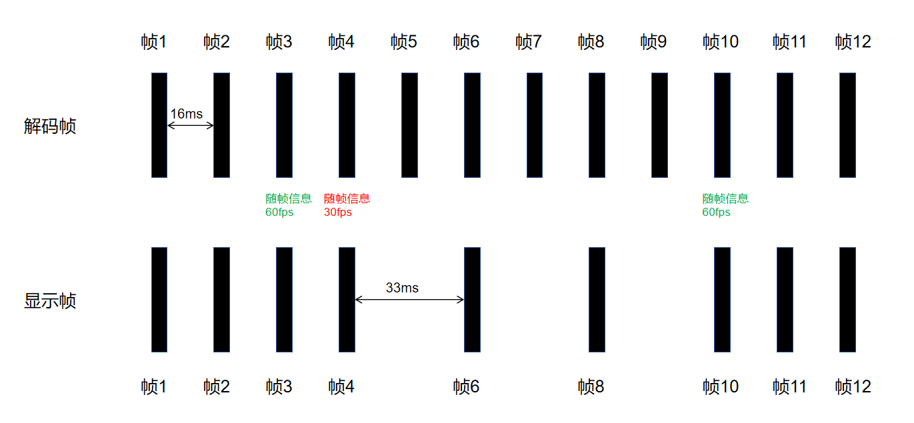

# 视频可变帧率

本模块提供视频可变帧率功能的CAPI接口，通过调用本接口，可以在视频播放过程中根据视频内容动态调整屏幕刷新率，在保障视频播放流畅度的基础上节省屏幕显示功耗。

## 适用场景

具有高帧率（>30fps）视频源的播放场景；视频帧率小于或等于30的场景建议以30Hz的刷新率运行。下图以播放一段60fps的视频为例，算法根据视频内容实时调整屏幕刷新率，调节过程中，当刷新率小于视频帧率时，显示前会丢弃部分视频帧以节省功耗。



## 约束与限制

1. 只支持硬件解码后直接送显的视频播放场景。
2. 屏幕整体刷新率会被调整，建议在全屏播放、无弹幕、无动效的场景使用，否则会影响弹幕、动效的流畅度体验。
3. 依赖解码帧率配置，使用前需要正确配置OH_MD_KEY_FRAME_RATE属性。
4. 与硬件平台能力相关，当平台不支持时，接口不报错，内部能力不生效，不影响正常解码播放流程。

## 开发步骤

基础解码功能请参考[视频解码开发指南](video-decoding.md)，下面仅针对于基础视频解码过程中存在的区别做具体说明。

1. 解码器配置阶段，添加视频可变帧率使能开关。
   
   示例中的变量说明如下：
   
   • videoDec：视频解码器实例的指针。创建方式参考[Surface模式下创建解码器实例对象](video-decoding.md#surface模式)。

    ```cpp
    OH_AVFormat *format = OH_AVFormat_Create();
    int32_t width = 1280; // 视频帧宽度。
    int32_t height = 720; // 视频帧高度。
    int32_t fps = 60; // 视频帧率。
    OH_AVFormat_SetIntValue(format, OH_MD_KEY_WIDTH, width);
    OH_AVFormat_SetIntValue(format, OH_MD_KEY_HEIGHT, height);
    OH_AVFormat_SetIntValue(format, OH_MD_KEY_FRAME_RATE, fps);
    OH_AVFormat_SetIntValue(format, OH_MD_KEY_VIDEO_DECODER_OUTPUT_ENABLE_VRR, 1);
    int32_t ret = OH_VideoDecoder_Configure(videoDec, format);
    if (ret != AV_ERR_OK) {
        // 异常处理。
    }
    OH_AVFormat_Destroy(format);
    ```

2. （可选）视频播放过程中，动态开关视频可变帧率。

    如果用户在播放中开启了弹幕，为了避免本模块输出最终未在屏幕刷新率调节过程中生效，导致计算资源的浪费，可以动态关闭本模块。
    
    动态关闭如下：

    ```cpp
    OH_AVFormat *format = OH_AVFormat_Create();
    OH_AVFormat_SetIntValue(format, OH_MD_KEY_VIDEO_DECODER_OUTPUT_ENABLE_VRR, 0);
    OH_VideoDecoder_SetParameter(videoDec，format);
    OH_AVFormat_Destroy(format);
    ```

    动态开启如下：

    ```cpp
    OH_AVFormat *format = OH_AVFormat_Create();
    OH_AVFormat_SetIntValue(format, OH_MD_KEY_FRAME_RATE, fps);
    OH_AVFormat_SetIntValue(format, OH_MD_KEY_VIDEO_DECODER_OUTPUT_ENABLE_VRR, 1);
    OH_VideoDecoder_SetParameter(videoDec，format);
    OH_AVFormat_Destroy(format);
    ```
