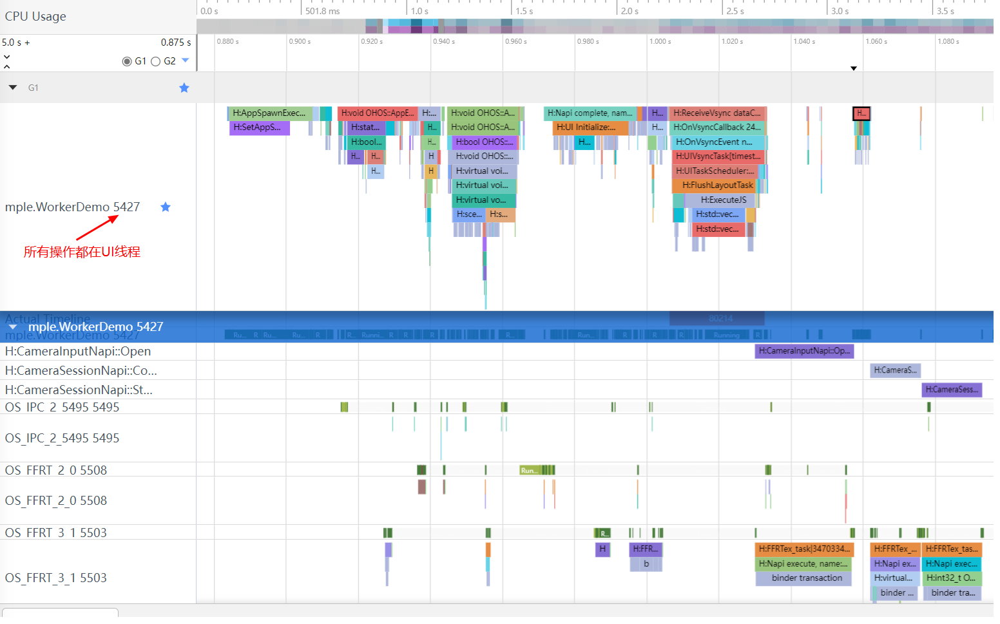
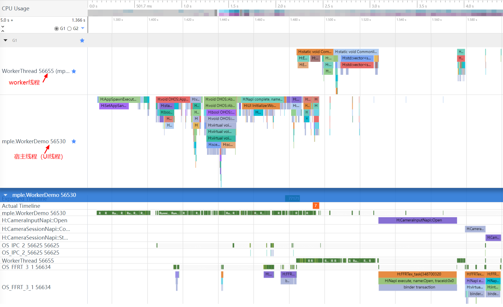

# 在Worker线程中使用相机(ArkTS)

[Worker](../../arkts-utils/worker-introduction.md)主要作用是为应用程序提供一个多线程的运行环境，可满足应用程序在执行过程中与主线程分离，在后台线程中运行一个脚本进行耗时操作，极大避免类似于计算密集型或高延迟的任务阻塞主线程的运行。

通常开发者使用相机功能需要创建相机会话，并持续接收处理预览流、拍照流、录像流等从而实现相关相机功能，这些密集型操作如果都放在主线程即UI线程，可能会阻塞UI绘制，推荐开发者在worker线程中实现相机功能。

## 开发步骤

1. 创建worker线程文件，配置worker。

   DevEco Studio支持一键生成Worker，在对应的{moduleName}目录下任意位置，点击鼠标右键 > New > Worker，即可自动生成Worker的模板文件及配置信息，无需再手动在build-profile.json5中进行相关配置 。

   CameraWorker.ets实现参考：

   ```ts
   import { ErrorEvent, MessageEvents, ThreadWorkerGlobalScope, worker } from '@kit.ArkTS';
   import CameraService from '../CameraService';
   
   const workerPort: ThreadWorkerGlobalScope = worker.workerPort;
   
   // 自定义消息格式
   interface MessageInfo {
     hasResolve: boolean;
     type: string;
     context: Context; // 注意worker线程中无法使用getContext()直接获取宿主线程context，需要通过消息从宿主线程通信到worker线程使用。
     surfaceId: string;
   }
   
   workerPort.onmessage = async (e: MessageEvents) => {
     const messageInfo: MessageInfo = e.data;
     console.info(`worker onmessage type:${messageInfo.type}`)
     if ('initCamera' === messageInfo.type) {
       // 在worker线程中收到宿主线程初始化相机的消息
       console.info(`worker initCamera surfaceId:${messageInfo.surfaceId}`)
       // 在worker线程中初始化相机
       await CameraService.initCamera(messageInfo.context, messageInfo.surfaceId);
     } else if ('releaseCamera' === messageInfo.type) {
       // 在worker线程中收到宿主线程释放相机的消息
       console.info('worker releaseCamera.');
       // 在worker线程中释放相机
       await CameraService.releaseCamera();
     }
   }
   
   workerPort.onmessageerror = (e: MessageEvents) => {
   }
   
   workerPort.onerror = (e: ErrorEvent) => {
   }
   ```
   
2. 创建相机服务代理类，调用CameraKit方法都放在这个类里执行。

   ```ts
   import { BusinessError } from '@kit.BasicServicesKit';
   import { camera } from '@kit.CameraKit';
   
   class CameraService {
     private imageWidth: number = 1920;
     private imageHeight: number = 1080;
     private cameraManager: camera.CameraManager | undefined = undefined;
     private cameras: Array<camera.CameraDevice> | Array<camera.CameraDevice> = [];
     private cameraInput: camera.CameraInput | undefined = undefined;
     private previewOutput: camera.PreviewOutput | undefined = undefined;
     private photoOutput: camera.PhotoOutput | undefined = undefined;
     private session: camera.PhotoSession | camera.VideoSession | undefined = undefined;
   
     // 初始化相机
     async initCamera(context: Context, surfaceId: string): Promise<void> {
       console.info(`initCamera surfaceId: ${surfaceId}`);
       try {
         await this.releaseCamera();
         // 获取相机管理器实例
         this.cameraManager = camera.getCameraManager(context);
         if (this.cameraManager === undefined) {
           console.error('cameraManager is undefined');
           return;
         }
         this.cameras = this.cameraManager.getSupportedCameras();
   
         // 创建cameraInput输出对象
         this.cameraInput = this.cameraManager.createCameraInput(this.cameras[0]);
         if (this.cameraInput === undefined) {
           console.error('Failed to create the camera input.');
           return;
         }
         // 打开相机
         await this.cameraInput.open();
   
         let previewProfile: camera.Profile = {
           format: camera.CameraFormat.CAMERA_FORMAT_YUV_420_SP,
           size: {
             width: this.imageWidth,
             height: this.imageHeight
           }
         };
         // 创建预览流输出
         this.previewOutput = this.cameraManager.createPreviewOutput(previewProfile, surfaceId);
         if (this.previewOutput === undefined) {
           console.error('Failed to create the preview stream.');
           return;
         }
   
         let photoProfile: camera.Profile = {
           format: camera.CameraFormat.CAMERA_FORMAT_JPEG,
           size: {
             width: this.imageWidth,
             height: this.imageHeight
           }
         };
         // 创建拍照流输出
         this.photoOutput = this.cameraManager.createPhotoOutput(photoProfile);
         if (this.photoOutput === undefined) {
           console.error('Failed to create the photoOutput.');
           return;
         }
   
         // 创建相机会话，启动会话
         this.session = this.cameraManager.createSession(camera.SceneMode.NORMAL_PHOTO) as camera.PhotoSession;
         this.session.beginConfig();
         this.session.addInput(this.cameraInput);
         this.session.addOutput(this.previewOutput);
         this.session.addOutput(this.photoOutput);
         await this.session.commitConfig();
         await this.session.start();
       } catch (error) {
         let err = error as BusinessError;
         console.error(`initCamera fail: ${JSON.stringify(err)}`);
       }
     }
   
     // 释放相机资源
     async releaseCamera(): Promise<void> {
       console.info('releaseCamera is called');
       try {
         await this.previewOutput?.release();
         await this.photoOutput?.release();
         await this.session?.release();
         await this.cameraInput?.close();
       } catch (error) {
         let err = error as BusinessError;
         console.error(`releaseCamera fail: error: ${JSON.stringify(err)}`);
       } finally {
         this.previewOutput = undefined;
         this.photoOutput = undefined;
         this.cameraManager = undefined;
         this.session = undefined;
         this.cameraInput = undefined;
       }
       console.info('releaseCamera success');
     }
   }
   
   export default new CameraService();
   ```

3. 创建组件，用于显示预览流，在页面相关生命周期中构造ThreadWorker实例，在worker线程中完成相机初始化和释放。

   ```ts
   import { worker } from '@kit.ArkTS';
   
   @Entry
   @Component
   struct Index {
     private mXComponentController: XComponentController = new XComponentController();
     private surfaceId: string = '';
     @State imageWidth: number = 1920;
     @State imageHeight: number = 1080;
     // 创建ThreadWorker对象获取worker实例
     private workerInstance: worker.ThreadWorker = new worker.ThreadWorker('entry/ets/workers/CameraWorker.ets');
   
     onPageShow(): void {
       if ('' !== this.surfaceId) {
         // 通过worker实例向worker线程发送消息初始化相机
         this.workerInstance.postMessage({
           type: 'initCamera',
           context: getContext(this),
           surfaceId: this.surfaceId,
         })
       }
     }
   
     onPageHide(): void {
       // 通过worker实例向worker线程发送消息销毁相机
       this.workerInstance.postMessage({
         type: 'releaseCamera',
       })
     }
   
     build() {
       Column() {
         Column() {
           XComponent({
             id: 'componentId',
             type: XComponentType.SURFACE,
             controller: this.mXComponentController
           })
             .onLoad(async () => {
               console.info('onLoad is called');
               // 初始化XComponent获取预览流surfaceId
               this.surfaceId = this.mXComponentController.getXComponentSurfaceId();
               let surfaceRect: SurfaceRect = {
                 surfaceWidth: this.imageHeight,
                 surfaceHeight: this.imageWidth
               };
               this.mXComponentController.setXComponentSurfaceRect(surfaceRect);
               console.info(`onLoad surfaceId: ${this.surfaceId}`);
               if (!this.workerInstance) {
                 console.error('create stage worker failed');
                 return;
               }
               // 宿主线程向worker线程发送初始化相机消息
               this.workerInstance.postMessage({
                 type: 'initCamera',
                 context: getContext(this), // 将宿主线程的context传给worker线程使用
                 surfaceId: this.surfaceId, // 将surfaceId传给worker线程使用
               })
             })// The width and height of the surface are opposite to those of the XComponent.
             .width(px2vp(this.imageHeight))
             .height(px2vp(this.imageWidth))
   
         }.justifyContent(FlexAlign.Center)
         .height('90%')
   
         Text('WorkerDemo')
           .fontSize(36)
       }
       .justifyContent(FlexAlign.End)
       .height('100%')
       .width('100%')
     }
   }
   ```

## trace对比

不使用worker：



使用woker：

