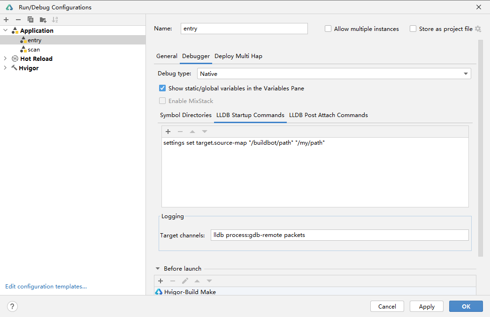

# 通过DevEco Studio调试

DevEco Studio提供了丰富的调试能力，在NDK开发过程中可以利用这些能力检测并修复程序中的错误。调试能力包括：

- 使用真机进行调试：将应用/服务运行到真机设备上并进行调试，具体请参见<!--RP1-->[使用真机进行调试](https://developer.huawei.com/consumer/cn/doc/harmonyos-guides-V5/ide-debug-device-V5)<!--RP1End-->。
  在调试过程中，如果本地编译设备so文件的源码路径和当前配置的C++源码路径不一致，可以分为以下两种场景处理：

  - 建立文件间映射关系：参考<!--RP2-->[三方源码调试](https://developer.huawei.com/consumer/cn/doc/harmonyos-guides-V5/ide-source-code-debugging-V5)<!--RP2End-->，当Step Into进入汇编代码后，会弹出源码关联的提示，请点击“Select file”，选择本地对应C++源码进行关联。
     
  - 建议路径间映射关系：选择**Run &gt; Edit Configurations**，选择模块后，切换到Debugger页签，选择Native类型，在LLDB Startup Commands页签中，新增“settings set target.source-map "/buildbot/path" "/my/path"”命令建立映射关系，其中参数一为编译环境中的源码路径，参数二为本地源码路径。
     

- C/C++反向调试：在调试过程中可以回退到历史行和历史断点，查看相关变量信息，具体请参见<!--RP3-->[C/C++反向调试](https://developer.huawei.com/consumer/cn/doc/harmonyos-guides-V5/ide-debug-native-reverse-V5)<!--RP3End-->。
