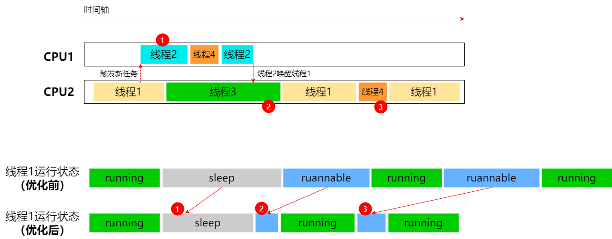

# QoS 开发指导

## 场景介绍

自多道程序及多任务操作系统问世以来，CPU、内存等有限的系统资源成为系统中所有任务的竞争对象。合理安排各个任务对系统的响应速度以及资源消耗都有非常重大的意义。相比操作系统，开发者更加清楚应用中各个任务的重要程度；根据重要程度对应用的任务进行分类，能帮助系统更好地进行任务的调度。通过本指导，开发者可以了解在OpenHarmony系统中，如何利用QoS特性及相关的接口调节任务在系统中的运行时间分配。

本文用于指导开发者基于QoS特性实现应用任务优先调度属性自定义。

## 基本概念

### QoS

QoS(quality-of-service)，即服务质量，在OpenHarmony中QoS特性主要指任务的优先调度属性。开发者可以利用QoS对要执行的工作进行分类，以指示其与用户交互的关联程度；系统则可以根据任务设置的QoS安排各任务的运行时间和运行次序。例如，当系统中有多个任务需要同时执行时，一些与用户交互关联程度不高的后台下载任务可以推迟到更晚的时间执行，且每次执行时分配更少的时间；而用户感知明显的动效绘制等任务则需要立即执行，并分配更多的执行时间。

### QoS等级定义
目前，OpenHarmony系统一共划分了如下6个QoS等级，从上到下与用户交互的关联程度依次递增，适用于多种不同的应用场景及负载特征情况。

| QoS等级                                                       | 使用场景                                                         | 负载特征                                                         |
| ------------------------------------------------------------ | ------------------------------------------------------------ | ------------------------------------------------------------ |
| QOS_BACKGROUND | 后台且用户不可见任务，例如数据同步、备份。 | 任务完成需要几分钟甚至几小时。 |
| QOS_UTILITY | 不需要立即看到响应效果的任务，例如下载或导入数据。 | 任务完成需要几秒到几分钟。 |
| QOS_DEFAULT | 默认。 | 任务完成需要几秒钟。 |
| QOS_USER_INITIATED | 用户触发并且可见进展的任务，例如打开文档。 | 任务在几秒钟之内完成。 |
| QOS_DEADLINE_REQUEST | 越快越好的关键任务，如页面加载。 | 任务几乎是瞬间完成的。 |
| QOS_USER_INTERACTIVE	 | 用户交互任务（UI线程、刷新界面、动效）。 | 任务是即时的。 |

QoS等级定义为枚举类型QoS_Level，如上表所示；枚举值定义如下。
### QoS_Level声明
```{.c}
typedef enum QoS_Level {
    /**
     * 适用于数据同步等用户不可见的后台任务。
     */
    QOS_BACKGROUND,
    /**
     * 适用于下载等不需要立即看到响应效果的任务。
     */
    QOS_UTILITY,
    /**
     * 默认的QoS等级。
     */
    QOS_DEFAULT,
    /**
     * 适用于打开文档等用户触发并且可以看到进展的任务。
     */
    QOS_USER_INITIATED,
    /**
     * 适用于页面加载等越快越好的任务。
     */
    QOS_DEADLINE_REQUEST,
    /**
     * 适用于动效绘制等用户交互任务。
     */
    QOS_USER_INTERACTIVE,
} QoS_Level;

```

## 功能效果
QoS等级更高的任务相对等级更低的可能被分配更多的CPU时间。

下面将展示合理使用QoS对程序执行的优化效果。

### QoS对线程执行的优化

#### 优化前


线程1和线程2是某程序的两个关键线程，线程1在运行时会触发新任务线程2，等线程2执行完后会唤醒线程1继续执行。在未标记这两个线程的QoS等级之前，其优先执行顺序低于线程3和线程4；此时线程1和线程2的执行效果如上图所示：

1. 线程1等待被线程2唤醒，而线程2优先级低，长时间被抢占，导致线程1长时间睡眠；

2. 线程1优先级低，它被唤醒后等待运行时间长；

3. 线程1优先级低，运行过程中长时间被其它线程抢占。

#### 优化后


合理标记线程1和线程2的QoS等级后，两个线程的执行优化效果如上图所示：

1. 线程2运行时间占比提高，线程1等待时间减少；

2. 线程1被线程2唤醒后，等待的时间减少；

3. 线程1运行实际占比提高，被抢占比例减少。

### QoS对RN框架的优化
在RN框架中合理标记关键线程的QoS等级后，如下表所示，开源benchmark测试的性能提升了约13%。

| 验证场景      | 验证环境 | 总渲染时间 |
| ----------- | ----------- | ----------- |
| benchmark<br>1500view      | 无QoS优化       | 270.8 ms       |
| benchmark<br>1500view   | 使用QoS优化        | 236.6 ms       |

## 接口说明

| 接口名                                                       | 描述                                                         | 参数                                                         | 返回值                                                         |
| ------------------------------------------------------------ | ------------------------------------------------------------ | ------------------------------------------------------------ | ------------------------------------------------------------ |
| OH_QoS_SetThreadQoS(QoS_Level level) | 设置当前任务的QoS等级。 | QoS_Level level | 0或-1 |
| OH_QoS_ResetThreadQoS() | 取消当前任务设置的QoS等级。 | 无 | 0或-1 |
| OH_QoS_GetThreadQoS(QoS_Level *level) | 获取当前任务的QoS等级。 | QoS_Level *level | 0或-1 |

### 使用限制
* QoS接口只能设置本任务的QoS等级。

## 函数介绍

### OH_QoS_SetThreadQoS

#### 声明
```{.c}
int OH_QoS_SetThreadQoS(QoS_Level level);
```

#### 参数
QoS_Level level
* 该参数用于描述要为任务设置的QoS等级。

#### 返回值
* 若成功则返回0，失败则返回-1。

#### 描述
为某个任务设置指定的QoS等级。

#### 样例
```
#include <stdio.h>
#include "qos/qos.h"

int func()
{
    // 设置当前任务的QoS等级为QOS_USER_INITIATED
    int ret = OH_QoS_SetThreadQoS(QoS_Level::QOS_USER_INITIATED);
    
    if (!ret) { // ret等于0说明设置成功
        printf("set QoS Success.");
    } else { // ret不等于0说明设置失败
        printf("set QoS failed.");
    }

    return 0;
}
```

### OH_QoS_ResetThreadQoS

#### 声明
```{.c}
int OH_QoS_ResetThreadQoS();
```

#### 参数
* 无。

#### 返回值
* 若成功则返回0，失败则返回-1。

#### 描述
取消某个任务设置的QoS等级。

#### 样例
```
#include <stdio.h>
#include "qos/qos.h"

int func()
{
    // 重置当前任务的QoS等级
    int ret = OH_QoS_ResetThreadQoS();
    
    if (!ret) { // ret等于0说明重置成功
        printf("reset QoS Success.");
    } else { // ret不等于0说明重置失败
        printf("reset QoS failed.");
    }

    return 0;
}
```

### OH_QoS_GetThreadQoS

#### 声明
```{.c}
int OH_QoS_GetThreadQoS(QoS_Level *level);
```

#### 参数
QoS_Level *level
* 该参数用于存储任务已经设置的QoS等级。

#### 返回值
* 若成功则返回0，失败则返回-1。

#### 描述
获取某个任务之前最近一次设置的QoS等级；如果之前未设置任何QoS等级，则返回-1。

#### 样例
```
#include <stdio.h>
#include "qos/qos.h"

int func()
{
    // 获取当前任务的QoS等级
    QoS_Level level = QoS_Level::QOS_DEFAULT;
    int ret = OH_QoS_GetThreadQoS(&level);

    if (!ret) { // ret等于0说明获取成功
        printf("get QoS level %d Success.", level);
    } else { // ret不等于0说明获取失败
        printf("get QoS level failed.");
    }

    return 0;
}
```

## 开发步骤
以下步骤描述了如何使用QoS特性提供的Native API接口，调整或查询任务的QoS等级。

### 1. 添加动态链接库
QoS特性的使用依赖相关的动态链接库：**libqos.so**；需要在目标应用或程序的编译环境中添加。

**示例**

使用DevEco Studio创建的模板NDK工程，会默认生成CMakeLists.txt脚本，在其中添加QoS相关动态链接库示例如下：

```txt
# the minimum version of CMake.
cmake_minimum_required(VERSION 3.4.1)
project(qos)

set(NATIVERENDER_ROOT_PATH ${CMAKE_CURRENT_SOURCE_DIR})

include_directories(${NATIVERENDER_ROOT_PATH}
                    ${NATIVERENDER_ROOT_PATH}/include)

add_library(entry SHARED hello.cpp)

# 直接引用libqos.so原因：位于已在链接寻址路径的NDK中，无需额外声明
target_link_libraries(entry PUBLIC libqos.so)
```

### 2. 引用头文件

在使用QoS特性的源代码中需要引用相关的头文件。

```c
#include "qos/qos.h"
```

### 3. 调用QoS接口

开发者根据自身需求调用相应的QoS接口调整任务的QoS等级，或者查询任务的QoS等级。

