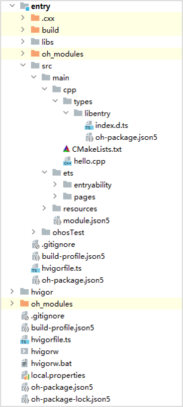

# 使用Node-API实现跨语言交互开发流程


使用Node-API实现跨语言交互，首先需要按照Node-API的机制实现模块的注册和加载等相关动作。


- **ArkTS/JS侧**：实现C++方法的调用。代码比较简单，import一个对应的so库后，即可调用C++方法。

- **Native侧**：.cpp文件，实现模块的注册。需要提供注册lib库的名称，并在注册回调方法中定义接口的映射关系，即Native方法及对应的JS/ArkTS接口名称等。


此处以在ArkTS/JS侧实现add()接口、在Native侧实现Add()接口，从而实现跨语言交互为例，呈现使用Node-API进行跨语言交互的流程。


## 创建Native C++工程

- 在DevEco Studio中**New &gt; Create Project**，选择**Native C++**模板，点击**Next**，选择API版本，设置好工程名称，点击**Finish**，创建得到新工程。

- 创建工程后工程结构可以分两部分，cpp部分和ets部分，具体可见下文的工程目录介绍。

**主要工程目录介绍**



- **entry &gt; src &gt; main &gt; cpp &gt; types**：用于存放C++的API接口描述文件。

- **entry &gt; src &gt; main &gt; cpp &gt; types &gt; libentry &gt; index.d.ts**：描述C++ API接口行为，如接口名、入参、返回参数等。

- **entry &gt; src &gt; main &gt; cpp &gt; types &gt; libentry &gt; oh-package.json5**：配置.so三方包声明文件的入口及包名。

- **entry &gt; src &gt; main &gt; cpp &gt; CMakeLists.txt**：C++源码编译配置文件，提供CMake构建脚本。

- **entry &gt; src &gt; main &gt; cpp &gt; napi_init.cpp**：定义C++ API接口的文件。

- **entry &gt; src &gt; main &gt; ets**：用于存放ArkTS源码。

更多工程介绍，请见[C++工程目录结构](https://developer.harmonyos.com/cn/docs/documentation/doc-guides-V3/project_overview-0000001053822398-V3#section3732132312179)。


## Native侧方法的实现

- 设置模块注册信息

  ArkTS侧import native模块时，会加载其对应的so。加载so时，首先会调用napi_module_register方法，将模块注册到系统中，并调用模块初始化函数。

  napi_module有两个关键属性：一个是.nm_register_func，定义模块初始化函数；另一个是.nm_modname，定义模块的名称，也就是ArkTS侧引入的so库的名称，模块系统会根据此名称来区分不同的so。

  ```
  // entry/src/main/cpp/napi_init.cpp
  
  // 准备模块加载相关信息，将上述Init函数与本模块名等信息记录下来。
  static napi_module demoModule = {
      .nm_version = 1,
      .nm_flags = 0,
      .nm_filename = nullptr,
      .nm_register_func = Init,
      .nm_modname = "entry",
      .nm_priv = nullptr,
      .reserved = {0},
  };
  
  // 加载so时，该函数会自动被调用，将上述demoModule模块注册到系统中。
  extern "C" __attribute__((constructor)) void RegisterDemoModule() { 
      napi_module_register(&demoModule);
   }
  ```

- 模块初始化

  实现ArkTS接口与C++接口的绑定和映射。

  ```
  // entry/src/main/cpp/napi_init.cpp
  EXTERN_C_START
  // 模块初始化
  static napi_value Init(napi_env env, napi_value exports) {
      // ArkTS接口与C++接口的绑定和映射
      napi_property_descriptor desc[] = {
          {"callNative", nullptr, CallNative, nullptr, nullptr, nullptr, napi_default, nullptr},
          {"nativeCallArkTS", nullptr, NativeCallArkTS, nullptr, nullptr, nullptr, napi_default, nullptr},
      };
      // 在exports对象上挂载CallNative/NativeCallArkTS两个Native方法
      napi_define_properties(env, exports, sizeof(desc) / sizeof(desc[0]), desc);
      return exports;
  }
  EXTERN_C_END
  
  // 模块基本信息
  static napi_module demoModule = {
      .nm_version = 1,
      .nm_flags = 0,
      .nm_filename = nullptr,
      .nm_register_func = Init,
      .nm_modname = "entry",
      .nm_priv = nullptr,
      .reserved = {0},
  };
  ```

- 在index.d.ts文件中，提供JS侧的接口方法。

  ```
  // entry/src/main/cpp/types/libentry/index.d.ts
  export const callNative: (a: number, b: number) => number;
  export const nativeCallArkTS: (cb: (a: number) => number) => number;
  ```

- 在oh-package.json5文件中将index.d.ts与cpp文件关联起来。

  ```
  // entry/src/main/cpp/types/libentry/oh-package.json5
  {
    "name": "libentry.so",
    "types": "./index.d.ts",
    "version": "",
    "description": "Please describe the basic information."
  }
  ```

- 在CMakeLists.txt文件中配置CMake打包参数。

  ```
  # entry/src/main/cpp/CMakeLists.txt
  cmake_minimum_required(VERSION 3.4.1)
  project(MyApplication2)
  
  set(NATIVERENDER_ROOT_PATH ${CMAKE_CURRENT_SOURCE_DIR})
  
  include_directories(${NATIVERENDER_ROOT_PATH}
                      ${NATIVERENDER_ROOT_PATH}/include)
  
  # 添加名为entry的库
  add_library(entry SHARED napi_init.cpp)
  # 构建此可执行文件需要链接的库
  target_link_libraries(entry PUBLIC libace_napi.z.so)
  ```

- 实现Native侧的CallNative以及NativeCallArkTS接口。具体代码如下：

  ```
  // entry/src/main/cpp/napi_init.cpp
  static napi_value CallNative(napi_env env, napi_callback_info info)
  {
      size_t argc = 2;
      // 声明参数数组
      napi_value args[2] = {nullptr};
  
      // 获取传入的参数并依次放入参数数组中
      napi_get_cb_info(env, info, &argc, args, nullptr, nullptr);
  
      // 依次获取参数
      double value0;
      napi_get_value_double(env, args[0], &value0);
      double value1;
      napi_get_value_double(env, args[1], &value1);
  
      // 返回两数相加的结果
      napi_value sum;
      napi_create_double(env, value0 + value1, &sum);
      return sum;
  }
  
  static napi_value NativeCallArkTS(napi_env env, napi_callback_info info)
  {    
      size_t argc = 1;
      // 声明参数数组
      napi_value args[1] = {nullptr};
  
      // 获取传入的参数并依次放入参数数组中
      napi_get_cb_info(env, info, &argc, args , nullptr, nullptr);
  
      // 创建一个int，作为ArkTS的入参
      napi_value argv = nullptr;    
      napi_create_int32(env, 2, &argv );
  
      // 调用传入的callback，并将其结果返回
      napi_value result = nullptr;
      napi_call_function(env, nullptr, args[0], 1, &argv, &result);
      return result;
  }
  ```


## ArkTS侧调用C/C++方法实现

ArkTS侧通过import引入Native侧包含处理逻辑的so来使用C/C++的方法。

```
// entry/src/main/ets/pages/Index.ets
// 通过import的方式，引入Native能力。
import nativeModule from 'libentry.so'

@Entry
@Component
struct Index {
  @State message: string = 'Test Node-API callNative result: ';
  @State message2: string = 'Test Node-API nativeCallArkTS result: ';
  build() {
    Row() {
      Column() {
        // 第一个按钮，调用add方法，对应到Native侧的CallNative方法，进行两数相加。
        Text(this.message)
          .fontSize(50)
          .fontWeight(FontWeight.Bold)
          .onClick(() => {
            this.message += nativeModule.callNative(2, 3);
            })
        // 第二个按钮，调用nativeCallArkTS方法，对应到Native的NativeCallArkTS，在Native调用ArkTS function。
        Text(this.message2)
          .fontSize(50)
          .fontWeight(FontWeight.Bold)
          .onClick(() => {
            this.message2 += nativeModule.nativeCallArkTS((a: number)=> {
                return a * 2;
            });
          })
      }
      .width('100%')
    }
    .height('100%')
  }
}
```


## Node-API的约束限制


### SO命名规则

导入使用的模块名和注册时的模块名大小写保持一致，如模块名为entry，则so的名字为libentry.so，napi_module中nm_modname字段应为entry，ArkTS侧使用时写作：import xxx from 'libentry.so'。


### 注册建议

- nm_register_func对应的函数（如上述Init函数）需要加上static，防止与其他so里的符号冲突；

- 模块注册的入口，即使用__attribute__((constructor))修饰的函数的函数名（如上述RegisterDemoModule函数）需要确保不与其它模块重复。


### 多线程限制

每个引擎实例对应一个JS线程，实例上的对象不能跨线程操作，否则会引起应用crash。使用时需要遵循如下原则：

- Node-API接口只能在JS线程使用。

- Native接口入参env与特定JS线程绑定只能在创建时的线程使用。
