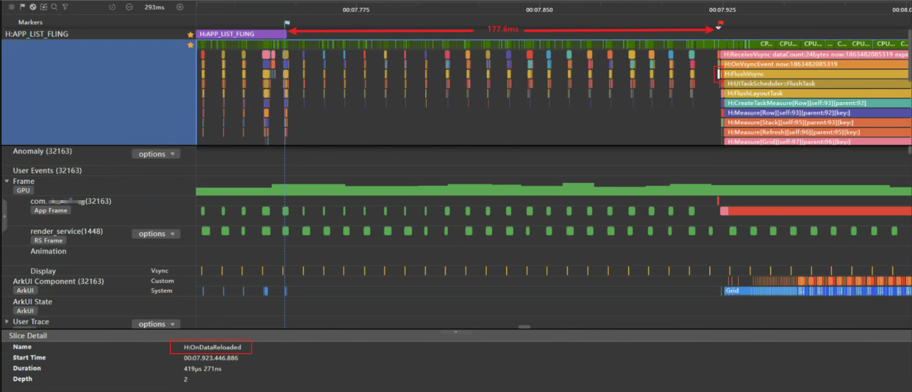
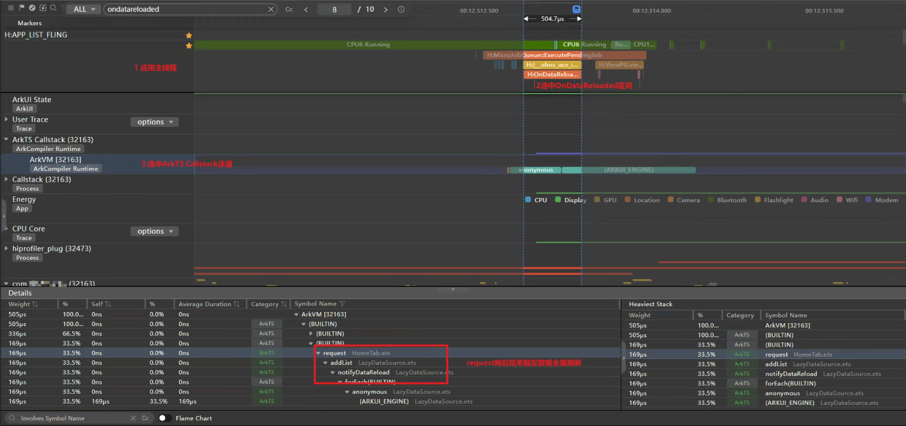
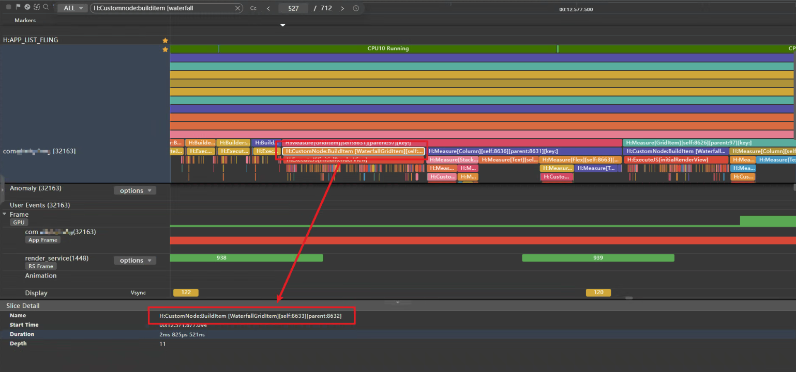
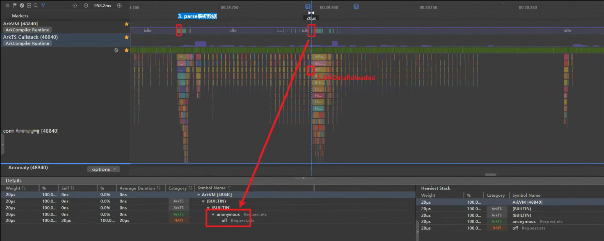

# 时延类性能问题分析实践

## 概要

当应用在运行时出现明显的延迟或不流畅的情况，会影响用户体验，开发者需要定位、分析、解决应用时延问题。本文先简单介绍应用流畅度评测指标，然后基于Trace数据，介绍时延问题分析思路，并结合案例实践，实操定位分析并优化时延问题。

## 性能指标

**性能指标介绍**

滑动页面占位符加载完成时延的标准为40ms。

**滑动页面占位符加载完成时延**

在可滑动页面中，滚动停止开始计算起，到屏幕内占位符（一般是图片）加载完成。

## 问题分析流程

### 信息准备

**确定问题现象**

- 应用运行环境版本、数据量是怎样？
- 应用运行时做了什么操作？
- 是否可以本地复现？复现概率如何？

**准备可观测性信息**

处理应用程序时，可以优先查看操作录屏，查看操作场景，能否发现一些有助于定位的信息。然后针对性获取HiTrace、HiPerf、CPU Profiler、常规log等各种可观测数据。

**Trace抓取**

抓取Trace前，可以打开ArkUI在hdc的一些debug开关。这样会增加一些详细的trace信息，比如显示具体引起组件标脏的变量、增加布局相关的信息、展示布局过程中所有涉及的组件层级等等。打开的方式，是连接设备后，通过hdc shell进入命令行交互模式，输入下表中所需命令。

| 开关命令                                          | 开关信息                                    |
| ------------------------------------------------ | ------------------------------------------ |
| param set persist.ace.debug.enabled 1             | 一些调试的Trace开关，包括状态变更更新的Trace  |
| param set persist.ace.trace.enabled 1             | ArkUI全局的Trace开关                        |
| param set persist.ace.layout.enabled true         | 节点树布局的详细过程的Trace                  |
| param set persist.ace.property.build.enabled      | 属性设置构建的开关（仅支持root镜像下）        |
| param set const.security.developermode.state true | 开发者模式的开关（仅支持root镜像下）          |

在设备相关debug开关打开后，通过Frame或SmartPerf Host等工具抓取场景Trace，开发者在抓取时，应结合问题现象，使Trace短小而有针对性，以方便后续问题定位。

### 问题分析

滑动操作占位符完成时延类问题的通用定位思路为先确认时延起止点，然后看起止点时延是否超标准的40ms，没有超过就是达标，超过就需要进一步分析Trace耗时主要发生在什么地方，主要分析网络耗时和帧渲染耗时，最后确定是系统问题还是三方问题。

图1 处理流程图

#### 确认起止点

**加载完成时延起始点**
APP_LIST_FLING终点视为滑动停止，则是加载完成时延起始点。
滑动页面占位符加载完成，是以滑动停止为起始点，在Trace中APP_LIST_FLING泳道可以体现滚动视图的FLING惯性滚动状态的起止，惯性滚动停止则滚动停止，此时开始计算占位符加载时延。

图2 时延起始点

查找步骤

1. 搜索APP_LIST_FLING。
2. 找到APP_LIST_FLING泳道，星标后即可置顶查看。
3. Trace标记了惯性滚动区间。
4. **APP_LIST_FLING结束点=加载完成时延起始点。**

**加载完成时延终止点**

APP_LIST_FLING终点视为滑动停止后，图片加载完成即页面不再发生变化（应用侧不提交Vsync信号到RenderService），则是加载完成时延终止点。

滑动页面滚动停止后，会出现两种情形。

1. 未触发上拉加载，滚动停止后的第一帧，分析异常帧。
2. 触发上拉加载，分析网络请求，分析异常帧。

图3 时延终止点

**加载完成时延**

图4 起始点与终止点时间间隔

#### 定位问题点

1. 如果从应用UI上发现有网络加载的动作，则可以在ArkTS CallStack泳道查找是否发送网络请求，关键Trace点createHttp，继续查找请求响应点off(request)，parse数据解析，OnDataReload（LazyForEach刷新数据）来判断请求结束数据刷新时间点。因为在长列表应用中，一般使用分页加载功能实现更多数据，在滚动停止或者将要停止时触发加载更多功能，发送网络请求，收到响应数据后解析并刷新数据源，驱动页面刷新。

图5 createHttp

1. 在FLING结束点，往后查看ArkTS CallStack调用栈，查看耗时任务，如发现耗时任务，则继续查看耗时原因，一般结合应用进程UI主线程查看；如未发现耗时任务（比如idle状态），则查看此时Frame应用侧是否有渲染任务和对应的Component组件情况，一般idle状态应用送帧情况为动画。

2. 在FLING结束点，往后查看Frame应用侧帧渲染情况，是否出现异常帧、超长帧。此时一般结合应用进程UI主线程查看具体的组件渲染详情。

图6 帧渲染类型

|泳道|问题1|问题2|问题3|
|-|-|-|-|
|Frame/应用线程|送帧平滑|超长帧|异常帧|
|ArkUI Component|组件极少|System和Custom组件居多|System组件居多|
|ArkTS CallStack|空闲+request|任务|任务|
|异常追踪|单一组件动画，后台任务网络请求|大量组件创建或刷新渲染|系统组件创建或刷新渲染|

#### 问题根因分析

1. 滑动停止有网络请求，则考虑网络时延。
2. 滑动停止有出现超长帧、异常帧耗时，考虑复用机制失效或者冗余嵌套渲染时延。
3. 列表中Item占位符图片占位符常常加载的是网络图片，考虑网络时延。
4. 占位符图片在加载过程中使用动画，会导致渲染完成时延，比如透明度0到1，缩放比例0到1，则考虑动画时延。

## 典型问题

### 因网络加载导致占位符加载完成时延不满足标准

滑动页面触发上拉加载，在loading动画期间等待数据请求，数据请求完成后刷新列表，占位符加载完成时延不满足标准。

图7 上拉加载示例

#### 问题根因分析

1. 根据起始点确定问题Trace起始点和终止点，如下图加载完成时延总共700ms。

图8 时延时长

2. 根据场景上拉加载更多，数据通过网络请求后刷新，放大Trace找到APP_LIST_FLING尾部，末尾触发request请求数据，即滚动到尾部将要停止时会触发上拉加载，发送请求获取网络接口数据。关键Trace点信息详见“网络关键Trace点”。

 图9 发送请求request
 

发送网络数据请求后，会有Response体现在应用中则是解析后刷新数据，LazyForEach绑定的IDataSource会触发刷新监听，通过OnDataReloaded找出刷新数据Trace点，可得到网络请求耗时177ms。

图10 开始刷新数据OnDataReloaded

3. 本案例中列表中主要占位符为Image组件，加载是通过ImageSource解码生成PixelMap。加载网络图片时，发送图片地址网络请求，接着将返回的数据解码为Image组件中的PixelMap。通过搜索CreateImagePixelMap搜索创建图像像素图，耗时14ms。

图11 加载网络图片资源 CreateImagePixelMap

#### 优化方案

由于网络时延受多方面因素影响，可尝试优化网络请求和网图加载。

1. 采用预请求方式加载更多数据，在快滑动到底部某个位置时触发请求，用户无感加载更多，缩减网络请求等待。
2. 列表图可适当采用小图模式加载，加速网图资源下载速度。
3. Image组件alt属性加载本地占位图，避免占位符在等待网图加载期间空白。
4. 图片缓存机制，再次加载网图可从缓存中取图。

占位图加载完成时延，一般受首次网络请求时延影响，如果二次加载图片完成时延<=40ms，也算达到标准。

### 因组件渲染导致占位符加载完成时延不满足标准

在滚动到底部时，上拉加载更多的网络请求，等待网络请求数据完成后驱动UI刷新。实际测试中发现，上拉加载次数越多，占位图加载完成耗时就越久，可以推断出在加载更多后的渲染有异常。

图12 占位符加载示例

#### 问题根因分析

1. 分析Trace发现列表每次滚动停止触发上拉加载后，会有一个超长帧。

图13 超长帧

2. 分析Trace中应用主线程泳道超长帧，发现有大量组件创建和布局测算。关键Trace点信息详见“UI绘帧关键Trace点”。
- 在应用主线程泳道超长帧前，有关键刷新Trace点：OnDataReloaded（LazyForEach通知控制器数据重新加载）。
- 在ArkTS CallStack中查看调用栈发现，js调用notifyDataReload，说明应用侧此时触发了页面刷新。
- 在应用主线程泳道两次超长帧加载LazyItem创建索引可以发现，0-51到0-71，单帧绘制的item越来越多。

总结如上3点，结合实际场景上拉加载次数越多，时延越久，说明应用侧使用了全量数据刷新。

图14 OnDataReloaded开始触发UI刷新

图15 查看超长帧，第一次上拉加载更多

图16 查看超长帧，第二次上拉加载更多

3. 继续分析超长帧，通过应用主线程泳道发现单帧有大量BuildItem构建GridItem，而且在懒加载LazyForEach predict中大量aboutToBeDeleted发现析构处理，说明GridItem在滑动过程中被释放。从而分析出列表中子组件未做复用影响性能。关键Trace点信息见“UI绘帧关键Trace点”。

图17 BuildItem构建GridItem

图18 LazyForEach predict中aboutToBeDeleted析构GridItem

#### 优化方案

1. 可以采用组件复用机制@Reusable优化性能。
2. 优化LazyForEach的键值刷新规则，采用onDataAdd局部更新。onDataReloaded会通知组件重新加载所有数据，键值没有变化的数据项会使用原先的子组件，键值发生变化的会重建子组件。

占位符Image组件加载完成需要通过UI渲染，优化滑动过程中UI组件渲染效率可提高占位符加载完成效率。

### 因组件动画导致占位符加载完成时时延不满足标准

在滑动列表过程中，占位符图片加载看到从无到有的渐变动画。

图19 渐变动画

#### 问题根因分析

分析Trace滑动过程中的每一帧，发现在GridItem加载过程中使用了自定义动画，查看JSAnimation动画参数duration为150ms，说明此动画完成时间为150ms，影响图片的加载效果。

图20 动画JSAnimation

#### 优化方案

评估动画是否合理或者优化参数。

在UI显示阶段，动画是影响响应时延类的重要因素。

## 附录：场景通用Trace流程点说明

### 网络关键Trace点

图21 网络关键Trace点

|序号|泳道|Trace点|描述|
|-|-|-|-|
|1|ArkTS CallStack|createHttp|创建网络请求|
|2|ArkTS CallStack|request|发送网络请求|
|3|ArkTS CallStack|parse|解析数据|
|4|ArkTS CallStack|off|取消订阅|
|5|应用进程|OnDataReloaded|懒加载数据刷新。懒加载数据刷新分全量刷新和局部刷新，在数据较多时建议局部刷新。|

### UI绘制关键Trace点

图22 UI绘制关键Trace点

|序号|泳道|Trace点|描述|
|-|-|-|-|
|1|应用进程|SendCommands|应用UI提交到Render Service|
|2|render_service|RSMainThread::DoComposition|合成渲染树上各节点图层|
|3|RSHardWareThread|Commit|绘制结果提交上屏|

|序号|泳道|Trace点|描述|
|-|-|-|-|
|1|应用进程|ReceiveVsync|接收Vsync信号。|
|2|应用进程|OnVsyncEvent|收到Vsync信号，渲染流程开始。|
|3|应用进程|FlushVsync|刷新视图同步事件，包括记录帧信息、刷新任务、绘制渲染上下文、处理用户输入。|
|4|应用进程|FlushDirtyNodeUpdate|标脏组件刷新。页面刷新渲染的时候要尽量减少刷新的组件数量。当状态变量改变后，会先对与状态变量相关的组件进行标脏，然后再对这些组件重新测量和布局，最后再进行渲染。|
|5|应用进程|JSAnimation|显示动画，动画会影响组件加载完成时延。比如透明度0-1，放大0-1等。|
|6|应用进程|FlushLayoutTask|执行布局任务。在此阶段会对组件做布局测算，如果层级较深或者组件较多会影响性能。|
|7|应用进程|Builder:BuildLazyItem|需创建的项目索引，在需要时创建项，并进行缓存。|
|8|应用进程|FlushMessage|发送信息通知图形侧进行渲染。|
|9|应用进程|LazyForEach predict|Onldle下，一般会用来做预加载之类的。LazyForEach会触发。|
|10|应用进程|aboutToDeleted|自定义组件生命周期函数。组件析构时出现，在未使用复用机制时，FlushDirtyNodeUpdate和LazyForEach predict下会析构组件，导致刷新时组件重复创建，影响性能。|

**FlushDirtyNodeUpdate**
- 执行js代码，修改状态变量。
- 由于状态变量变化，将与状态变量关联的组件都标记为脏节点。
- 重新测量和布局所有的脏节点。
- 将结果进行序列化后传给渲染服务做合成显示。
