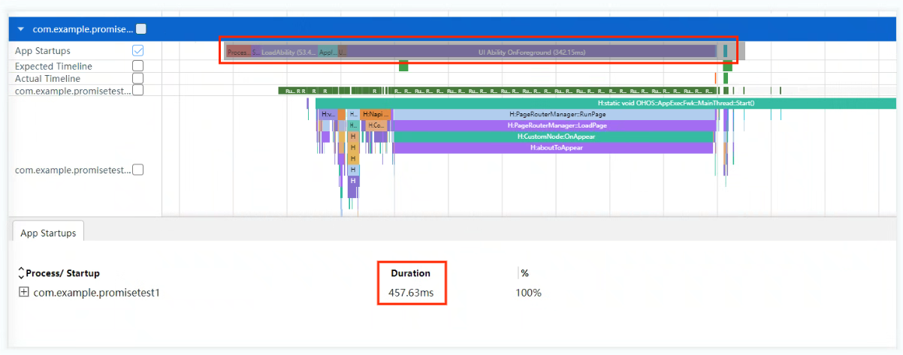
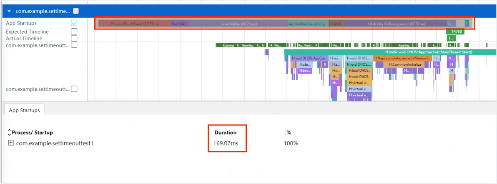
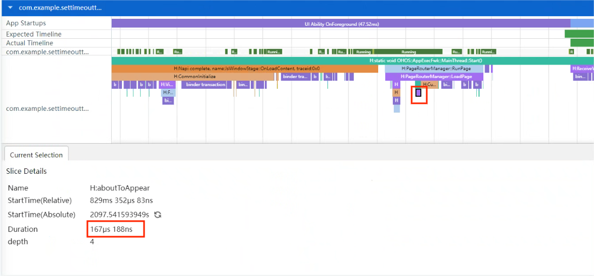
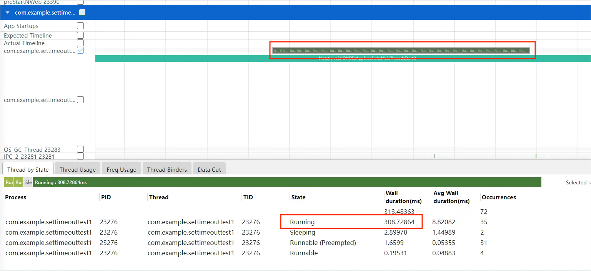
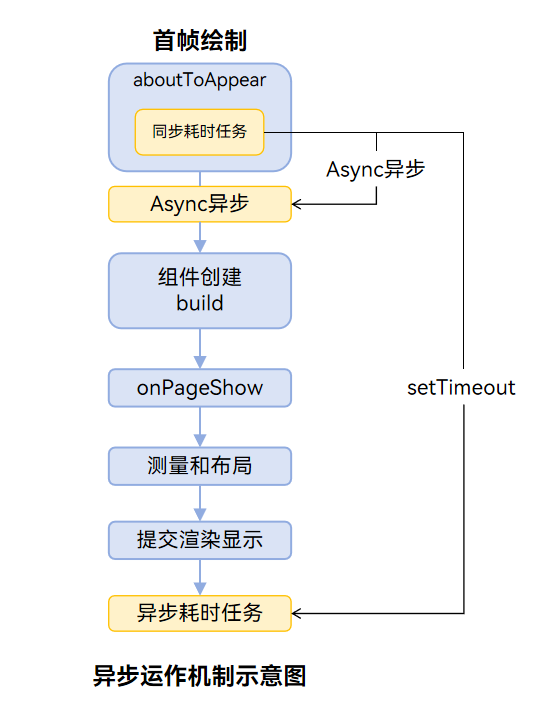
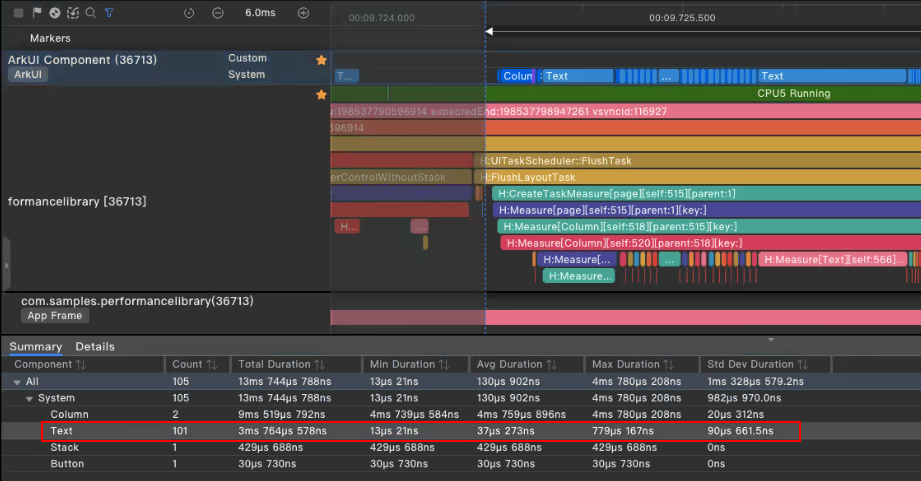
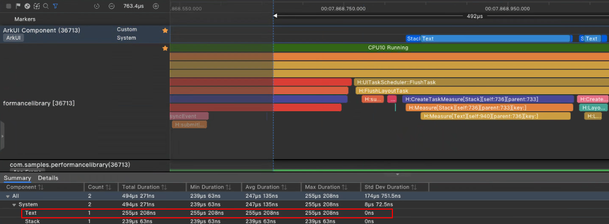
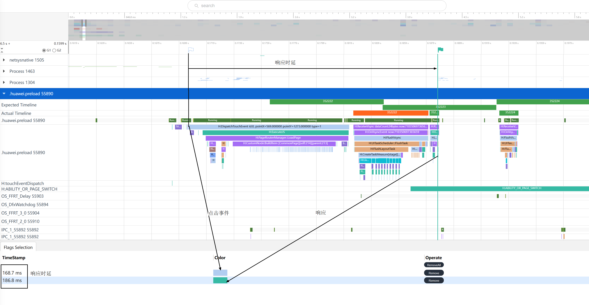
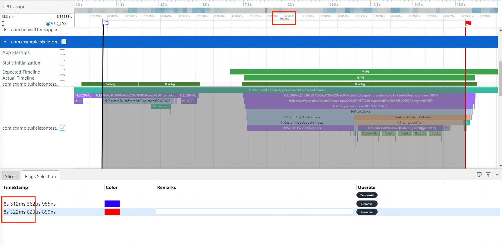
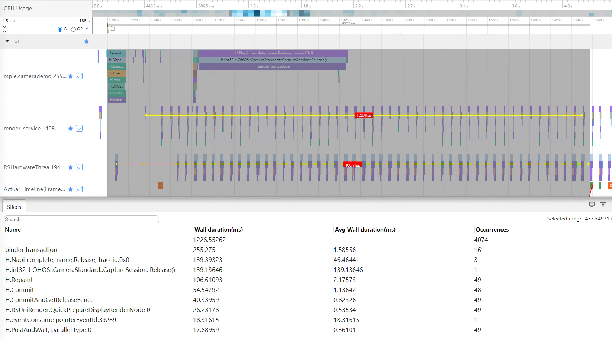

# 提升应用响应速度

应用对用户的输入需要快速反馈，以提升交互体验，因此本文提供了以下方法来提升应用响应速度。

- 避免主线程被非UI任务阻塞
- 减少组件刷新的数量
- 合理使用缓存提升响应速度
- 合理使用预加载提升响应速度

## 避免主线程被非UI任务阻塞

在应用响应用户输入期间，应用主线程应尽可能只执行UI任务（待显示数据的准备、可见视图组件的更新等），非UI的耗时任务（长时间加载的内容等）建议通过异步任务延迟处理或者分配到其他线程处理。

### 使用组件异步加载特性

当前系统提供的Image组件默认生效异步加载特性，当应用在页面上展示一批本地图片的时候，会先显示空白占位块，当图片在其他线程加载完毕后，再替换占位块。这样图片加载就可以不阻塞页面的显示，给用户带来良好的交互体验。因此，只在加载图片耗时比较短的情况下建议下述代码。 

```typescript
@Entry
@Component
struct ImageExample1 {
  build() {
    Column() {
      Row() {
        Image('resources/base/media/sss001.jpg')
          .border({ width: 1 }).borderStyle(BorderStyle.Dashed).aspectRatio(1).width('25%').height('12.5%')
        Image('resources/base/media/sss002.jpg')
          .border({ width: 1 }).borderStyle(BorderStyle.Dashed).aspectRatio(1).width('25%').height('12.5%')
        Image('resources/base/media/sss003.jpg')
          .border({ width: 1 }).borderStyle(BorderStyle.Dashed).aspectRatio(1).width('25%').height('12.5%')
        Image('resources/base/media/sss004.jpg')
          .border({ width: 1 }).borderStyle(BorderStyle.Dashed).aspectRatio(1).width('25%').height('12.5%')
      }
    // 此处省略若干个Row容器，每个容器内都包含如上的若干Image组件
    }
  }
}
```

建议：在加载图片的耗时比较短的时候，通过异步加载的效果会大打折扣，建议配置Image的syncLoad属性。

```typescript
@Entry
@Component
struct ImageExample2 {
  build() {
    Column() {
      Row() {
        Image('resources/base/media/sss001.jpg')
          .border({ width: 1 }).borderStyle(BorderStyle.Dashed).aspectRatio(1).width('25%').height('12.5%').syncLoad(true)
        Image('resources/base/media/sss002.jpg')
          .border({ width: 1 }).borderStyle(BorderStyle.Dashed).aspectRatio(1).width('25%').height('12.5%').syncLoad(true)
        Image('resources/base/media/sss003.jpg')
          .border({ width: 1 }).borderStyle(BorderStyle.Dashed).aspectRatio(1).width('25%').height('12.5%').syncLoad(true)
        Image('resources/base/media/sss004.jpg')
          .border({ width: 1 }).borderStyle(BorderStyle.Dashed).aspectRatio(1).width('25%').height('12.5%').syncLoad(true)
      }
    // 此处省略若干个Row容器，每个容器内都包含如上的若干Image组件
    }
  }
}
```

### 使用TaskPool线程池异步处理

当前系统提供了[TaskPool线程池](../reference/apis-arkts/js-apis-taskpool.md)，相比worker线程，TaskPool提供了任务优先级设置、线程池自动管理机制，示例如下：

```typescript
import taskpool from '@ohos.taskpool';

@Concurrent
function computeTask(arr: string[]): string[] {
  // 模拟一个计算密集型任务
  let count = 0;
  while (count < 100000000) {
    count++;
  }
  return arr.reverse();
}

@Entry
@Component
struct AspectRatioExample3 {
  @State children: string[] = ['1', '2', '3', '4', '5', '6'];

  aboutToAppear() {
    this.computeTaskInTaskPool();
  }

  async computeTaskInTaskPool() {
    const param = this.children.slice();
    let task = new taskpool.Task(computeTask, param);
    await taskpool.execute(task);
  }

  build() {
    // 组件布局
  }
}
```

### 创建异步任务

反例：将非UI的耗时任务通过Promise进行Async异步执行。虽然执行了异步操作，但只是将顺序移到了下一个执行的任务位置，还是会影响页面响应速度。

```typescript
@Entry
@Component
struct Index {
  @State private text: string = "hello world";
  private count: number = 0;

  aboutToAppear() {
    const result: Promise<void> = new Promise(() => {
      this.computeTask();
    });
  }

  build() {
    Column({space: 10}) {
      Text(this.text).fontSize(50)
    }
    .width('100%')
    .height('100%')
    .padding(10)
  }

  computeTask() {
    this.count = 0;
    while (this.count < 10000000) {
      this.count++;
    }
  }
}
```

建议：将一个长时间执行的非UI任务通过setTimeout改造成异步任务，主线程可以先绘制初始页面。等主线程空闲时，再执行异步任务。

```typescript
@Entry
@Component
struct Index {
  @State private text: string = "Hello World";
  private count: number = 0;

  aboutToAppear() {
    setTimeout(() => {
      this.computeTask();
    }, 1000)
  }

  build() {
    Column({space: 10}) {
      Text(this.text).fontSize(50)
    }
    .width('100%')
    .height('100%')
    .padding(10)
  }

  computeTask() {
    this.count = 0;
    while (this.count < 10000000) {
      this.count++;
    }
  }
}
```

通过SmartPerf-Host工具对trace进行抓取，可从应用启动阶段分析响应速度。


如下图所示，反例中启动时总耗时为457ms。



反例中启动时aboutToAppear阶段耗时为295ms。


正例中启动时总耗时为169ms。



正例中启动时aboutToAppear阶段耗时为167us。



其中setTimeout真正的耗时为308ms。



异步运行机制如图所示。



## 减少刷新的组件数量

应用刷新页面时需要尽可能减少刷新的组件数量，如果数量过多会导致主线程执行测量、布局的耗时过长，还会在自定义组件新建和销毁过程中，多次调用aboutToAppear()、aboutToDisappear()方法，增加主线程负载。

### 使用指定宽高的容器限制刷新范围

反例：如果一个容器没有同时指定宽高，此时改变容器内部的布局，那么该容器外同级的所有组件都会重新做布局计算和测量更新，导致主线程UI刷新耗时过长。

以下代码的Text('New Page')组件被状态变量isVisible控制，isVisible为true时创建，false时销毁。当isVisible发生变化时，由于其外包裹的Stack容器没有同时指定宽高，
因此会扩散影响到容器外ForEach中的Text渲染：

```typescript
const IMAGE_TOTAL_NUM: number = 10; // 图片总数

@Entry
@Component
struct StackExample {
  @State isVisible: boolean = true;
  private data: number[] = [];

  aboutToAppear() {
    for (let i: number = 0; i < IMAGE_TOTAL_NUM; i++) {
      this.data.push(i);
    }
  }
  
  build() {
    Column() {
      Button('Switch Hidden and Show').onClick(() => {
        this.isVisible = !this.isVisible;
      })

      Stack() {
        if (this.isVisible) {
          Text('New Page').width(100).height(30).backgroundColor(0xd2cab3)
        }
      }.width(100) // 本案例以Stack容器为例，只指定了宽，会触发父容器组件重新布局计算，引起ForEach中文本测量。

      ForEach(this.data, (item: number) => { // 由于Stack容器没有同时指定宽高，会扩散影响到这一层，引起Text的测量更新。
        Text(`Item value: ${item}`)
          .fontSize($r('app.integer.font_size_20'))
          .width($r('app.string.layout_100_percent'))
          .textAlign(TextAlign.Center)
      }, (item: number) => item.toString())
    }
  }
}
```


建议：指定Stack宽高，此时Stack组件作为布局计算的边界，内部的变化不会扩散到父容器，进而减少兄弟节点的刷新。

```typescript
const IMAGE_TOTAL_NUM: number = 10; // 图片总数

@Entry
@Component
struct StackExample2 {
  @State isVisible: boolean = true;
  private data: number[] = [];

  aboutToAppear() {
    for (let i: number = 0; i < IMAGE_TOTAL_NUM; i++) {
      this.data.push(i);
    }
  }

  build() {
    Column() { // 父容器
      Button('Switch Hidden and Show').onClick(() => {
        this.isVisible = !this.isVisible;
      })

      Stack() {
        if (this.isVisible) {
          Text('New Page').width(100).height(30).backgroundColor(0xd2cab3)
        }
      }.width(100).height(30) // 在指定宽高的Stack容器内，内部的Text组件变化只会在容器内部做布局和测量更新，不会影响到容器外ForEach中的Text组件。

      ForEach(this.data, (item: number) => { // Stack容器指定了宽高，不会影响到这一层兄弟节点
        Text(`Item value: ${item}`)
          .fontSize($r('app.integer.font_size_20'))
          .width($r('app.string.layout_100_percent'))
          .textAlign(TextAlign.Center)
      }, (item: number) => item.toString())
    }
  }
}  
```
**效果对比**

正反例相同的操作步骤：通过点击按钮，将初始状态为显示的Text('New Page')组件切换为隐藏状态，此时开始抓取耗时，再次点击按钮，将隐藏状态切换为显示状态，此时结束抓取，两次切换间的时间间隔长度，需保证页面渲染完成。

反例：父容器Column内有被只指定了宽的Stack容器包裹的Text组件，其中if条件结果变更会触发创建和销毁该组件，此时会触发父组件兄弟节点重新布局计算，引起ForEach中的文本测量，因此导致主线程UI刷新耗时过长。

当Text('New Page')隐藏状态时开始抓取耗时，此时点击按钮显示Text('New Page')组件时结束抓取，此时引起了兄弟节点中ForEach中的文本测量，Text总共创建个数为stack容器1个Text+兄弟节点中ForEach中的100个Text，共101个，Text总耗时为3ms。



基于上例，将Stack容器指定宽高，相同操作抓取耗时，此时没有引起父组件兄弟节点的布局计算和测量更新，仅有Stack容器中的1个Text创建耗时，Text总耗时为255μs。



可见，对于可以指定宽高的容器可以限制刷新范围。

### 按需加载列表组件的元素

反例：this.arr中的每一项元素都被初始化和加载，数组中的元素有10000个，主线程执行耗时长。

```typescript
@Entry
@Component
struct MyComponent7 {
  @State arr: number[] = Array.from(Array<number>(10000), (v,k) =>k); 
  build() {
    List() {
      ForEach(this.arr, (item: number) => {
        ListItem() {
          Text(`item value: ${item}`)
        }
      }, (item: number) => item.toString())
    }
  }
}
```

建议：这种情况下用LazyForEach替换ForEach，LazyForEach一般只加载可见的元素，避免一次性初始化和加载所有元素。

```typescript
class BasicDataSource implements IDataSource {
  private listeners: DataChangeListener[] = []

  public totalCount(): number {
    return 0
  }

  public getData(index: number): string {
    return ''
  }

  registerDataChangeListener(listener: DataChangeListener): void {
    if (this.listeners.indexOf(listener) < 0) {
      console.info('add listener')
      this.listeners.push(listener)
    }
  }

  unregisterDataChangeListener(listener: DataChangeListener): void {
    const pos = this.listeners.indexOf(listener);
    if (pos >= 0) {
      console.info('remove listener')
      this.listeners.splice(pos, 1)
    }
  }

  notifyDataReload(): void {
    this.listeners.forEach(listener => {
      listener.onDataReloaded()
    })
  }

  notifyDataAdd(index: number): void {
    this.listeners.forEach(listener => {
      listener.onDataAdd(index)
    })
  }

  notifyDataChange(index: number): void {
    this.listeners.forEach(listener => {
      listener.onDataChange(index)
    })
  }

  notifyDataDelete(index: number): void {
    this.listeners.forEach(listener => {
      listener.onDataDelete(index)
    })
  }

  notifyDataMove(from: number, to: number): void {
    this.listeners.forEach(listener => {
      listener.onDataMove(from, to)
    })
  }
}

class MyDataSource extends BasicDataSource {
  private dataArray: string[] = Array.from(Array<number>(10000), (v, k) => k.toString());

  public totalCount(): number {
    return this.dataArray.length
  }

  public getData(index: number): string  {
    return this.dataArray[index]
  }

  public addData(index: number, data: string): void {
    this.dataArray.splice(index, 0, data)
    this.notifyDataAdd(index)
  }

  public pushData(data: string): void {
    this.dataArray.push(data)
    this.notifyDataAdd(this.dataArray.length - 1)
  }
}

@Entry
@Component
struct MyComponent {
  private data: MyDataSource = new MyDataSource()

  build() {
    List() {
      LazyForEach(this.data, (item: string) => {
        ListItem() {
            Text(item).fontSize(20).margin({ left: 10 })
        }
      }, (item:string) => item)
    }
  }
}
```
## 合理使用缓存提升响应速度
缓存可以存储经常访问的数据或资源，当下次需要访问相同数据时，可以直接从缓存中获取，避免了重复的计算或请求，从而加快了响应速度。
### 使用AVPlayer实例缓存提升视频加载速度
AVPlayer实例的创建与销毁都很消耗性能，针对这个问题可以使用实例缓存进行优化，首次加载页面时创建两个实例，在打开新页面时切换空闲实例，通过reset方法重置实例到初始化状态。优化点在于不需要频繁创建销毁实例，且reset方法性能优于release方法。下面以AVPlayer为例列出正反例对比供参考。

反例：打开新页面时创建实例，离开页面时使用release方法销毁实例。
```typescript
import media from '@ohos.multimedia.media';

@Entry
@Component
struct Index {
  private avPlayer: media.AVPlayer | undefined = undefined;
  
  aboutToAppear(): void {
    // 页面创建时初始化AVPlayer实例
    media.createAVPlayer().then((ret) => {
      this.avPlayer = ret;
    });
  }
  
  aboutToDisappear(): void {
    // 离开页面时销毁AVPlayer实例
    if (this.avPlayer) {
      this.avPlayer.release();
    }
    this.avPlayer = undefined;
  }
  
  build() {
    // 组件布局
  }
}
```

正例：首次加载页面时维护两个实例，在切换页面时切换实例，并将之前的实例通过reset方法重置。
```typescript
import media from '@ohos.multimedia.media';

@Entry
@Component
struct Index {
  private avPlayer: media.AVPlayer | undefined = undefined;
  private avPlayerManager: AVPlayerManager = AVPlayerManager.getInstance();

  aboutToAppear(): void {
    this.avPlayerManager.switchPlayer();
    this.avPlayer = this.avPlayerManager.getCurrentPlayer();
  }

  aboutToDisappear(): void {
    this.avPlayerManager.resetCurrentPlayer();
    this.avPlayer = undefined;
  }

  build() {
    // 组件布局
  }
}

class AVPlayerManager {
  private static instance?: AVPlayerManager;

  private player1?: media.AVPlayer;
  private player2?: media.AVPlayer;
  private currentPlayer?: media.AVPlayer;

  public static getInstance(): AVPlayerManager {
    if (!AVPlayerManager.instance) {
      AVPlayerManager.instance = new AVPlayerManager();
    }
    return AVPlayerManager.instance;
  }

  async AVPlayerManager() {
    this.player1 = await media.createAVPlayer();
    this.player2 = await media.createAVPlayer();
  }

  /**
   * 切换页面时切换AVPlayer实例
   */
  switchPlayer(): void {
    if (this.currentPlayer === this.player1) {
      this.currentPlayer = this.player2;
    } else {
      this.currentPlayer = this.player1;
    }
  }

  getCurrentPlayer(): media.AVPlayer | undefined {
    return this.currentPlayer;
  }

  /**
   * 使用reset方法重置AVPlayer实例
   */
  resetCurrentPlayer(): void {
    this.currentPlayer?.pause(() => {
      this.currentPlayer?.reset();
    });
  }
}
```
## 合理使用预加载提升响应速度

### 使用NodeContainer提前渲染降低响应时延

应用启动时有广告页的场景下。如果先渲染广告页而后再渲染首页，很可能造成首页响应时延较长，影响用户体验。针对此类问题可以使用NodeContainer在广告页渲染时同步渲染首页，等到跳转到首页时直接送显，提高响应速度。

反例：按次序依次渲染送显。

主要代码逻辑如下：

1、模拟广告页，通过点击不同按钮分别进入普通页面和预加载页面。
```typescript
// Index.ets

import router from '@ohos.router';

@Entry
@Component
struct Index {
  build() {
    Column({ space: 5 }) {
      // 进入普通页面
      Button("普通页面")
        .type(ButtonType.Capsule)
        .onClick(() => {
          router.pushUrl({ url: 'pages/CommonPage' })
        })
      // 进入预加载页面
      Button("预加载页面")
        .type(ButtonType.Capsule)
        .onClick(() => {
          router.pushUrl({ url: 'pages/PreloadedPage' })
        })
    }.height('100%')
    .width('100%')
    .justifyContent(FlexAlign.Center)
  }
}
```

2、普通首页，也即按顺序普通渲染的页面。
```typescript
// CommonPage.ets

import { MyBuilder, getNumbers } from '../builder/CustomerBuilder';

@Entry
@Component
struct CommonPage {
  build() {
    Row() {
      MyBuilder(getNumbers())
    }
  }
}
```
3、自定义builder，用来定制页面结构。
```typescript
// CustomerBuilder.ets

@Builder
export function MyBuilder(numbers: string[]) {
  Column() {
    List({ space: 20, initialIndex: 0 }) {
      ForEach(numbers, (item: string) => {
        ListItem() {
          Text('' + item)
            .width('100%')
            .height(50)
            .fontSize(16)
            .textAlign(TextAlign.Center)
            .borderRadius(10)
            .backgroundColor(0xFFFFFF)
        }
      }, (day: string) => day)
    }
    .listDirection(Axis.Vertical) // 排列方向
    .scrollBar(BarState.Off)
    .friction(0.6)
    .divider({ strokeWidth: 2, color: 0xFFFFFF, startMargin: 20, endMargin: 20 }) // 每行之间的分界线
    .edgeEffect(EdgeEffect.Spring) // 边缘效果设置为Spring
    .width('90%')
    .height('100%')
  }
  .width('100%')
  .height('100%')
  .backgroundColor(0xDCDCDC)
  .padding({ top: 5 })
}

export const getNumbers = (): string[] => {
  const numbers: string[] = [];
  for (let i = 0; i < 100; i++) {
    numbers.push('' + i)
  }
  return numbers;
}
```

正例：在启动时预加载首页。

主要代码逻辑如下：

1、应用启动时提前创建首页。
```typescript
// EntryAbility.ets  

import { ControllerManager } from '../builder/CustomerController';
import { getNumbers } from '../builder/CustomerBuilder';

export default class EntryAbility extends UIAbility {
  onWindowStageCreate(windowStage: window.WindowStage): void {
    // Main window is created, set main page for this ability
    hilog.info(0x0000, 'testTag', '%{public}s', 'Ability onWindowStageCreate');

    windowStage.loadContent('pages/Index', (err, data) => {
      if (err.code) {
        hilog.error(0x0000, 'testTag', 'Failed to load the content. Cause: %{public}s', JSON.stringify(err) ?? '');
        return;
      }
      hilog.info(0x0000, 'testTag', 'Succeeded in loading the content. Data: %{public}s', JSON.stringify(data) ?? '');
    });
    window.getLastWindow(this.context, (err: BusinessError, data) => {
      if (err.code) {
        console.error('Failed to obtain top window. Cause:' + JSON.stringify(err));
        return;
      }
      // 提前创建
      ControllerManager.getInstance().createNode(data.getUIContext(), getNumbers());
    })
  }

  onWindowStageDestroy(): void {
    // Main window is destroyed, release UI related resources
    hilog.info(0x0000, 'testTag', '%{public}s', 'Ability onWindowStageDestroy');
    // 清空组件，防止内存泄漏
    ControllerManager.getInstance().clearNode();
  }
}
```

2、预加载的首页，使用NodeContainer进行占位，当跳转到本页时直接将提前创建完成的首页填充。
```typescript
// PreloadedPage.ets

import { ControllerManager } from '../builder/CustomerController';

@Entry
@Component
struct PreloadedPage {
  build() {
    Row() {
      NodeContainer(ControllerManager.getInstance().getNode())
    }
  }
}
```

3、自定义NodeController，并提供提前创建首页的能力。
```typescript
// CustomerController.ets

import { UIContext } from '@ohos.arkui.UIContext';
import { NodeController, BuilderNode, FrameNode } from "@ohos.arkui.node";
import { MyBuilder } from './CustomerBuilder';

export class MyNodeController extends NodeController {
  private rootNode: BuilderNode<[string[]]> | null = null;
  private wrapBuilder: WrappedBuilder<[string[]]> = wrapBuilder(MyBuilder);
  private numbers: string[] | null = null;

  constructor(numbers: string[]) {
    super();
    this.numbers = numbers;
  }

  makeNode(uiContext: UIContext): FrameNode | null {
    if (this.rootNode != null) {
      // 返回FrameNode节点
      return this.rootNode.getFrameNode();
    }
    // 返回null控制动态组件脱离绑定节点
    return null;
  }

  // 通过UIContext初始化BuilderNode，再通过BuilderNode中的build接口初始化@Builder中的内容
  initNode(uiContext: UIContext) {
    if (this.rootNode != null) {
      return;
    }
    // 创建节点，需要uiContext
    this.rootNode = new BuilderNode(uiContext)
    // 创建组件
    this.rootNode.build(this.wrapBuilder, this.numbers)
  }
}

export class ControllerManager {
  private static instance?: ControllerManager;
  private myNodeController?: MyNodeController;

  static getInstance(): ControllerManager {
    if (!ControllerManager.instance) {
      ControllerManager.instance = new ControllerManager();
    }
    return ControllerManager.instance;
  }

  /**
   * 初始化需要UIContext 需在Ability获取
   * @param uiContext
   * @param numbers
   */
  createNode(uiContext: UIContext, numbers: string[]) {
    // 创建NodeController
    this.myNodeController = new MyNodeController(numbers);
    this.myNodeController.initNode(uiContext);
  }

  /**
   * 自定义获取NodeController实例接口
   * @returns MyNodeController
   */
  getNode(): MyNodeController | undefined {
    return this.myNodeController;
  }

  /**
   * 解除占用，防止内存泄漏
   */
  clearNode(): void {
    this.myNodeController = undefined;
  }
}
```

通过SmartPerf-Host工具抓取相关trace进行分析首页响应时延，其中主要关注两个trace tag分别是DispatchTouchEvent代表点击事件和MarshRSTransactionData代表响应,如下图所示：

反例响应时延：18.1ms。



正例响应时延：9.4ms。


由上述对比数据即可得出结论，预加载首页能优化首页响应时延。

### 使用条件渲染实现预加载

当页面较为复杂时，跳转至该页面的响应时长较高。可通过条件渲染的方式，使用**骨架图**作为默认展示，等数据加载完再显示最终布局，从而加快响应速度。

```typescript
@Entry
@Component
struct Index {
  @State simpleList: Array<number> = [1, 2, 3, 4, 5];
  @State isInitialized: boolean = false; // 是否已获取数据进行初始化
  @State isClicked: boolean = false;

  build() {
    Column() {
      Button('点击加载')
        .onClick(() => {
          this.isClicked = !this.isClicked;
          setTimeout(() => {
            this.isInitialized = !this.isInitialized;
          }, 300);
        })
      if (this.isClicked) {
        ForEach(this.simpleList, (item: number) => {
          if (!this.isInitialized) {
            // 未获取数据前使用骨架图
            ArticleSkeletonView()
              .margin({ top: 20 })
          } else {
            // 获取数据后再刷新显示内容
            Text('OK')
            // ...
          }
        }, (item: number) => item.toString())
      }
    }
    .padding(20)
    .width('100%')
    .height('100%')
  }
}

@Builder
function textArea(width: number | Resource | string = '100%', height: number | Resource | string = '100%') {
  Row()
    .width(width)
    .height(height)
    .backgroundColor('#FFF2F3F4')
}

@Component
struct ArticleSkeletonView { // 自定义骨架图
  build() {
    Row() {
      Column() {
        textArea(80, 80)
      }
      .margin({ right: 20 })

      Column() {
        textArea('60%', 20)
        textArea('50%', 20)
      }
      .alignItems(HorizontalAlign.Start)
      .justifyContent(FlexAlign.SpaceAround)
      .height('100%')
    }
    .padding(20)
    .borderRadius(12)
    .backgroundColor('#FFECECEC')
    .height(120)
    .width('100%')
    .justifyContent(FlexAlign.SpaceBetween)
  }
}
```

效果如下图：


将使用和未使用骨架图的组件通过SmartPerf-Host工具抓取trace后对比可得：

未使用骨架图时，响应时间约为321.5ms。(其中包含setTimeout的300ms)。


使用了骨架图后，响应时间变为10.3ms。



## 延迟执行相机的资源释放操作

将相机的关闭和释放操作放在setTimeout函数中执行，使其延迟到系统相对空闲的时刻进行，可以避免在程序忙碌时段占用关键资源，提升整体性能及响应能力；确保相机资源在系统任务负载减轻时得以释放，维护了应用的稳定性和效率。
### 反例

这段代码定义了在相机页面隐藏时触发的函数，用于释放相机相关资源。通过“停止拍摄进程 > 暂停并释放相机会话 > 关闭和释放预览及拍照的输入输出对象 > 清空相机管理对象”的过程，确保应用程序在不再使用相机时能够有效管理并回收所有相机资源。但是直接调用的release方法中captureSession、cameraInput、previewOutput、cameraOutput都用了await,使相机关闭和释放顺序执行可能会导致应用程序的响应性下降，造成用户界面卡顿。
```ts
// 相机页面每次隐藏时触发一次
onPageHide() {
  this.service.release()
}

// 释放资源
public async release() {
  this.stopCapture();
  if (this.isSessionStart) {
    try {
      // 拍照模式会话类暂停
      await this.captureSession?.stop();
      // 拍照模式会话类释放
      await this.captureSession?.release();
    } catch (e) {
      logger.error("release session error:",JSON.stringify(e))
    }
    this.isSessionStart = false;
    this.isSessionCapture = false;
    try {
      // 拍照输入对象类关闭
      await this.cameraInput?.close()
      // 预览输出对象类释放
      await this.previewOutput?.release()
      // 拍照输出对象类释放
      await this.cameraOutput?.release()
    } catch (e) {
     logger.error('release input output error:',JSON.stringify(e))
    }
    // 相机管理对象置空
    this.cameraManager = null
  }
}
```

反例trace图

利用Smart-Perf工具分析得到反例trace图，追踪流程从应用侧的`DispatchTouchEvent`（type=1，标识手指离开屏幕）标签开始，到render_service直至RSHardwareThread硬件提交vsync，最终定位到首帧渲染的变化。在直接于`onPageHide`中执行相机关闭与释放操作时，该过程耗时457.5ms。



### 正例

这个代码片段启动setTimeout异步延迟操作，在200ms后调用release释放关闭相机。其通过“停止拍摄进程 >  并发执行：（暂停并释放相机会话 > 关闭和释放预览及拍照的输入输出对象 > 清空相机管理对象）”的过程，确保应用程序在不再使用相机时能够有效管理并回收所有相机资源。移除await关键字应用于相机资源释放操作，允许异步并发执行，显著减少了主线程阻塞，从而提升了应用性能和响应速度。

```ts
// 相机页面每次隐藏时触发一次
onPageHide() {
  setTimeout(this.service.release, 200)
}

// 释放资源
public async release() {
  // 摄像机在停止拍摄时的生命周期
  this.stopCapture();
  if (this.isSessionStart) {
    try {
      // 拍照模式会话类暂停
      await this.captureSession?.stop();
      // 拍照模式会话类释放
      this.captureSession?.release();
    } catch (e) {
      logger.error("release session error:",JSON.stringify(e))
    }
    this.isSessionStart = false;
    this.isSessionCapture = false;
    try {
      // 拍照输入对象类关闭
      await this.cameraInput?.close()
      // 预览输出对象类释放
      this.previewOutput?.release()
      // 拍照输出对象类释放
      this.cameraOutput?.release()
    } catch (e) {
     logger.error('release input output error:',JSON.stringify(e))
    }
    // 相机管理对象置空
    this.cameraManager = null
  }
}
```

正例trace图

而利用Smart-Perf工具分析得到正例trace图，追踪流程从应用侧的`DispatchTouchEvent`（type=1，标识手指离开屏幕）标签开始，到render_service直至RSHardwareThread硬件提交vsync，最终定位到首帧渲染的变化。而通过在`onPageHide`中引入200ms的`setTimeout`延迟机制，执行时间减少至85.6ms。


### 性能比对 

（注：不同设备特性和具体应用场景的多样性，所获得的性能数据存在差异，提供的数值仅供参考。）

| 操作类型        | 执行时间    | 备注                                             |
| ----------- | ------- |------------------------------------------------|
| 直接关闭与释放（反例） | 457.5ms | 在`onPageHide`中直接执行相机关闭与释放操作。                   |
| 延时关闭与释放（正例） | 85.6ms  | 在`onPageHide`中使用`setTimeout`延迟200ms后执行关闭与释放操作。 |

正反例数据表明，合理运用延时策略能显著提升函数执行效率，是优化相机资源管理与关闭操作性能的有效手段，对提升整体用户体验具有重要价值。

## 减小拖动识别距离

应用识别拖动手势事件时需要设置合理的拖动距离，设置不合理的拖动距离会导致滑动不跟手、响应时延慢等问题。针对此类问题可以通过设置distance大小来解决。

### 反例

指定触发拖动手势事件的最小拖动距离为100vp。

```ts
import { hiTraceMeter } from '@kit.PerformanceAnalysisKit'

@Entry
@Component
struct PanGestureExample {
  @State offsetX: number = 0
  @State offsetY: number = 0
  @State positionX: number = 0
  @State positionY: number = 0
  private panOption: PanGestureOptions = new PanGestureOptions({ direction: PanDirection.Left | PanDirection.Right })

  build() {
    Column() {
      Column() {
        Text('PanGesture offset:\nX: ' + this.offsetX + '\n' + 'Y: ' + this.offsetY)
      }
      .height(200)
      .width(300)
      .padding(20)
      .border({ width: 3 })
      .margin(50)
      .translate({ x: this.offsetX, y: this.offsetY, z: 0 }) // 以组件左上角为坐标原点进行移动
      // 左右拖动触发该手势事件
      .gesture(
        PanGesture(this.panOption)
          .onActionStart((event: GestureEvent) => {
            console.info('Pan start')
            hiTraceMeter.startTrace("PanGesture", 1)
          })
          .onActionUpdate((event: GestureEvent) => {
            if (event) {
              this.offsetX = this.positionX + event.offsetX
              this.offsetY = this.positionY + event.offsetY
            }
          })
          .onActionEnd(() => {
            this.positionX = this.offsetX
            this.positionY = this.offsetY
            console.info('Pan end')
            hiTraceMeter.finishTrace("PanGesture", 1)
          })
      )

      Button('修改PanGesture触发条件')
        .onClick(() => {
          this.panOption.setDistance(100)
        })
    }
  }
}
```

利用Profiler工具分析得到反例trace图，其中主要关注两个trace tag分别是DispatchTouchEvent代表点击事件和PanGesture代表响应，追踪流程从应用侧的DispatchTouchEvent（type=0，标识手指接触屏幕）标签开始，到PanGesture（事件响应）的变化，该过程耗时145.1ms。

反例trace图


日志主要关注从应用接收TouchDown事件到pan识别耗时，该过程耗时127ms。（注：日志信息和trace图非同一时间获取，所获得的性能数据存在差异，提供的数值仅供参考。）

反例日志


### 正例

指定触发拖动手势事件的最小拖动距离为4vp。

```ts
import { hiTraceMeter } from '@kit.PerformanceAnalysisKit'

@Entry
@Component
struct PanGestureExample {
  @State offsetX: number = 0
  @State offsetY: number = 0
  @State positionX: number = 0
  @State positionY: number = 0
  private panOption: PanGestureOptions = new PanGestureOptions({ direction: PanDirection.Left | PanDirection.Right })

  build() {
    Column() {
      Column() {
        Text('PanGesture offset:\nX: ' + this.offsetX + '\n' + 'Y: ' + this.offsetY)
      }
      .height(200)
      .width(300)
      .padding(20)
      .border({ width: 3 })
      .margin(50)
      .translate({ x: this.offsetX, y: this.offsetY, z: 0 }) // 以组件左上角为坐标原点进行移动
      // 左右拖动触发该手势事件
      .gesture(
        PanGesture(this.panOption)
          .onActionStart((event: GestureEvent) => {
            console.info('Pan start')
            hiTraceMeter.startTrace("PanGesture", 1)
          })
          .onActionUpdate((event: GestureEvent) => {
            if (event) {
              this.offsetX = this.positionX + event.offsetX
              this.offsetY = this.positionY + event.offsetY
            }
          })
          .onActionEnd(() => {
            this.positionX = this.offsetX
            this.positionY = this.offsetY
            console.info('Pan end')
            hiTraceMeter.finishTrace("PanGesture", 1)
          })
      )

      Button('修改PanGesture触发条件')
        .onClick(() => {
          this.panOption.setDistance(4)
        })
    }
  }
}
```

利用Profiler工具分析得到正例trace图，其中主要关注两个trace tag分别是DispatchTouchEvent代表点击事件和PanGesture代表响应，追踪流程从应用侧的DispatchTouchEvent（type=0，标识手指接触屏幕）标签开始，到PanGesture（事件响应）的变化，该过程耗时38.4ms。

正例trace图


日志主要关注从应用接收TouchDown事件到pan识别耗时，该过程耗时42ms。（注：日志信息和trace图非同一时间获取，所获得的性能数据存在差异，提供的数值仅供参考。）

正例日志


### 性能比对 
（注：不同设备特性和具体应用场景的多样性，所获得的性能数据存在差异，提供的数值仅供参考，该表格仅分析trace图。）

| 拖动距离设置              | 执行时间 | 备注                              |
| ------------------------- | -------- |---------------------------------|
| 最小拖动距离100vp（反例） | 145.1ms  | 最小拖动距离过大会导致滑动脱手、响应时延慢等问题导致性能劣化。 |
| 最小拖动距离4vp（正例）   | 38.4ms   | 设置合理的拖动距离优化性能。                  |

正反例数据表明，合理减小拖动距离能显著提升执行效率，是优化响应时延的有效手段，对提升整体用户体验具有重要价值。（注：本案例通过设置较大和较小拖动距离进行数据对比得出相关结论。distance的默认值为5vp，设置过小的distance容易出现误触等问题，开发者可根据具体应用场景进行设置。）
